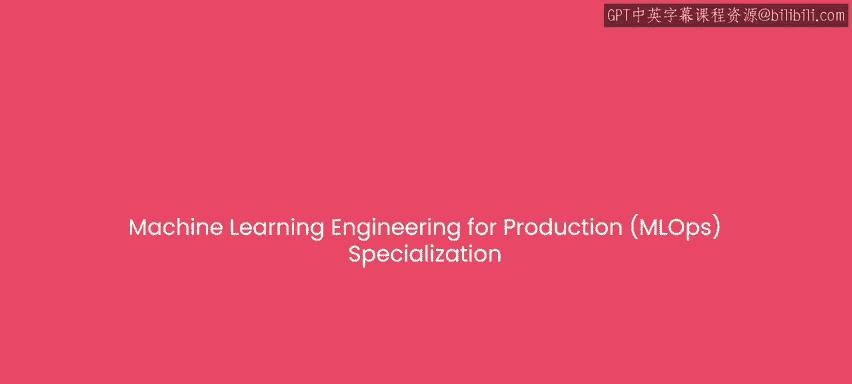
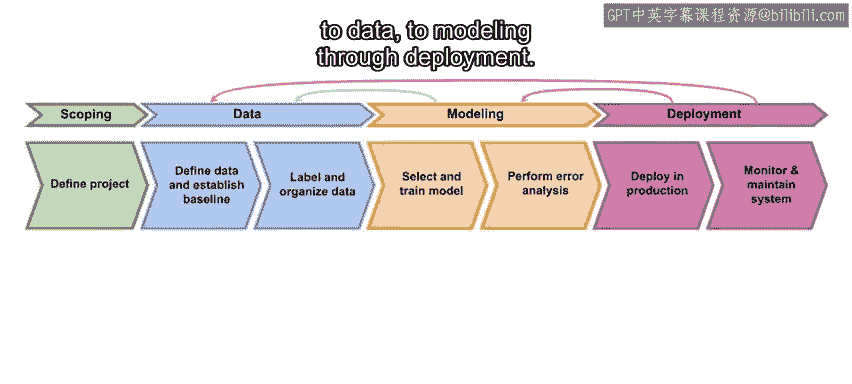
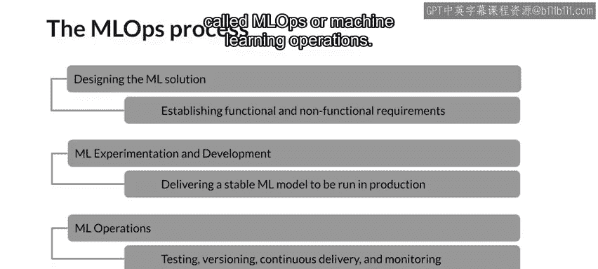

#  042：专项课程概述 🎯

在本节课中，我们将要学习《机器学习工程师的生产实践（MLOps）》专项课程的整体介绍。我们将了解从开发一个模型到将其部署到生产环境所需的全套技能和挑战，并认识本课程的教学团队。

---

假设你已经在Jupyter笔记本中训练了一个准确的机器学习模型，并为此感到高兴。你现在可能在想，接下来该做什么？

在开发出一个好模型这一里程碑之后，实际上将你的模型投入生产，构建一个能够持续做出有用预测的工作系统，仍然需要做很多工作。

本专项课程将教你构建和部署生产级机器学习系统所需的技能。你将学习完整的机器学习项目生命周期，从项目规划、数据处理、建模到部署，从而真正从头到尾执行一个机器学习项目。

一个常见的误解是，在本地机器的Jupyter笔记本中开发模型与将该模型部署到生产环境之间的唯一区别，仅仅在于部署环节本身，可能只是一些软件工程工作。但事实并非如此，这不仅仅是软件工程问题，生产环境也面临机器学习特有的挑战，这些挑战在Jupyter笔记本开发模型的过程中并不突出。构建和维护生产系统的这门学科，即执行所有这些工作的流程和工具，有时被称为MLOps（机器学习运维），你也将学习这方面的知识。

我很高兴能与来自Google TensorFlow团队的两位杰出讲师——Robert Crowe和Laurence Moroney——共同为大家带来这个新的专项课程。

Robert Crowe是Google的TensorFlow开发工程师、数据科学家和TensorFlow布道师。他热衷于帮助开发者快速学习他们需要掌握的知识，希望这正是你所需要的。Laurence Moroney在Google领导AI布道工作，同时也是DeepLearning.AI与TensorFlow合作的其他三门专项课程的讲师，并著有《AI and Machine Learning for Coders》一书。非常高兴你们两位能加入本专项课程的教学团队。

正如Andrew所说，除了在生产系统中构建第一个可工作的模型，你还需要处理一系列问题，包括数据漂移——你训练所用的数据分布最终可能会变得与模型进行推理时所面对的数据分布非常不同。我们将讨论的一个关键主题是“变化”。世界在变化，你的模型需要意识到这种变化。

在本专项课程中，我们还将向你介绍机器学习之外的几个相关主题。你可以将生产机器学习视为机器学习本身与现代软件开发所需知识和技能的结合。如果你在工业界的机器学习团队工作，你确实需要同时具备机器学习和软件方面的专业知识才能成功。这是因为你的团队不仅仅是产出一个单一的结果，你将开发一个持续运行的产品或服务，它可能是公司工作中至关重要的一部分。

根据我自己的经验，构建机器学习系统最具挑战性的方面，往往是那些你最意想不到的事情，比如部署。能够构建一个模型固然很好，但将其交到用户手中并观察他们如何使用它，可能会让你大开眼界。你可能认为自己拥有针对完美场景的完美模型，但你的用户可能有不同的看法，向他们学习总是非常有益的。例如，他们可能可以接受频繁更新的模型需要往返服务器，或者他们可能坚持要求他们的数据永不离开设备，因此你需要知道保持他们设备上模型新鲜度的最佳方法。

本专项课程包含四门课程，为你提供启动和运行生产机器学习系统所需的知识和实践经验。

以下是四门课程的简要介绍：

*   **第一门课程**：由我（Andrew）讲授，你将看到生产机器学习项目从规划、获取数据、建模到部署的整个生命周期的概述。
*   **第二门课程**：专注于数据及其随时间的变化。在这门课程中，你将使用TensorFlow Extended（TFX）及其系列库，通过收集、清理和验证数据集来构建数据管道。为了理解数据演变，你将使用数据溯源作为概念框架，通过ML元数据来追踪变化。
*   **第三门课程**：聚焦于生产环境中的机器学习建模流水线。在这门课程中，你将学习如何管理建模资源，以最佳方式服务推理请求并最小化成本。你还将使用分析工具来解决模型公平性和可解释性问题，并缓解瓶颈。
*   **第四门课程**：全部关于部署。这意味着你需要准备好服务用户的请求。这既令人兴奋又充满挑战。因此，在第四门课程中，你将构建部署流水线，用于可能需要多种不同基础设施的模型服务。你还将应用最佳实践来维护一个持续运行的生产系统，使其保持最新状态，并且重要的是，始终将用户的需求放在首位。

作为本专项课程的学习者，我们假设你熟悉Python编程和机器学习，并对Python中的一种深度学习框架（如TensorFlow、Keras或PyTorch）有一定了解。如果你已经完成了DeepLearning.AI提供的深度学习专项课程，那么你将非常适合开始学习本专项课程。当然，如果你完成了DeepLearning.AI的TensorFlow开发者专业课程，你将为本专项课程的学习做好更充分的准备。

---

本节课中，我们一起学习了《机器学习工程师的生产实践（MLOps）》专项课程的目标和结构。我们了解到，将模型投入生产远不止于部署，它涉及数据管理、模型维护、系统部署和持续监控等一系列挑战（MLOps）。本课程由四位专家共同设计，包含四门循序渐进的课程，旨在帮助具备一定机器学习基础的开发者掌握构建和维护生产级机器学习系统所需的完整技能栈。