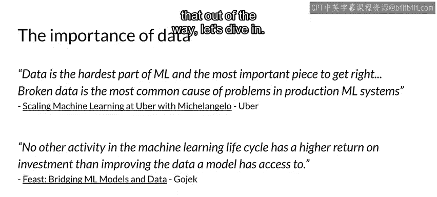
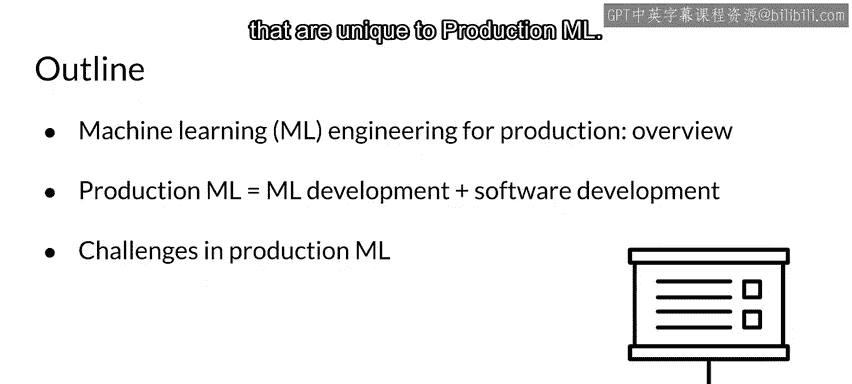
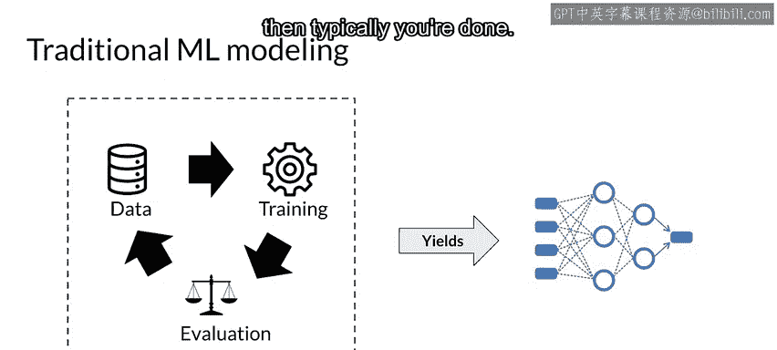
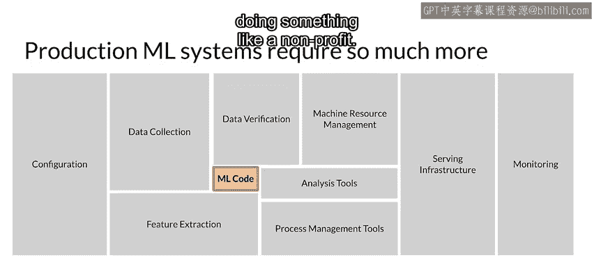
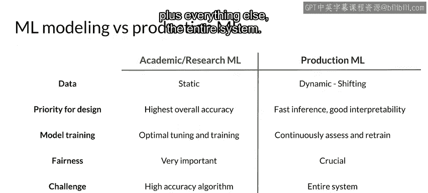
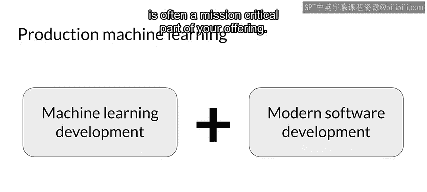
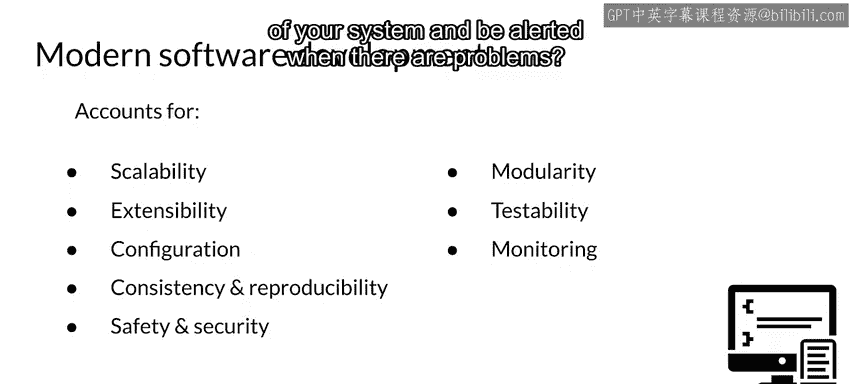
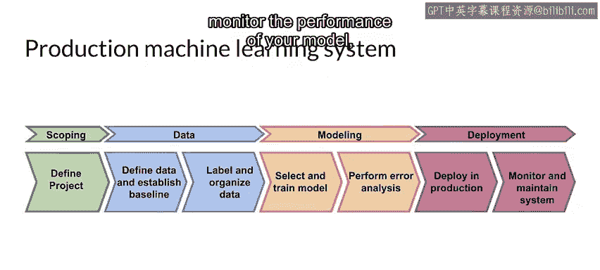
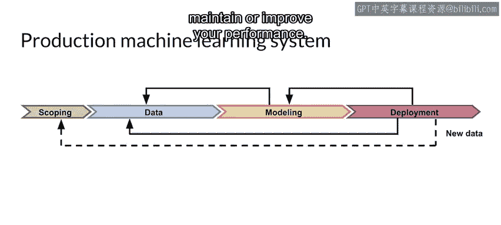
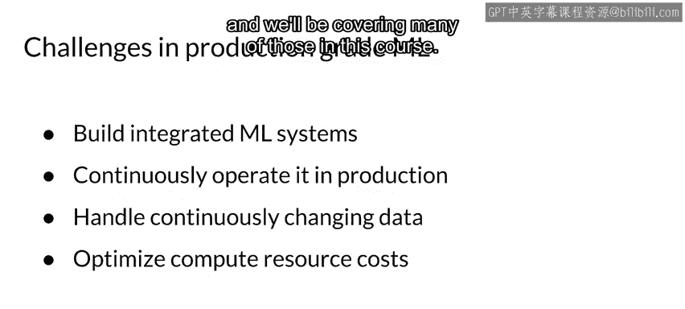

#  043：生产环境机器学习概述 🚀

在本节课中，我们将要学习生产环境机器学习的基本概念，并探讨它与学术研究环境中的机器学习有何不同。我们将了解构建和维护生产级机器学习系统所需的关键组件和挑战。

---

上一节我们介绍了课程主题，本节中我们来看看什么是生产环境机器学习。

生产环境机器学习可以看作是机器学习开发与现代软件开发实践的结合。它不仅关注模型本身，还涉及整个系统的设计、部署、监控和维护。

---

## 学术研究环境与生产环境的对比

在学术或研究环境中，建模过程通常较为直接。你通常会获得一个标准数据集，该数据集已经过清洗和标注，然后你用它来训练模型并评估结果。最终目标是获得一个预测性能良好的模型。

然而，生产环境机器学习的要求远不止一个模型。

我们发现，模型代码通常只占将机器学习应用投入生产所需总代码量的约 **5%**。下图展示了生产ML系统的其他关键组成部分：

从根本上说，我们讨论的不仅是机器学习和建模，更是生产级机器学习应用，以及创建、部署、维护和改进它们所需的一切，以便为你的用户、企业或组织提供服务。

---

以下是学术研究ML与生产ML的一些核心区别：

*   **数据**：学术研究通常使用静态数据集；生产ML使用动态且不断变化的真实世界数据。
*   **设计优先级**：学术研究追求在整个训练集上的最高准确率；生产ML则需平衡**快速推理**、良好的**可解释性**、**准确率**和**成本**。
*   **模型训练**：学术研究基于单一最优结果进行调优；生产ML需要**持续监控、评估和再训练**。
*   **可解释性与公平性**：这对所有ML建模都很重要，但对生产ML**绝对至关重要**。
*   **主要挑战**：学术研究的主要挑战是找到高精度模型；生产ML的挑战是“模型加上整个系统的一切”。

---

## 生产ML的双重属性

因此，可以公平地说，生产环境机器学习既是机器学习本身，也需要现代软件开发的知识和技能集。要取得成功，需要在这两个领域都具备专业知识，因为你不仅仅是在产出单一结果，而是在开发一个产品或服务，它通常是你业务中关键任务的一部分。

---

上一节我们了解了生产ML的复合属性，本节中我们分别看看这两个方面。

**机器学习开发**本身关注与数据和预测质量相关的具体问题。例如，在监督学习中，你需要确保：
*   标签准确。
*   训练数据覆盖的**特征空间**与模型将接收的请求一致。
*   在保留或增强数据中预测信息的同时，降低特征向量的维度以优化系统性能。
*   在整个过程中，需要考虑并衡量数据和模型的**公平性**，特别是对于罕见但重要的情况（例如在医疗保健领域）。

---

**但除此之外**，你还需要将软件投入生产。这需要一个系统设计，包含任何生产软件部署所需的所有要素。当然，这个部署必须专注于ML和你的应用。

以下是需要考虑的软件工程原则：
*   系统是否**可扩展**（能否向上和向下扩展）？
*   能否清晰地**扩展**以添加新功能？
*   是否有清晰、定义明确的**配置**？
*   是否**一致**且能**可靠地复现结果**？
*   是否**加固**以抵御攻击？
*   设计是否**模块化**，遵循现代软件开发原则？
*   能否进行**单元测试**和**端到端测试**？
*   能否**持续监控**系统的健康状况和性能，并在出现问题时收到警报？
*   是否采用了行业**最佳实践**？

---

## 机器学习生产流程

在现实世界应用中使用模型，需要的远不止理解机器学习算法。

以下是构建生产ML系统的主要步骤：

1.  **项目范围确定**：定义项目需求、目标以及实现它们所需的资源。
2.  **数据处理**：定义将要使用的特征，并组织和标注数据。有时可能需要测量**人类水平表现**以设定比较基线。
3.  **模型设计与训练**：在此阶段，**误差分析**将帮助你优化模型以适应项目需求。
4.  **模型部署**：部署模型以服务预测请求。部署目标可以是移动设备、云端、物联网设备甚至网页浏览器。
5.  **持续监控与维护**：随着时间的推移，真实世界数据不断变化，可能导致模型性能下降。因此需要持续监控模型性能。如果检测到性能下降，则需要返回进行模型再训练和调优，或修订数据。

在部署期间，新数据可能会对项目设计产生积极或消极的影响，可能需要进行**重新范围确定**。

最终，所有这些步骤共同构成了你的生产ML系统。这个系统需要自动运行，以便你能够持续监控模型性能、获取新数据、根据需要重新训练，然后重新部署以维持或提升性能。

---

## 核心挑战与总结

本节课中我们一起学习了生产环境机器学习与学术研究环境的关键区别。

进行生产ML所面临的挑战与学术研究ML非常不同。在某种意义上，挑战是相同的，但包含了更多内容。你将构建一个专注于ML用例的集成系统。你需要考虑在生产中持续运行它，对于在线用例，这意味着它必须保持 **24/7** 可用。你必须考虑并建立系统来处理不断变化的世界和数据。当然，与任何生产系统一样，你需要在**最低成本**下尝试完成所有这些，同时产生**最佳性能**。

这看起来可能令人生畏，但好消息是，对于完成所有这些工作，已有成熟的工具和方法论，你将在本课程中学到很多。

---

**总结**：生产环境机器学习是一个结合了机器学习技术与软件工程实践的综合性领域。它要求从业者不仅关注模型精度，还要统筹考虑数据动态性、系统可扩展性、部署可靠性、持续监控和成本效益，以构建和维护能够持续创造价值的实时应用系统。