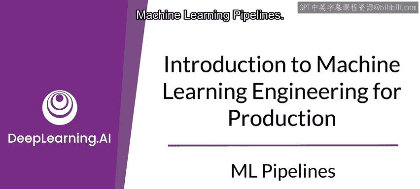
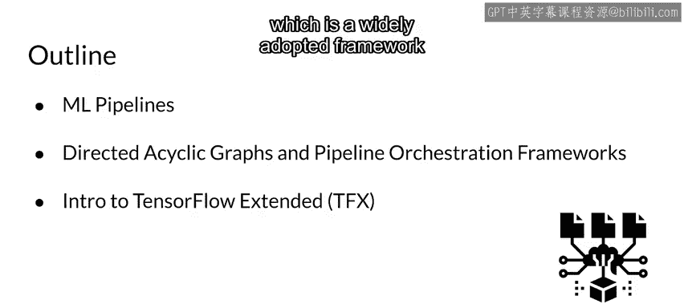
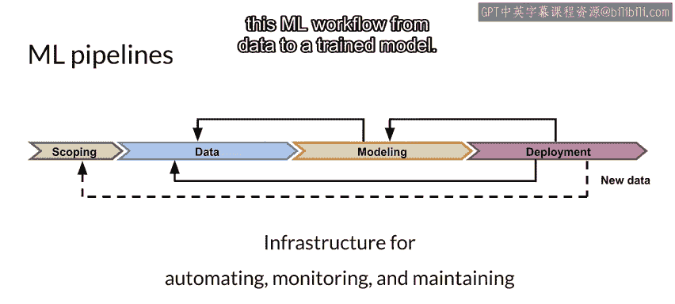
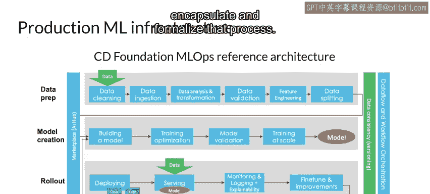
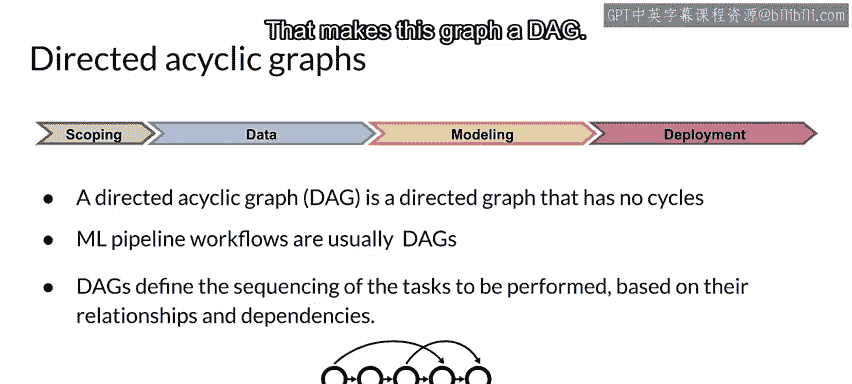
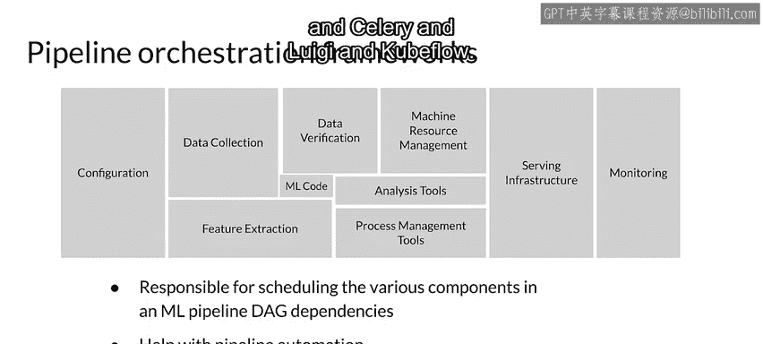
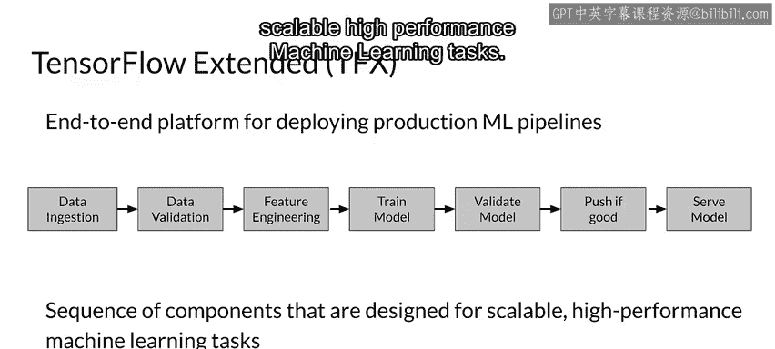
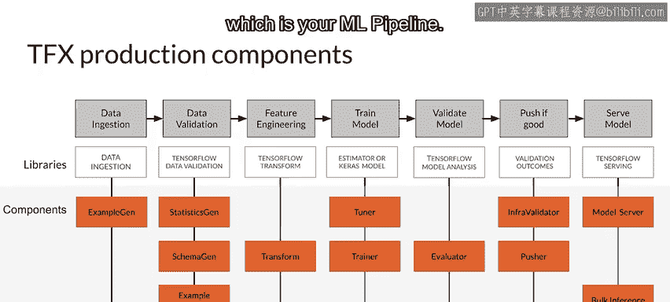
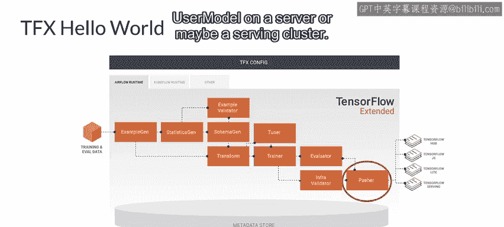
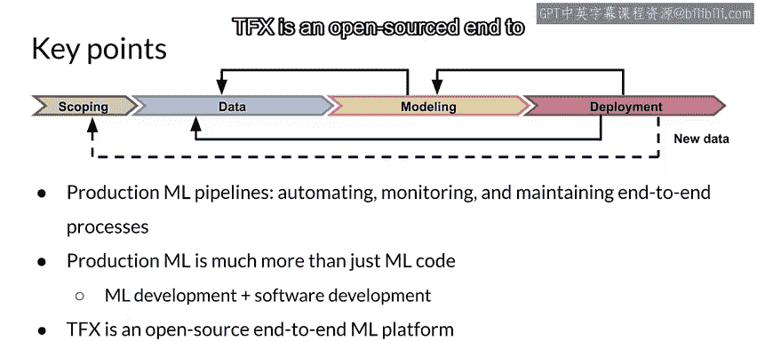

#  044：机器学习流水线 🚀

在本节课中，我们将学习机器学习流水线的核心概念。我们将介绍什么是机器学习流水线，它在MLOps架构中的角色，以及如何使用流水线编排器来自动化机器学习工作流程。最后，我们将以TensorFlow Extended（TFX）为例，了解一个广泛应用的机器学习流水线框架的具体构成。

---

机器学习流水线是任何生产级机器学习系统的核心。它指的是一种软件架构，旨在自动化、监控和维护从数据到训练模型的整个机器学习工作流程。

上一节我们回顾了迭代式的机器学习工作流程，本节中我们来看看如何通过流水线架构来具体实现它。

机器学习流水线构成了MLOps架构的关键组成部分。下图展示了由行业组织CDF基金会提出的一个流水线架构示例。

不同的流水线架构可能存在一些差异，但总体上它们都与此类似。你会注意到，它们基本上反映了机器学习开发过程，从数据摄取开始，到训练出模型结束。这是有意设计的，因为它们需要封装并规范化这个过程。

---

机器学习流水线几乎总是**有向无环图**，尽管在一些高级用例中，它们有时可能包含循环。

**DAG**（有向无环图）是所有你想要运行的任务的集合，这些任务按照反映它们之间关系和依赖性的方式排序。请注意，在这个图中，边是有方向的，并且没有循环。这使得这个图成为一个DAG。

---

流水线编排器负责根据DAG定义的依赖关系，调度机器学习流水线中的各个组件。编排器有助于实现流水线自动化。

以下是编排器的例子：
*   Argo
*   Airflow
*   Celery
*   Luigi
*   Kubeflow

---

现在，让我们来看一个具体的机器学习流水线框架示例：TensorFlow Extended（TFX）。

TFX是一个开源的全栈机器学习平台，也是我们在谷歌内部使用的平台。一个TFX流水线是一系列可扩展的组件序列，能够处理海量数据。

从左侧开始，我们摄取数据，然后进行数据验证和特征工程，接着训练模型并验证它。如果它优于我们生产环境中已有的模型，我们就会将其推送到生产环境，最后用于提供预测服务。这个组件序列专为可扩展、高性能的机器学习任务而设计。

在本课程中，你将使用TFX来实现真实的机器学习流水线，就像为生产系统所做的那样。

---

TFX的生产组件建立在开源库之上，例如：
*   **TensorFlow Data Validation**（本周晚些时候会学习）
*   **TensorFlow Transform**（本课程后续会深入使用）
*   **TensorFlow Model Analysis** 等

下图中橙色的组件利用了这些库，并构成了你的DAG。当你对这些组件进行排序并设置它们之间的依赖关系时，你就创建了你的DAG，也就是你的机器学习流水线。

---

接下来，我们详细看看一个基础的TFX流水线结构，可以称之为TFX的“Hello World”。

我们从左侧的数据开始，使用名为 **ExampleGen** 的TFX组件来摄取数据。你在此处看到的所有橙色框都是TFX组件。实际上，这些是当你执行 `pip install` 安装TFX时自带的组件。

以下是各个组件的功能：
*   **StatisticsGen**：为数据生成统计信息，例如数值特征的范围、分类特征的有效类别等。
*   **ExampleValidator**：用于查找数据中的问题。
*   **SchemaGen**：为整个特征向量生成数据模式。
*   **Transform**：进行特征工程。
*   **Tuner** 和 **Trainer**：用于训练模型并调整其超参数。
*   **Evaluator**：对模型性能进行深入分析。
*   **InfraValidator**：确保我们可以在现有基础设施上实际使用模型运行预测（例如，内存是否足够）。
*   **Pusher**：如果模型通过所有验证，并且性能优于生产环境中的现有模型，则将其推送到生产环境。

“推送到生产环境”意味着什么？它可能意味着：
*   推送到像 **TensorFlow Hub** 这样的存储库，用于后续的迁移学习或生成嵌入。
*   推送到 **TensorFlow.js**，用于Web浏览器或Node.js应用。
*   推送到 **TensorFlow Lite**，用于移动应用或物联网设备。
*   推送到 **TensorFlow Serving**，用于服务器或服务集群。

---

本节课中我们一起学习了机器学习流水线的核心要点。首先，生产级机器学习流水线不仅仅是机器学习代码，它结合了机器学习开发、软件开发，并以一种可维护和可扩展的方式，规范化了运行这一系列任务的流程。

其次，TFX是一个开源的全栈机器学习平台，我们将在本课程中使用它。

