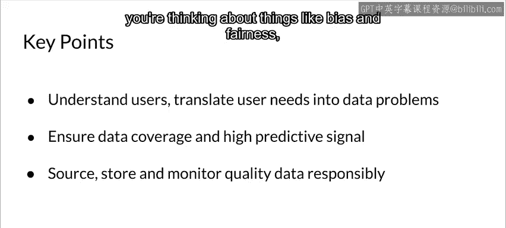

#  045：4_数据的重要性 📊

在本节课中，我们将要学习机器学习项目中数据的重要性，以及如何在实际生产环境中收集和管理数据。数据是机器学习系统的基石，其质量直接决定了模型的成败。

---

上一节我们介绍了机器学习项目的整体流程，本节中我们来看看数据这一核心要素。

## 数据收集的现实挑战

首先，让我分享一个我曾参与的应用案例。我们被要求创建一个模型，用于预测在不同日期、不同时间、不同队伍长度下，通过机场安检点所需的时间。为此，我们需要数据。

我们如何获取这些数据呢？我们必须测量人们通过安检点所需的时间。具体方法是：我们派人前往机场，并获得安全部门的许可。一人在安检队伍起点记录某人进入的时间，另一人在安检出口记录该人离开的时间。两人距离很远，甚至无法看到彼此。通过这种方式，我们逐步构建了一个带有标签的数据集，记录了人们通过安检所需的时间。

可以想象，这个过程极其繁琐且昂贵。我们必须开发应用程序来支持数据收集，并支付人员费用，他们还需要通过安全审查。这个例子说明，在生产环境中收集数据通常需要创造性的方法，并且可能成本高昂。除非你非常幸运，已经有人为你准备好了数据。

## 数据与数据质量的重要性

你的模型质量将完全取决于你的数据质量。如果数据中存在大量噪声，尤其是标签噪声，你必须设法清理这些信号。

我们将几乎完全使用数据管道，因为我们需要自动化这些流程。在管道中，数据收集、摄取和准备将作为一系列自动化任务进行。我们还需要监控数据收集过程，因为对于大多数应用而言，数据收集不是一次性的，而是贯穿应用整个生命周期的持续活动。

正如我们所见，数据是机器学习中最困难也是最重要的一环。优步（Uber）曾指出：“损坏的数据是生产机器学习系统中最常见的问题根源。”GoJk 等公司也有类似看法。几乎任何生产机器学习团队都会告诉你数据收集的故事，以及确保数据正确的重要性。

在编程语言设计中，“一等公民”指的是支持该语言中所有通用操作的实体。在机器学习中，**数据就是一等公民**。

*   **软件 1.0** 的核心是代码，即给计算机的指令。
*   **软件 2.0** 则需要我们指定程序行为的目标。代码虽然重要，但已不是我们唯一关心的事情。

优化是这里的驱动力，我们需要在多个方向上进行优化：性能、可维护性和可扩展性。对于机器学习而言，**数据和数据质量对成功至关重要**。在某种程度上，数据在机器学习应用中的角色，类似于代码在传统软件应用中的角色。

模型并非魔法。你可能拥有海量数据，但如果这些数据没有预测性内容，你将无法用它构建出有效的预测模型。因此，你需要从模型中移除那些没有预测性的信息和特征，因为它们不仅会引发问题，还会浪费宝贵的计算资源。

在监督学习甚至无监督学习中，你必须确保训练数据所覆盖的特征空间，与模型投入生产后收到的预测请求所覆盖的特征空间是一致的。你的模型需要在该空间的所有区域都有良好的信息来进行预测。正如常言道：**垃圾进，垃圾出**。如果你的数据质量低下，你的模型和应用质量也会低下。

机器学习的一个好消息是，我们可以相对容易地衡量解决方案的好坏。而在许多传统软件应用中，这可能不那么直接。因此，**数据收集是构建机器学习系统关键且重要的第一步**。

## 构建稳健机器学习系统的考量

为了避免系统停机等问题，你需要确保训练的模型是可扩展的，能够服务于预测请求。特别是对于时间序列数据，你需要考虑季节性和趋势等因素。你需要思考不同类型的错误，我们将在后续课程中详细讨论。

在开发过程中，你需要在脑海中构建一个完整的图景：这是一个从数据摄取到模型服务的全过程。所有环节都必须实现自动化、可测试、可维护和可扩展。

你需要理解你的用户，并确保将用户需求转化为数据问题。你不能仅仅使用手头现成的模型，如果它不符合用户需求的话。

你需要确保你的数据覆盖的特征空间区域与未来预测请求的一致。你需要最大化数据中的预测信号。你不仅需要在项目开始时关注数据质量，更要在应用的整个生命周期中持续关注。这包括确保数据来源可靠，并考虑偏见和公平性等问题，我们将在本课程后续部分进行讨论。

---

本节课中我们一起学习了数据在机器学习项目中的核心地位。我们探讨了在生产环境中收集数据可能面临的现实挑战，理解了数据质量如何直接决定模型性能，并认识到数据应被视为机器学习系统中的“一等公民”。最后，我们概述了构建一个稳健、可维护的机器学习系统时，围绕数据需要进行的全盘考量。记住，优质的模型始于优质的数据。