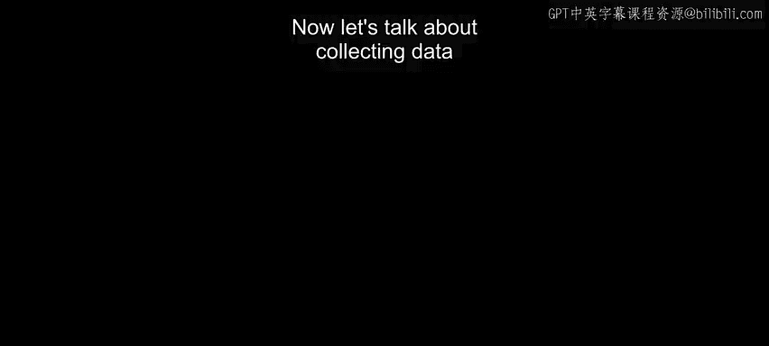
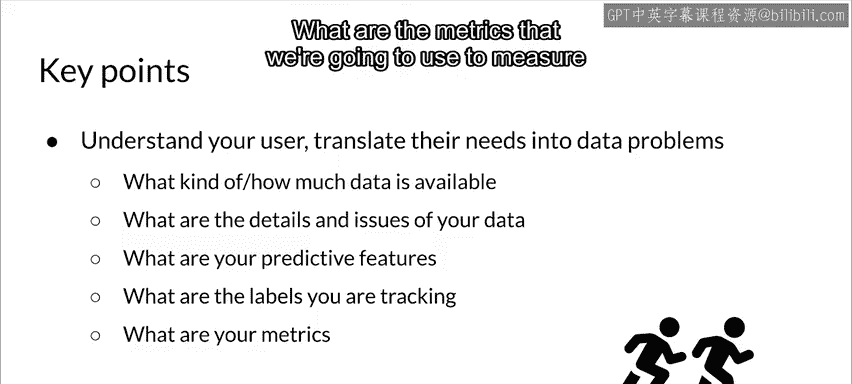

#  046：5_建议运行的应用示例 🏃‍♂️📱

在本节课中，我们将学习如何为一个“跑步建议”应用收集和准备数据。我们将通过一个具体示例，探讨从理解用户需求到定义数据特征和标签的完整过程。

---

## 理解用户与应用目标

上一节我们讨论了数据收集的重要性，本节中我们来看看一个具体的应用示例。

我们正在构建一个为跑步者推荐跑步路线的应用。用户是不同健康水平的跑步者。系统的目标是通过分析用户行为和偏好模式来推荐跑步路线，从而提高用户跑步的规律性、完成率与满意度。

## 将用户需求转化为数据需求

理解用户是第一步，但最终我们需要将其转化为具体的数据和特征需求，否则可能收集到无用的数据。

我们需要明确：数据是什么？特征是什么？标签是什么？

以下是一个示例数据集，包含三种不同类型的跑步活动及其特征：

| 跑步活动示例 | 跑步者用时 | 海拔变化 | 趣味性评分（标签） |
| :--- | :--- | :--- | :--- |
| 波士顿马拉松 | 3小时30分 | 200英尺 | 7 |
| 西雅图十月节5K | 28分钟 | 50英尺 | 9 |
| 休斯顿半程马拉松 | 1小时45分 | 100英尺 | 6 |

在这个例子中，特征包括**跑步活动本身**、**跑步者用时**和**海拔变化**。标签是跑步者对这次跑步**趣味性的评分**。

## 了解你的数据源

你需要确定数据来源，不仅用于首次训练，还要考虑持续推断时的数据收集。你需要思考：
*   训练数据需要多久更新一次？
*   数据是否具有预测价值？需要剔除无预测价值的特征。
*   数据是否一致？例如，预期为浮点数的字段是否总是浮点数？
*   是否存在异常值或错误？例如，传感器故障可能导致错误数据。
*   缺失值如何编码？例如，海拔数据为0英尺，是代表海平面还是数据缺失？
*   如果特征来自其他ML模型（如集成模型），其中的错误会在下游模型中被放大。

你需要在流程早期发现错误和问题，并监控数据源的系统问题和中断。例如，如果应用离线一段时间，记录的跑步者时间出错，你是否有办法处理？

## 评估数据有效性并优化特征

你需要对数据价值有直觉，但直觉可能具有误导性。因此，必须通过分析来确定哪些数据真正提供了最多信息。

特征工程和特征选择对于塑造数据至关重要：
*   **特征工程**：在确定预测信号所在后，帮助你最大化这些信号。
*   **特征选择**：帮助你衡量预测信息的位置，并专注于那些能提供最大价值、对模型帮助最大的特征。

## 定义特征与标签

再次强调，你需要理解用户和应用。在本例中，我们可以从应用获取跑步数据，用户填写资料时获取人口统计数据，并通过GPS获取本地地理信息。

以下是如何将高层理解转化为具体特征和标签：

**特征来源示例：**
*   **跑步者人口统计**：转化为一个或多个特征。
*   **跑步行为数据**：一天中的跑步时间、完成跑步所需时长、跑步配速、距离、海拔变化等。
*   **传感器数据**：如果应用连接了心率监测器等传感器，这些是极好的信息源，可能包含预测信息（但需验证）。

**标签定义：**
*   **跑步者接受度**：用户是否采纳了我们的建议并执行了推荐跑步。这表示应用成功推荐了他们想进行的跑步。
*   **用户生成的反馈**：需要以结构化方式获取，以便用于模型训练。例如，用户对推荐跑步的趣味性进行评分。反馈通常不能是自由文本（除非使用NLP技术处理），而应是可直接使用的形式。

## 关键要点总结

本节课中我们一起学习了为机器学习应用准备数据的关键步骤：

1.  **理解你的用户或应用**：如果没有直接用户，则理解应用要解决的问题。
2.  **将需求转化为数据问题和特征**：定义能提供预测信息的、明确的特征。
3.  **评估可用数据**：你能获取什么数据？有哪些细节和问题？（例如传感器可靠性）
4.  **定位预测信息**：数据中的预测信息可能不在你预期的地方。
5.  **正确定义标签**：确保我们训练的模型是在预测正确的东西，标签需与目标一致。
6.  **关联到评估指标**：确定用于衡量模型性能的指标。

通过以上步骤，你可以为构建一个有效的“跑步建议”系统打下坚实的数据基础。