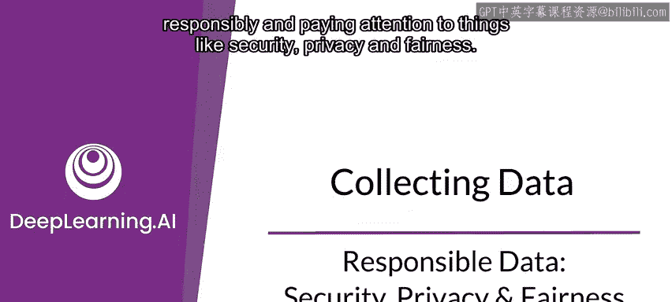
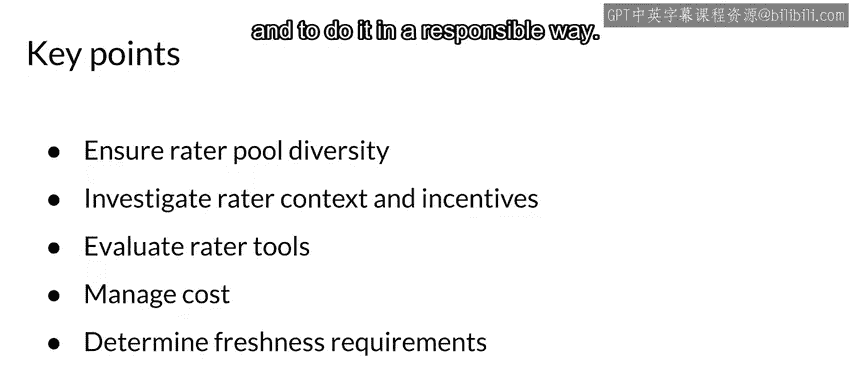

#  047：负责任的数据、安全、隐私与公平 🔒⚖️

在本节课中，我们将学习如何负责任地收集和管理数据，重点关注数据安全、用户隐私以及确保机器学习系统的公平性。我们将探讨数据来源、偏见产生的原因以及如何设计标注系统来减轻偏见。

---

## 负责任地收集数据

上一节我们介绍了数据收集的重要性，本节中我们来看看如何确保数据收集过程是负责任的。收集数据的一个关键方面是确保以负责任的方式进行，并关注安全、隐私和公平性等问题。

我们将探讨如何负责任地获取数据源，确保数据安全，并正确管理用户隐私。我们还需要知道如何检查和确保公平性，并设计能够减轻偏见的标注系统。

以下是一个例子：

这些图片展示了一个标准的开源图像分类器，它在一个开放图像数据集上训练，但未能正确地将与婚礼相关的标签应用于来自世界不同地区的婚礼传统图片。

*   最左边的图片，分类器的预测标签是“仪式、婚礼、新娘、男人、群体、女人、礼服”，这基本正确。
*   下一张图片的标签是“新娘、仪式、婚礼、礼服、女人”，在西方文化中，这看起来也是正确的。
*   再下一张图片的标签“仪式、新娘、婚礼、男人、女人、礼服”同样正确。
*   但最右边的图片，描绘的是一个非洲婚礼仪式，却被错误地仅标记为“人”或“人们”。虽然图片中确实有人，但它也是一个仪式，并且包含新娘、新郎、礼服等元素。

这是一个经典案例，常被引用来说明数据集中存在的偏见问题。

---

## 数据来源与安全隐私

在机器学习系统中，数据可能来自不同来源。你需要考虑这些来源，而不仅仅是你拥有的数据本身，还要考虑你是从哪里获取的。

数据来源可能包括：
*   构建合成数据
*   进行网络爬取
*   收集实时数据（尤其是在运行推理时）
*   构建自己的数据集（最常见）
*   使用开源数据集（取决于可用性和需求）

数据安全和隐私至关重要。数据安全指的是保护个人数据（通常称为PII，个人可识别信息）的策略、方法和手段。数据隐私则涉及对这些数据的正确使用、收集、保留、删除和存储。

数据收集不仅关乎你的模型，还需要考虑你的用户。你需要将数据视为托付给你保管的东西，并负责任地进行管理。用户应该能够控制哪些数据被收集，并且建立机制以防止系统无意中或因攻击而泄露用户数据至关重要。

你处理数据隐私和安全的方式取决于数据的性质、操作条件、法规和政策（如GDPR）等因素。

---

## 用户隐私保护

用户隐私同样关键，你需要保护个人可识别信息或数据。

以下是几种保护方式：
*   **数据聚合**：如果能将数据聚合，使其无法识别其中的个体，这将大有帮助。
*   **匿名化**：对数据进行匿名处理。
*   **用户控制**：让用户控制他们分享哪些数据。
*   **遵守法规**：考虑在你使用模型的地区可能影响用户隐私的任何法律或法规。
*   **数据删除**：在许多情况下，你需要为用户提供删除部分数据的方式，这虽然会形成不完整的画像，但却是负责任处理数据的一部分。

---

## 机器学习系统的失败与公平性

机器学习系统可能以多种方式对用户造成损害，我们需要在公平、准确、透明和可解释性之间取得平衡。

机器学习系统可能失败的方式包括：
*   **代表性伤害**：系统放大或反映对特定群体的负面刻板印象。
*   **机会剥夺**：系统的预测产生负面的现实生活后果，可能导致持久影响。
*   **不成比例的产品失效**：模型的有效性严重偏斜，导致对特定用户群体的输出（可以视为错误）更频繁地发生。
*   **劣势关联伤害**：系统在不同人口特征和用户行为之间推断出不利的关联。

公平性非常重要，你应该从一开始就致力于实现它。

---

## 实现公平性

那么，公平意味着什么？公平意味着识别某些人群，或识别某些人群是否以有问题的方式获得与其他人群不同的体验。

例如，假设特定的性别、职业或年龄字段是你数据的一部分，并且你用它来训练一个预测某人是否会是可靠新员工的模型（涉及招聘）。你需要仔细检查，确保你的模型不会以有问题的方式持续为某些群体预测不同的体验，这需要通过确保**群体公平性**来实现。

这意味着要实现人口统计上的平等，使不同群体间的事物均衡化。你还需要确保准确性也尽可能相等或接近。

由人类收集和标注的数据在许多情况下会反映他们的偏见和个人经验，因此你必须考虑到这一点。多样化你的用户基础是迈向公平的好方法，但这并非保证。机器学习系统可能放大偏见，你需要意识到这一点并谨慎对待。你真正想做的是部署公平的模型。

当你的数据中某些群体的代表性不成比例或根本没有代表性时，也可能产生偏见。

观察这里的图示，我们试图展示的是，图中显示的部分人在你的数据中，但还有大量其他人不在其中。因此，那些不在你数据中的群体可能会被刻板印象化，或以不那么积极的方式呈现，或者他们可能更频繁地获得糟糕的体验。

---

## 减少监督学习中的偏见

为了减少监督学习中的偏见，你需要准确的标签来训练模型并进行预测。

标签通常来自两个广泛的来源（当然也有其他来源）：
*   自动化系统
*   人类标注员

我们接下来会讨论两者。

人类能够以不同的方式标注数据，数据越复杂，你可能越需要专家来查看这些数据，我们稍后会讨论这一点。标注数据的人类被称为“标注员”。

---

## 标注员的类型

那么，标注员是谁？他们可能是：
*   **通才**：这些是普通人，通过各种众包工具添加标签。适用于人们能相对容易识别正确标签的情况。例如，让人识别猫和狗的区别，大多数人看图片就能做到。
*   **主题专家或领域专家**：在某些情况下，你真的需要一位主题专家。这时你通常使用专门的工具。一个例子是查看X光片进行诊断，这不是任何人都能做的，你需要确保与专家合作，这种标注往往成本很高。
*   **用户**：我们之前为跑步应用程序看到的这种反馈，如果你能在应用程序中找到利用它的方法，通常非常有价值。如果你能让它发挥作用，它将为你提供持续的数据标签流。

---

## 关键要点

以下是关于负责任数据管理的几个关键要点：

*   **公平性与代表性**：始终考虑数据集中标注员的公平性和数据的公平代表性，以避免潜在的偏见。考虑那些标注员是谁以及他们的动机是什么，因为如果你设计的激励机制不正确，你的数据中可能会充斥大量垃圾。
*   **成本考量**：成本无疑总是一个重要的考虑因素。如果能找到一种以高质量但较低成本完成的方法，那很好。但你需要足够的数据，并找到实现这一目标的方法，这是生产应用面临的挑战之一。
*   **数据新鲜度**：你将处理数据，根据应用程序周围世界的变化以及你拥有的数据，你需要定期刷新数据，并检测何时需要这样做。

这些都是你需要思考的问题，以便真正管理好数据收集，并以负责任的方式进行。

---

本节课中，我们一起学习了如何负责任地收集和管理数据，重点关注了数据安全、用户隐私和机器学习公平性的核心概念。我们探讨了数据来源、偏见产生的原因、不同类型的标注员以及确保数据质量和公平性的关键实践。记住，构建负责任的机器学习系统始于对数据的深思熟虑和谨慎管理。

