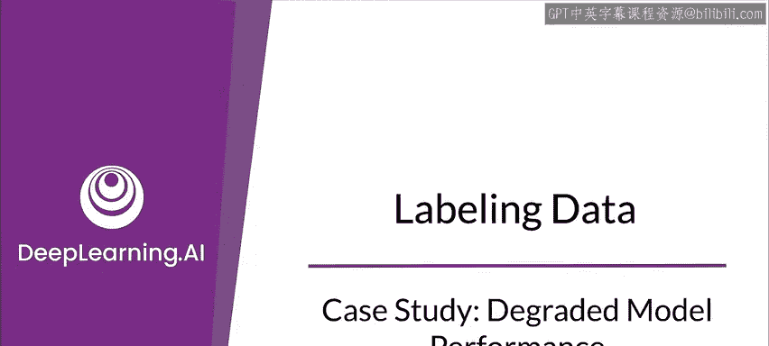
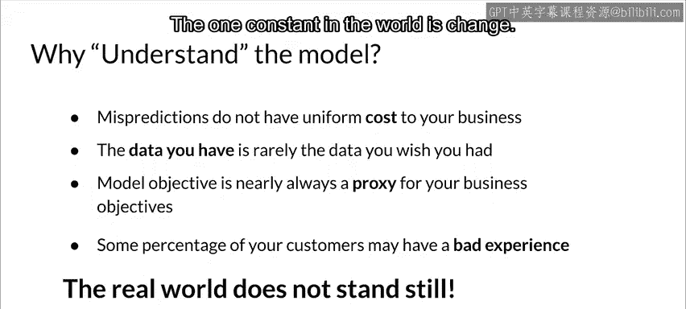

#  048：模型性能退化案例研究 📉

在本节课中，我们将通过一个具体的案例研究，探讨机器学习模型在生产环境中性能退化的常见原因、影响以及应对策略。我们将学习如何识别和处理由数据变化、世界变化以及系统问题导致的模型性能下降。

---

## 概述

模型部署到生产环境后，其性能并非一成不变。现实世界是动态变化的，这些变化会直接影响模型的表现。本节课将通过一个在线零售商的案例，分析模型性能退化的具体场景、根本原因以及监控和缓解方法。

上一节我们介绍了模型部署后的监控概念，本节中我们来看看一个具体的性能退化案例。

---

## 案例背景：在线零售商的点击率预测模型

想象你是一家在线零售商，销售鞋子。你有一个用于预测商品点击率（CTR）的模型，该模型的预测结果帮助你决定订购多少库存。

突然，模型的评估指标（如AUC和预测准确率）出现了下降。值得注意的是，这种下降并非全局性的，而是集中体现在库存的某个特定部分——**男士正装鞋**。

这就引出了几个关键问题：
*   为什么模型在训练时表现良好，现在却对男士正装鞋的预测不准了？
*   发生了什么变化？
*   更重要的是，你如何能及早发现这个问题？模型仍在运行、仍在给出预测、你仍在根据预测订购库存。你如何知道你的订单决策和模型预测已经不如从前？

---

## 性能退化的后果与早期检测的重要性

如果不为生产环境建立良好的实践，你可能只有在订购了过多或过少的鞋子时才会发现问题。这在商业环境中是不可取的，会造成直接的经济损失。

因此，你需要思考：
1.  **如何早期检测**此类问题。
2.  **问题的可能原因**是什么，以便你能有针对性地监控系统。
3.  建立**应对机制和系统**，以便在问题发生时进行处理（因为问题很可能会在某个时刻发生）。

---

## 性能退化问题的两大类别

性能退化问题通常可分为两大类，它们需要不同的监控和应对策略。

### 1. 缓慢发生的问题（渐变问题）

这类问题随着时间推移逐渐发生，通常与世界的变化相关。它们又可以细分为以下相互关联的几类：

以下是渐变问题的几种常见形式：

*   **趋势与季节性**：尤其在时间序列数据中，趋势和季节性变化非常普遍。这可以看作是数据的变化，也是世界运行规律的变化。
*   **特征分布变化**：输入模型的数据特征其统计分布会逐渐改变。
*   **特征重要性变化**：不同特征对预测结果的相对重要性会发生改变。如果模型没有重新训练，其准确性就会开始衰减。

### 2. 突然发生的问题（剧变问题）

这类问题通常与系统本身直接相关，发生得很快。

以下是剧变问题的几种常见形式：

*   **数据收集问题**：例如传感器或摄像头损坏；日志数据格式突然改变或轮转方式变化；传感器位置被移动而未被告知。
*   **系统问题**：软件更新引入了未被察觉的重大变更；网络连接中断（尽管我们希望它永不中断）；整个系统宕机。
*   **凭证问题**：访问凭证过期或变更，导致数据流中断。

---

## 现实世界的变化对模型的影响

世界在不断变化，在生产环境中，这必须成为你系统设计和流程的一部分。理解这些变化有助于预判模型性能的衰退。

以下是世界变化影响模型的具体例子：

*   **风格与偏好变化**：在零售业中，商品风格会变。例如，去年男士正装鞋流行黑色，今年可能流行棕色。
*   **流程与范围变化**：业务流程或范围的变化会影响模型对结果的解读。
*   **竞争与业务变化**：新产品的引入、旧产品的淘汰、新竞争对手的出现、业务地域的扩张或收缩。
*   **市场价格变化**：供应商价格或公开市场价格波动。

所有这些都要求模型去适应世界。这种影响通常是领域特定的，但几乎在所有领域，世界的变化都会影响模型性能。

---

## 应对性能退化的关键考量

在设计和监控系统时，需要考虑以下几个核心点：

1.  **预测错误的成本不均等**：并非所有的预测错误对业务的影响都一样大。有些错误影响甚微，有些则可能造成巨大损失。监控系统时，应重点关注那些可能产生较大影响的错误。
2.  **可用数据与理想数据的差距**：你收集到的数据很少是你理想中希望拥有的完美数据。通常需要基于现有的、可能有噪声或不完整的数据进行工作。
    *   **代码示例**：`data = load_real_world_data() # 数据通常是嘈杂、不完整的`
3.  **模型目标是真实目标的代理**：在很多情况下，模型优化的目标（如点击率）只是你真正业务目标（如优化库存利润）的一个代理指标。
    *   **公式描述**：我们真正关心的是 **最大化利润**，但模型优化的是 **点击率预测准确率**，即 `模型目标 ≈ f(真实目标)`。
4.  **部分客户体验不佳**：总会有一定比例的客户获得不理想的体验（如收到不准确的推荐）。目标是尽可能降低这个比例，并尽可能理解哪些客户会受到影响，从而设计缓解方案。

---

## 总结

本节课中我们一起学习了机器学习模型在生产环境中性能退化的典型案例。核心要点在于：**唯一不变的是变化本身**。

我们分析了性能退化如何通过**渐变问题**（如数据漂移、趋势变化）和**剧变问题**（如系统故障、数据源异常）两种形式出现。通过在线零售商的案例，我们认识到早期检测和持续监控的重要性，并理解了模型需要不断适应变化的现实世界。建立应对这些问题的系统和流程，是维持生产环境机器学习模型长期健康的关键。