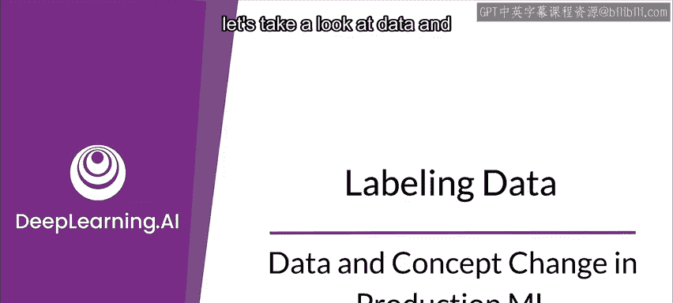
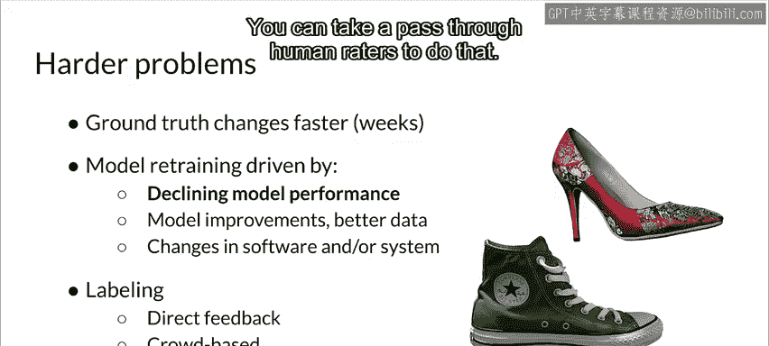
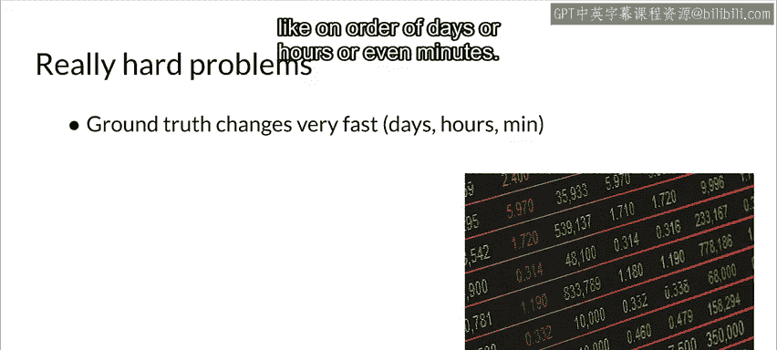
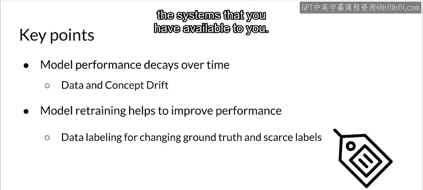

#  049：生产环境中的数据与概念变更 📊

在本节课中，我们将学习如何检测生产环境中已部署机器学习模型的问题，重点关注**数据变更**和**概念变更**。理解这些变更的类型及其应对策略，对于维护模型在生产环境中的性能至关重要。

---

## 模型问题检测概述

检测已部署模型的问题，可以从数据和现实世界范围等多个角度进行。其根本在于需要对模型进行持续监控，并验证模型的结果与数据，以便及时发现问题。我们尤其希望快速发现系统性问题，例如之前讨论过的传感器故障等。

然而，一个根本性问题是**不断变化的真实情况**。这意味着在应用程序的整个生命周期中，你需要持续标注新数据。具体采用何种方法可行，很大程度上取决于你所处的领域和试图解决的问题类型。

---

## 不同类型的问题与应对策略

以下是几种不同难度级别的问题及其应对方法。

### 简单问题：缓慢变化的真实情况

上一节我们介绍了问题检测的基本概念，本节中我们来看看第一种情况。这类问题的真实情况变化非常缓慢，例如识别猫狗图像。在这种情况下，模型重新训练通常由模型改进驱动，例如提升了识别猫狗的准确率。

此外，软件或系统的升级（如使用不同的库）也可能触发重新训练。对于此类问题，数据标注相对简单。

以下是可行的数据标注方法：
*   **使用现有数据集**：可以利用来自公共领域或组织长期使用的精选数据集。
*   **众包标注**：如果问题简单，这也是一种可行方式。
*   **用户反馈**：如果能够获得用户反馈，应充分利用。

### 较难问题：快速变化的真实情况

接下来，我们探讨真实情况变化更快的场景。例如时尚风格（如鞋款），现实世界可能在数周内就会发生变化。在这种情况下，模型重新训练通常由**模型性能下降**驱动，因此你需要有能力测量这种下降。

当然，模型改进、获得更好数据以及软件系统变更也可能触发重新训练。随着问题难度增加，模型性能下降成为一个更关键的驱动因素。

对于此类问题的数据标注，以下是可行的方法：
*   **直接反馈**：如果能够从系统或用户那里获得直接反馈，这是最佳选择。
*   **众包人工标注**：由于你可能有数周的时间来响应，通过人工评审员进行标注是另一种可行的方法。

### 极难问题：急速变化的真实情况

然而，当问题变得极其困难时，应对策略也完全不同。在这种情况下，真实情况变化极快，可能以天、小时甚至分钟为单位。金融市场预测就属于此类范畴，它们变化非常迅速。

此时，**模型性能下降**无疑是触发模型重新训练的主要驱动因素。模型改进和软件变更等工作通常在线下进行，而应对性能下降则需要定义清晰的流程。

此类问题的数据标注极具挑战性。如果领域允许，直接反馈是理想方式；否则，可能需要借助我们后续会讨论的**弱监督**等方法。这些领域（如市场预测）往往价值很高，进行预测的激励很大，因此挑战也相应更大。

---

## 核心要点总结

本节课中，我们一起学习了生产环境中数据与概念变更的应对。核心要点如下：

1.  **模型性能会随时间衰减**。衰减速度可能很慢（如猫狗识别），也可能极快（如金融市场）。
2.  **模型重新训练有助于提升或维持性能**。当模型性能下降时，重新训练是关键的应对手段。
3.  **数据标注是关键环节**。假设你使用的是常见的监督学习，那么数据标注是重新训练过程中的核心部分。你需要根据具体的问题、领域以及可用的系统，仔细思考如何实施数据标注策略。

**公式/代码表示核心概念**：
*   **模型性能衰减**可概念化为：`模型性能 = f(时间, 数据分布, 概念漂移)`，其中 `f` 通常随时间呈下降趋势。
*   **触发重新训练的条件**常基于性能指标阈值，例如：`if current_accuracy < threshold: trigger_retraining()`。