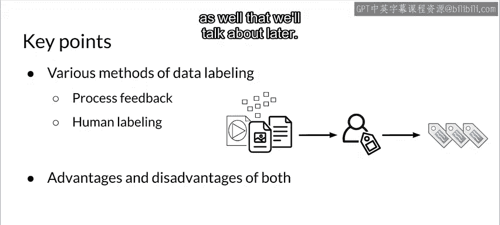

#  050：流程反馈与人工标注 📝

在本节课中，我们将学习为机器学习数据生成标签的两种最常见方法：流程反馈（或称直接标注）与人工标注。我们将探讨它们的工作原理、各自的优缺点，以及在实际生产环境中的应用场景。

---

## 概述

在监督学习中，模型需要带有标签的数据进行训练。然而，原始数据通常是无标签的。因此，如何高效、准确地为数据生成标签，是机器学习工程中的一个关键环节。本节将重点介绍两种最基础的标签生成方法。

---

## 流程反馈（直接标注） 🔄

上一节我们介绍了标签的重要性，本节中我们首先来看看流程反馈（或称直接标注）这种方法。这是一种通过监控系统运行结果，自动为模型预测数据打上标签的方法。

其核心思想是：收集模型在生产环境中进行推理请求时所用的特征数据，然后通过监控后续的系统反馈（如用户行为），为这些特征数据生成对应的标签。

**公式化描述**：
`标签 = 系统反馈(模型预测(特征))`

例如，在推荐系统中，模型根据用户特征预测其可能点击的项目。随后，系统可以监控用户是否真的点击了该推荐。点击行为可以作为一个“正”标签，未点击则作为“负”标签。

以下是流程反馈的主要特点：

*   **优点**：
    *   **标签信号强**：标签直接来源于真实世界的反馈（如点击、购买），非常可靠。
    *   **可持续生成**：只要系统在运行，就能持续产生新的带标签训练数据，便于模型迭代更新。
    *   **自动化程度高**：一旦流程建立，无需持续的人工干预。

*   **缺点**：
    *   **适用领域有限**：并非所有问题都能轻易获得这种直接的、自动化的反馈（例如，医疗诊断）。
    *   **系统设计复杂**：需要定制化开发数据管道，以关联推理请求和后续反馈（两者在时间上可能相隔数小时甚至数天）。
    *   **非通用方案**：解决方案高度依赖于具体的业务系统和问题。

在实施流程反馈时，日志分析是关键技术环节，因为反馈数据常来源于系统日志。

以下是几种常用的日志分析工具：

*   **开源工具**：
    *   **Logstash**：用于收集、解析和存储日志，可与 Elasticsearch 集成。
    *   **Fluentd**：云原生计算基金会旗下的项目，擅长从多种平台收集和统一日志数据。
*   **云服务商工具**：
    *   **Google Cloud Logging**：适用于 GCP 及混合云环境。
    *   **Amazon OpenSearch Service**：AWS 提供的 Elasticsearch 服务，可用于日志分析。
    *   **Azure Monitor**：微软 Azure 平台的监控与日志分析服务。

---

## 人工标注 👥

如果无法通过系统自动获得标签，人工标注便是另一种基础且广泛使用的方法。这种方法的核心是聘请标注员（人类）来检查原始数据并手动分配标签。

其流程可以概括为：从**未标注的原始数据**开始，交由**人工标注员**根据**明确的标注指南**进行审查和打标，最终形成可用于训练的**标注数据集**。

以下是实施人工标注的关键步骤：

1.  **准备数据与指南**：提供未标注的原始数据和清晰、具体的标注说明书。
2.  **招募标注员**：可以自行招募，或使用提供现成标注员池的专业服务（如亚马逊 Mechanical Turk）。
3.  **分配与标注**：将数据分发给标注员。通常，同一份数据会分给多人标注，以检验一致性。
4.  **收集与解决冲突**：回收标注结果，并处理不同标注员之间的分歧，以得到最终一致的标签。

以下是人工标注的主要特点：

*   **优点**：
    *   **适用范围广**：几乎任何类型的数据都可以通过人工进行标注。
    *   **能够处理复杂判断**：对于需要专业领域知识（如医学影像分析）或复杂逻辑判断的任务，人类标注员不可或缺。

*   **缺点**：
    *   **成本高昂**：尤其是需要领域专家（如放射科医生）参与时，人力成本非常可观。
    *   **速度缓慢**：人工处理每个数据样本需要时间，难以应对数据快速变化的场景。
    *   **质量不一致**：不同标注员对同一数据的判断可能存在分歧，需要额外的质量控制流程。
    *   **难以规模化**：由于成本和时间的限制，通常难以通过纯人工方式获得超大规模的数据集。

---

## 总结

本节课中我们一起学习了为机器学习生成训练标签的两种核心方法。

*   **流程反馈（直接标注）** 通过系统自动监控反馈来生成标签，适用于能获得明确行为反馈的场景（如推荐系统），优点是自动化、可持续，但系统设计复杂且适用面较窄。
*   **人工标注** 依靠人力为数据打标，几乎万能但成本高、速度慢，常用于缺乏自动反馈或需要专业知识的领域。

选择哪种方法，取决于具体问题的性质、数据的类型、对标签更新频率的要求以及项目预算。在实际生产中，有时也需要结合使用多种方法。后续课程中，我们还将探讨半监督标注、主动学习等更高级的标签生成技术。