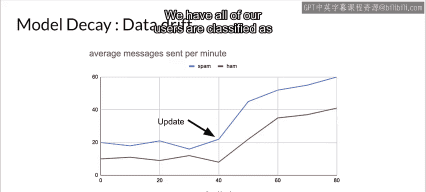
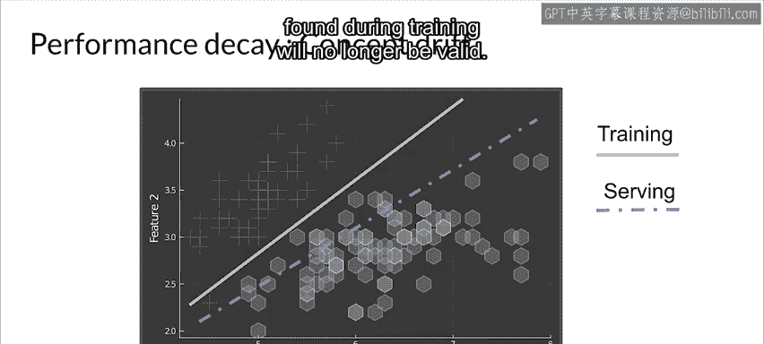
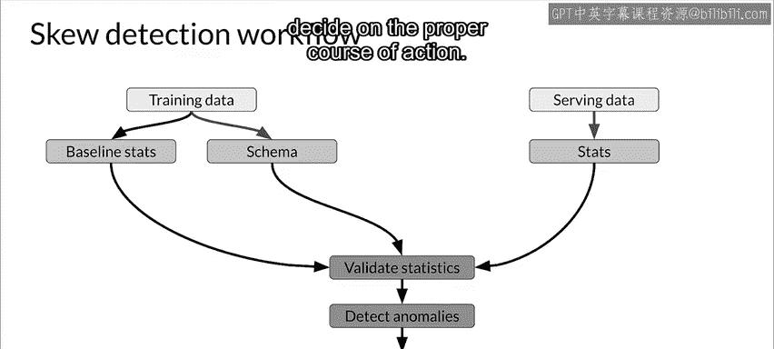

#  051：第10课 检测数据问题 📊

在本节课中，我们将学习如何验证数据并检测数据问题，特别是理解在机器学习生产实践中需要处理的各种数据漂移和偏斜问题。数据质量是模型性能的基石，糟糕的数据必然导致糟糕的模型输出。

---

## 数据漂移与偏斜的定义

上一节我们明确了数据质量的重要性，本节中我们来看看数据问题的具体类型。首先，我们需要区分两个核心概念：漂移和偏斜。

*   **漂移** 指的是数据随时间发生的变化。例如，每天收集的数据，在一周或一个月后，其统计特性可能已经发生了变化。
*   **偏斜** 指的是两个静态版本、来自不同来源但概念上相同的数据集之间的差异。例如，你的训练集和用于预测请求的服务数据之间的差异。

在一个典型的机器学习流水线中，无论是批处理还是在线处理，你都会遇到概念相同但来源不同的数据。这些数据拥有相同的特征向量，但会随时间发生变化。这意味着模型性能可能因系统故障而快速下降，也可能因数据或世界的变化而随时间衰减。我们将重点关注因训练数据与服务数据之间的问题而导致的性能衰减。

---

## 模型衰减与概念漂移

模型衰减通常由漂移引起，即特征的统计属性发生了变化。这可能是由于季节性、趋势、意外事件或世界本身的变化。

**示例**：一个应用在训练时，将每分钟发送20条或以上消息的用户分类为垃圾信息发送者。但在一次系统更新后，无论是垃圾信息发送者还是普通用户，都开始发送更多消息。此时，世界已经改变，导致模型将所有用户误分类为垃圾信息发送者。

**概念漂移** 是指标签的统计属性随时间发生了变化。在训练时，模型学习特征与标签之间的映射关系。在一个静态世界中这没问题，但在现实世界中，标签的分布和含义会改变，因此模型也需要随之改变，否则训练时找到的映射将不再有效。

---

## 偏斜的类型与检测

导致数据随时间变化的因素很多，包括上游数据变化、季节性和不断演变的业务流程。

以下是两种主要的偏斜类型：

*   **模式偏斜**：当训练数据和服务数据的模式不一致时发生。例如，你期望收到浮点数却收到了整数，或期望收到分类值却收到了字符串。
*   **分布偏斜**：训练数据集和服务数据集之间的分布出现差异。数据偏移可以通过协变量偏移、概念偏移等形式表现出来。

偏斜检测涉及在模型部署后，对流入服务的数据进行持续评估。为了检测这类变化，你需要对数据进行持续的监控和评估。

---

## 数据偏移的严格定义

让我们更严谨地定义一下我们讨论的漂移和偏斜类型。

*   **数据集偏移**：当特征 `X` 和标签 `Y` 的联合概率分布在训练时和服务时不同时发生。即数据随时间发生了偏移。
    *   **公式**：`P_train(X, Y) != P_serve(X, Y)`
*   **协变量偏移**：指训练数据和服务数据中输入变量分布的变化。换句话说，特征是 `X` 的边缘分布在训练和服务时不同，但条件分布保持不变。
    *   **公式**：`P_train(X) != P_serve(X)`，但 `P_train(Y|X) = P_serve(Y|X)`
*   **概念偏移**：指输入变量和输出变量之间关系的变化，而不是数据分布或输入本身的差异。换句话说，给定特征 `X` 时，标签 `Y` 的条件分布在训练和服务时不同，但特征 `X` 的边缘分布保持不变。
    *   **公式**：`P_train(Y|X) != P_serve(Y|X)`，但 `P_train(X) = P_serve(X)`

---

## 检测数据偏斜的工作流程

检测数据偏斜有一个直接的工作流程。

以下是具体步骤：

1.  **建立基线**：分析训练数据，计算基线统计量并定义参考模式。
2.  **分析服务数据**：对服务数据执行相同操作，生成描述性统计量。
3.  **比较差异**：将服务数据的基线统计量和实例与训练数据进行比较，寻找偏斜和漂移。
4.  **告警与处理**：显著的差异被视为异常，并触发警报。警报会发送给监控系统（可以是人或另一个系统），由其分析变化并决定采取适当的纠正措施。

---

本节课中我们一起学习了机器学习生产中的数据问题。我们明确了**漂移**（数据随时间变化）和**偏斜**（不同数据源间的静态差异）的定义，探讨了**模型衰减**和**概念漂移**的成因，并区分了**数据集偏移**、**协变量偏移**和**概念偏移**。最后，我们介绍了一个用于检测数据偏斜的标准化工作流程，包括建立基线、持续比较和触发警报修复。理解并监控这些数据问题是构建健壮、可持续的机器学习系统的关键。