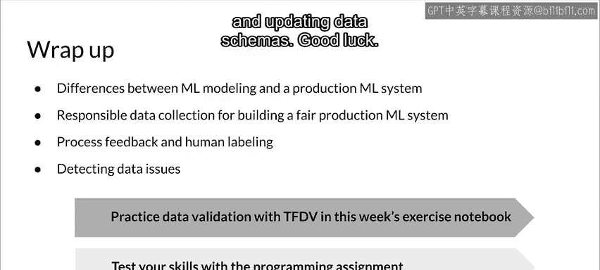

#  052：TensorFlow 数据验证 📊

在本节课中，我们将学习 TensorFlow Data Validation（TFDV）库。这是一个来自谷歌的工具，属于 TFX 生态系统的一部分。我们将了解如何使用 Python 进行数据验证，并理解其在生产规模机器学习系统中的重要性。

---

## 什么是 TensorFlow Data Validation？

上一节我们介绍了数据问题及其检测工作流的重要性。本节中，我们来看看 TensorFlow Data Validation（TFDV）这个具体的工具。

TFDV 帮助开发者在规模上理解、验证和监控他们的机器学习数据。谷歌每天使用 TFDV 分析和验证数百或数千个生产应用中的 PB 级数据。它帮助 TFX 用户维护其机器学习管道的健康。

TFDV 的核心功能包括：
*   生成数据统计信息并提供浏览器可视化。
*   推断数据模式，但需要开发者确保该模式合理。
*   基于统计信息和模式，检测数据中的问题或异常。
*   通过比较训练数据集和服务数据集，检查训练-服务偏差。

一个常见的用例是：持续检查新到达的数据，将其与从训练数据生成的参考模式中的预期进行验证。典型的设置是维护一个长期有效的模式，然后计算新数据的统计信息，并用这些统计信息根据原始模式来验证数据。

---

## 使用 TFDV 检测数据偏差

还记得我们讨论过的偏差检测吗？使用 TFDV，你可以轻松检测三种不同类型的偏差。

以下是 TFDV 可以检测的偏差类型：

1.  **模式偏差**：当服务数据和训练数据不遵循相同的模式时发生。例如，类型变更（期望是浮点数，实际是整数），或特征本身的变更。
2.  **特征偏差**：训练和服务之间特征值的变化。这可能是因为系统在训练和服务时使用了不同的数据源，或者数据本身发生了变化（如季节性、趋势）。有时，仅仅是因为训练模型和服务模型时使用了不同的代码路径进行相同的转换，导致了不同的结果。
3.  **分布偏差**：数据中单个特征分布的变化。例如，训练时某个特征的范围是 0 到 100，而服务时看到的数据在 5 到 600 之间。均值、中位数或标准差的变化都属于分布变化。偏差的严重程度决定了它是否构成问题，关键在于它是否足以影响模型性能。

TFDV 对分类特征执行偏差或漂移检测。偏差用 **L∞ 距离**（也称为切比雪夫距离）表示。你可以设置阈值，当漂移超过可接受范围时收到警告。

---

## TFDV 的功能与可视化

TFDV 提供了大规模数据的描述性统计（可处理 PB 级数据）和一些可视化工具，帮助你监控和理解数据。

其核心目标是：
*   理解数据的底层统计信息并进行比较。
*   比较训练、评估和服务数据集在统计上的差异（例如，它们是否具有相同的均值）。
*   计算、检测并修复数据异常。

---

## 本周内容回顾与总结

本节课中我们一起学习了 TFDV 的基础知识。现在，让我们回顾一下本周的核心内容。

本周，你看到了学术/研究环境与生产 ML 系统中的机器学习建模差异。我们讨论了负责任的数据收集以及如何构建公平的生产 ML 系统。我们学习了过程反馈、直接标记和人工标记。我们还研究了一些可能遇到的数据问题，以及如何识别和检测这些问题。

现在，我们将在本周的练习笔记本中实践使用 TFDV 进行数据验证。你将通过生成数据集统计信息、创建、比较和更新数据模式来测试你的编程技能。

祝你好运！🚀