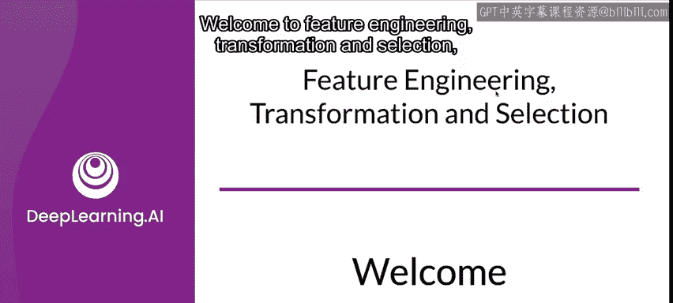
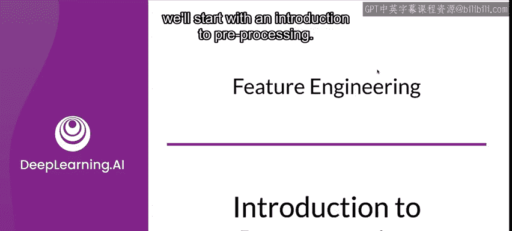
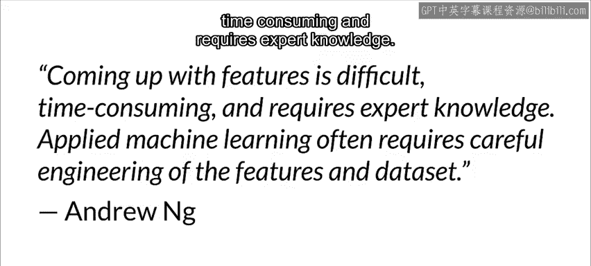
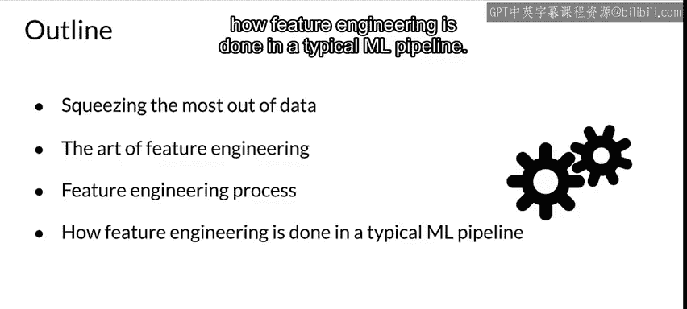
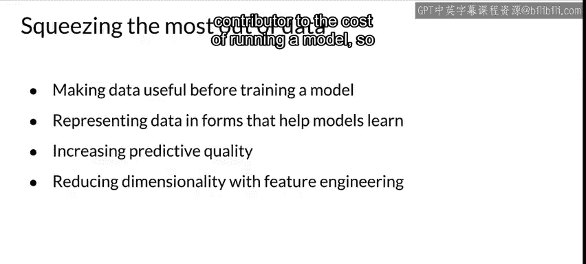
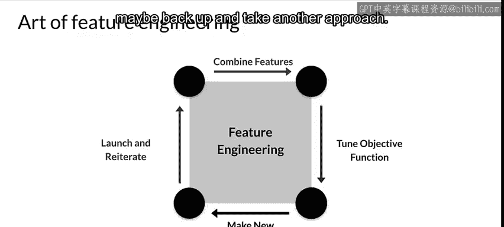
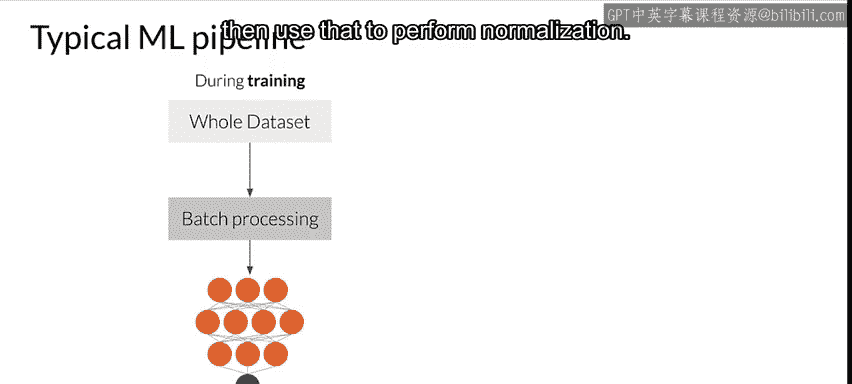
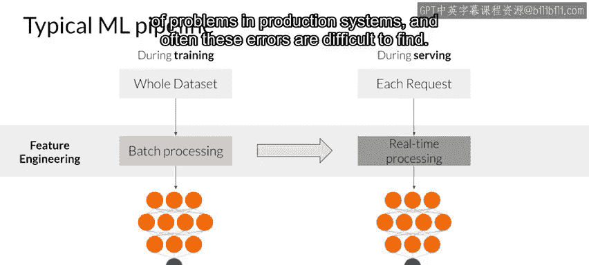
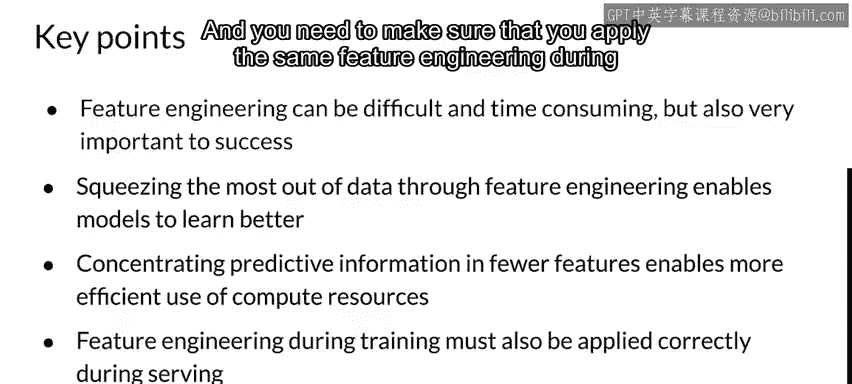

#  053：特征工程、转换与选择简介 🧠

在本节课中，我们将学习特征工程、转换与选择的基础知识。这些内容可能看起来像是复习，尤其是如果你之前学习过相关课程或在学术研究环境中工作过。但在这里，我们将重点关注生产环境中的问题，其中一个关键点是如何以可重复且一致的方式大规模执行这些操作。

---

## 概述

特征工程是应用机器学习中至关重要的一环。正如吴恩达所说：“构思特征很困难，耗时且需要专业知识。” 应用机器学习通常需要对特征和数据集进行细致的工程化处理。

接下来，我们将探讨如何从数据中提取最大价值，了解特征工程这门“艺术”，审视特征工程过程本身，并看看它在典型机器学习流水线中是如何实现的。

---

## 如何从数据中提取信息 📊

机器学习模型通常需要一些数据预处理来改进训练效果。你可能已经训练过足够多的模型，对此非常熟悉。但可能不太熟悉的是生产环境中涉及的一些问题，而这正是我们的重点。

数据的表示方式会极大地影响模型从中学习的能力。例如，当数值数据被**归一化**后，模型往往会更快、更可靠地收敛。

选择和转换输入数据的技术是提高模型预测质量的关键。此外，只要可能，就推荐进行**降维**，这样可以在增强数据表示和预测能力的同时，保留最相关的信息，并减少所需的计算资源。请记住，在生产环境中，计算资源是模型运行成本的主要组成部分。

---

## 特征工程的概念审视 🎨

特征工程这门“艺术”旨在提高模型的学习能力，同时尽可能减少其所需的计算资源。它通过对原始数据中的特征进行**转换、投影、消除和/或组合**，来形成数据集的新版本。

在典型的机器学习流水线中，你会整合原始特征（通常经过转换或投影到新空间）和/或特征的组合。必须正确调整**目标函数**，以确保模型朝着正确的方向前进，并且与你的特征工程保持一致。

你还可以通过从可用数据集中添加新特征来更新模型。与机器学习中的许多事情一样，这往往是一个迭代过程，随着迭代逐步改进结果（或者你希望如此）。你必须监控这个过程，如果没有改进，可能需要回退并尝试另一种方法。

---

## 训练与部署中的特征工程 🔄

特征工程通常以两种相当不同的方式应用。

**在训练期间**，你通常可以访问整个数据集，因此可以在特征工程转换中使用各个特征的全局属性。例如，你可以计算一个特征的**标准差**，然后用它来执行归一化。

**然而，在部署训练好的模型时**，你必须进行相同的特征工程，以便为模型提供与训练时相同类型的数据。例如，如果你在训练时为分类特征创建了**独热编码向量**，那么在部署模型时也需要创建等效的独热编码向量。

在训练和部署期间，你通常单独处理每个请求。因此，至关重要的是，如果你在训练时使用了特征的全局属性（如标准差），那么在部署时进行的特征工程中也必须包含这些属性。未能正确处理这一点是生产系统中一个非常常见的问题来源，而且这些错误往往难以发现。

---

## 总结

本节课我们一起学习了特征工程、转换与选择的核心概念。

回顾一些关键点：
*   正如吴恩达的引述所示，特征工程可能非常困难且耗时，但它对成功至关重要。
*   你需要从数据中榨取最大价值，而特征工程正是实现这一目标的手段。通过它，你的模型能够更好地学习。
*   你还需要确保将数据中的预测信息集中在尽可能少的特征中，以最佳且最经济的方式利用计算资源。
*   最后，你必须确保在模型部署时应用与训练时相同的特征工程流程。