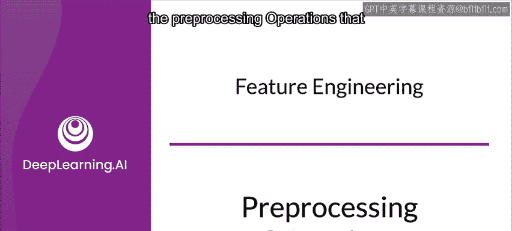
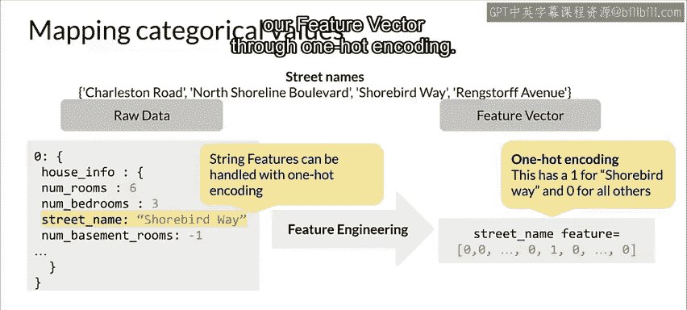
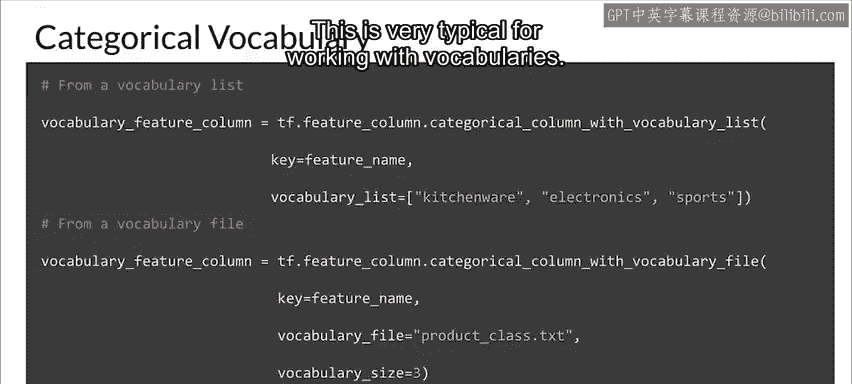
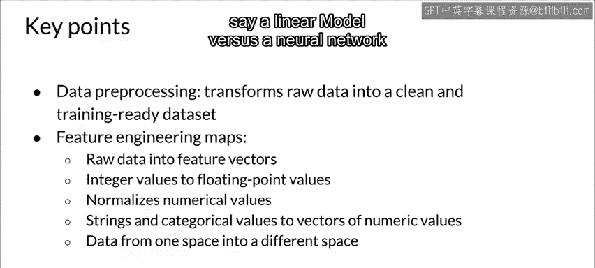

#  054：13_预处理操作 🛠️

在本节课中，我们将要学习机器学习中关键的预处理操作。这些操作是特征工程的核心，负责将原始数据转化为模型能够有效学习的格式。我们将探讨数据清洗、数值缩放、降维以及特征构建等主要技术，并了解如何根据数据类型（如文本、图像）应用特定的预处理方法。

## 从原始数据到特征向量

上一节我们介绍了特征工程的重要性，本节中我们来看看具体的映射过程。特征工程的核心在于分析原始数据，并从中创建出特征向量。

例如，整数数据可以映射为浮点数，数值数据可以进行归一化，而分类值则可以创建为独热编码向量。特征工程正是从原始数据中创建这些特征的过程。

以下是一个将分类特征转换为模型友好格式的示例：
*   我们有一个名为“街道名称”的分类特征。
*   我们通过独热编码对其进行特征工程处理。
*   最终，我们得到了特征向量中的一个特征。

创建词汇表是处理文本分类特征的另一种常见方式。TensorFlow等框架提供了相应的函数来实现。

## 主要预处理操作概述

以下是数据预处理中一些最主要的操作类型。请注意，这并非一份详尽的列表，但涵盖了关键部分。

**数据清洗**
数据清洗广义上指消除或纠正错误数据。

**数值变换**
通常需要对数据进行变换，例如对数值进行缩放或归一化。因为模型（尤其是神经网络）对数值特征的幅度或范围很敏感。数据预处理有助于机器学习构建更好的预测模型。

**降维**
降维通过创建更低维度、更鲁棒的数据表示来减少特征数量。

**特征构建**
特征构建可以通过多种技术来创建新特征，我们稍后会讨论其中一些。

## 处理分类特征：词汇表

对于分类特征，创建词汇表是一种标准做法。TensorFlow提供了两个不同的函数来创建分类词汇表列，其他框架也有类似功能。

**`categorical_column_with_vocabulary_list`**
此函数根据一个显式定义的词汇表列表，将每个字符串映射为一个整数。
*   `feature_name` 是一个字符串，对应分类特征。
*   `vocabulary_list` 是一个有序列表，用于定义词汇表。

**`categorical_column_with_vocabulary_file`**
此函数功能类似，但词汇表来源于文件。当词汇表过长时，它允许你将词汇放在一个单独的文件中。
*   在这种情况下，`vocabulary_list` 被定义为一个文件路径，该文件包含了词汇列表。

## 依据数据知识指导特征变换

我们对数据的理解（无论是领域专业知识还是处理不同类型数据的经验）能够指导我们如何转换特征，从而设计出更好的特征。

针对不同的数据类型，有截然不同的操作和预处理技术，可以帮助我们增加其预测信息。

**文本数据**
对于文本，我们有词干提取、词形还原、以及像TF-IDF、N-gram和词嵌入这样的归一化技术。这些技术真正聚焦于词语的语义价值，这是我们作为数据科学家或机器学习工程师所应掌握的处理文本数据的知识。

**图像数据**
图像处理类似。我们知道一些方法可以提升图像的预测质量，例如：
*   裁剪
*   调整大小
*   模糊处理
*   使用Canny滤波器、Sobel滤波器等滤波器
*   应用其他光度畸变

所有这些方法都能真正帮助我们处理图像数据，以改善其预测质量。

## 关键要点总结

本节课中我们一起学习了数据预处理与特征工程的核心概念。

**数据预处理**是一种将原始数据转换为对训练模型有用的数据的技术。

**特征工程**则包括映射原始输入数据，并利用针对不同数据类型的各种技术从中创建特征向量。它还可以包括将数据从一个空间映射到另一个空间，这根据模型特性（例如线性模型与神经网络）的不同，会对模型的学习效果产生重大影响。

记住一个故事：我曾因匆忙而跳过数据归一化步骤，结果模型无法收敛。在花费时间调整超参数和模型结构后，才想起是归一化的问题。希望这个教训能帮助你避免类似的失误。