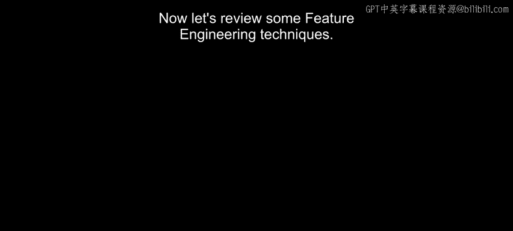
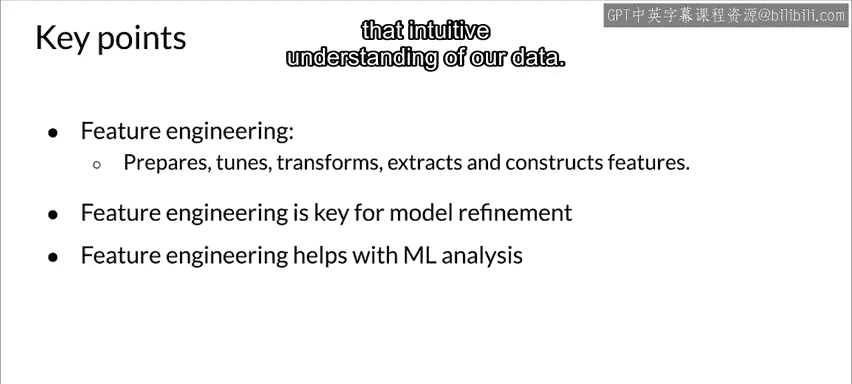

#  055：特征工程技术 🛠️

在本节课中，我们将学习特征工程的核心技术。特征工程是数据预处理的关键步骤，它通过转换和优化原始数据，使其更适合机器学习模型。我们将探讨特征缩放、分桶、降维等基本技术，并理解它们如何影响模型性能。

---

## 特征缩放基础

上一节我们介绍了特征工程的重要性，本节中我们来看看特征缩放的具体方法。特征缩放旨在将数值特征转换到标准范围内，以帮助模型更高效地学习。

以下是几种常见的特征缩放技术：

*   **归一化 (Normalization / Min-Max Scaling)**
    归一化将数据线性缩放到 [0, 1] 区间。其**公式**为：
    `x_normalized = (x - min(x)) / (max(x) - min(x))`
    这种方法适用于数据分布不遵循高斯（正态）分布的情况。需要注意的是，计算最小值和最大值需要对整个数据集进行一次完整遍历。

*   **标准化 (Standardization / Z-score Normalization)**
    标准化基于数据的均值和标准差进行缩放，使数据均值为0，标准差为1。其**公式**为：
    `x_standardized = (x - mean(x)) / std(x)`
    标准化后的数据范围不固定，可包含负值。当数据近似服从正态分布时，标准化是一个很好的起点。

在实际应用中，建议尝试**归一化**和**标准化**两种方法，并比较模型效果，因为不同数据集和模型对缩放方式的响应可能不同。

---

## 分桶与离散化

了解了数值特征的连续缩放后，我们来看一种将连续值转换为类别特征的技术：分桶。

有时，直接将一个数值（如房屋建造年份）输入模型效果不佳。通过将其分组到不同的“桶”中，可以更好地捕捉其内在意义。例如，1960年和1961年的差异，远不如1960年和1970年的差异重要。

以下是分桶的一个示例：
原始特征：`建造年份 = 1960`
分桶后（例如按年代）：`[1960-1969]`
进一步进行**独热编码 (One-Hot Encoding)**，可能表示为：`[0, 1, 0, 0, ...]`

这种技术有助于模型学习更有意义的模式，同时也是探索和理解数据分布的有效可视化手段。

---

## 降维与其他技术

除了缩放和分桶，特征工程还包含其他高级技术，用于处理高维数据或创造新的特征。

*   **降维技术**
    当特征维度很高时，降维可以帮助我们理解和可视化数据，同时可能提升模型效率。
    *   **主成分分析 (PCA)**：将数据投影到方差最大的几个主成分上。
    *   **t-分布随机邻域嵌入 (t-SNE)**：常用于高维数据的可视化，能较好地保留局部结构。
    *   **统一流形逼近与投影 (UMAP)**：另一种降维和可视化技术，在保留全局结构方面可能有优势。

*   **特征交叉与可视化**
    特征交叉是指将两个或多个特征组合，以捕捉它们之间的交互作用。对于由嵌入（如词向量）构成的高维数据，使用像 **TensorFlow Embedding Projector** 这样的工具进行可视化至关重要。它可以帮助我们直观地看到数据点在空间中的聚类情况，从而形成对数据的“直觉”，这是特征工程中“艺术性”的一部分。

---

## 本节总结 🎯

本节课中我们一起学习了特征工程的核心技术。
我们首先介绍了**特征缩放**，包括归一化和标准化的原理与应用场景。
接着，我们探讨了**分桶技术**，它如何将连续值转化为更具表达力的类别特征。
最后，我们概述了**降维方法**（如PCA、t-SNE）和**可视化工具**的重要性，它们能帮助我们在高维空间中理解数据。

特征工程是连接原始数据与机器学习模型的桥梁，精心设计的特征能显著提升模型的性能与收敛速度。掌握这些技术，是成为一名优秀机器学习工程师的关键一步。