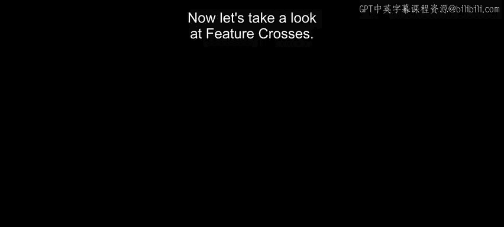
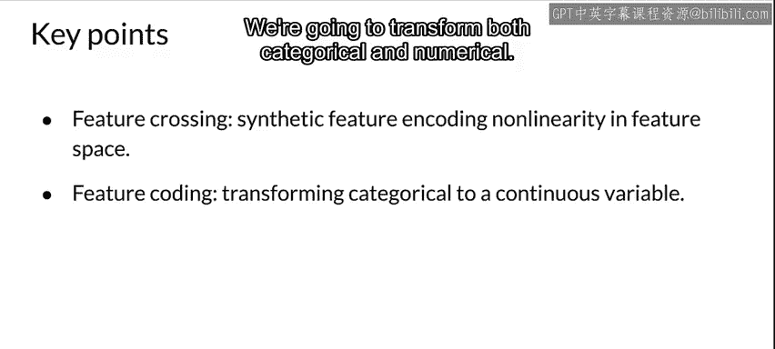
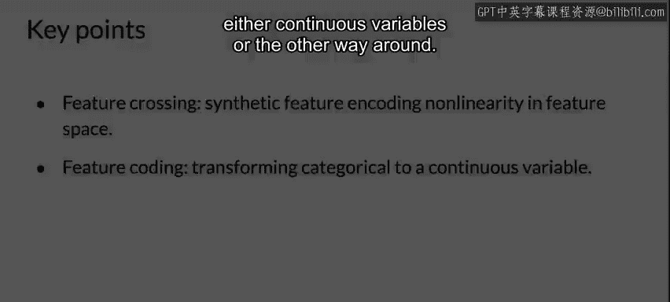

#  056：交叉特征与特征编码 🧩

在本节课中，我们将学习特征工程中的两个重要概念：**交叉特征** 与 **特征编码**。我们将了解如何通过组合现有特征来创建新的合成特征，以及如何对特征进行编码以更好地适应模型。

---

## 交叉特征介绍

上一节我们讨论了特征工程的基础，本节中我们来看看**交叉特征**。交叉特征是本节将要讨论的核心内容。

交叉特征的本质是将多个特征组合在一起，形成一个新的特征。它能在特征空间中编码非线性关系，或者用更少的特征表达相同的信息。

我们可以创建多种类型的交叉特征，这很大程度上取决于我们的数据。因此，这需要一些想象力来寻找组合现有特征的方法。

以下是创建交叉特征的几种常见方式：
*   **数值特征相乘**：例如，将两个数值特征相乘，生成一个表达两者关系的新特征。如果我们有多个数值特征，甚至可以将它们全部相乘，最终得到一个特征，而不是原来的五个。
*   **组合分类与数值特征**：以符合语义逻辑的方式组合特征。例如，如果我们有“星期几”和“小时”这两个特征，可以将它们组合成“一周中的第几个小时”，从而在一个特征中表达相同的信息。

---

## 特征编码示例

现在让我们快速了解一下特征编码。特征编码是将特征转换为更适合机器学习模型处理格式的过程。

假设我们有一个数据集，用于区分健康树木和患病树木。我们使用散点图来理解数据，并问自己：能否画一条线来分隔这两个数据簇？

如果能用一条线创建决策边界，那么我们知道可以使用线性模型，这非常高效。

但是，假设数据分布如下图所示，问题就变得非线性了。此时的问题是：我们能否将数据投影到一个线性空间，以便使用线性模型？还是必须使用非线性模型来处理这些数据？因为如果尝试在原始数据上绘制线性分类边界，效果不会很好。

可视化工具能帮助我们理解这一点。审视数据能有效指导我们作为开发者，在选择模型类型和应用何种特征工程时做出决策。

---

## 核心要点总结

本节课中我们一起学习了交叉特征与特征编码。

关键点总结如下：
*   **交叉特征** 是一种创建合成特征的方法，常用于在特征空间中编码非线性关系。
*   我们可以转换特征，特别是分类特征（实际上数值特征也可以），将其转换为连续变量，或进行其他形式的转换。

通过巧妙地组合和编码特征，我们可以帮助模型更好地理解数据中的复杂模式，即使使用相对简单的线性模型也能解决非线性问题。