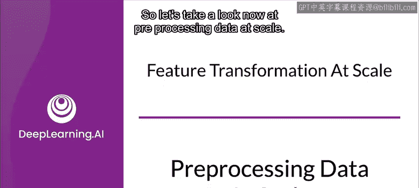
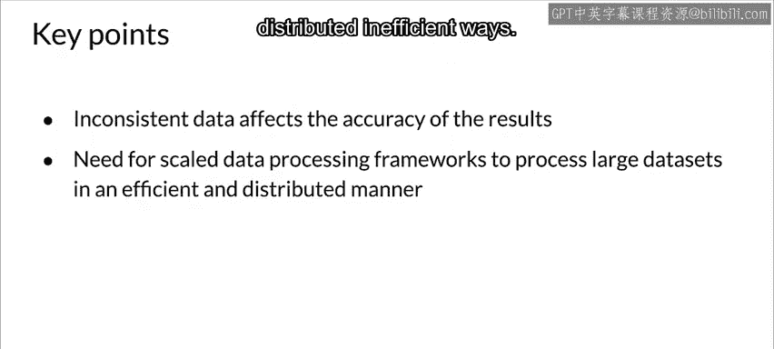

#  057：🚀 大规模数据预处理

在本节课中，我们将要学习如何在生产环境中进行大规模的数据预处理和特征工程。我们将探讨从笔记本环境到生产环境的转变所带来的挑战，并介绍确保处理过程可重复、一致且高效的关键策略。

---

我们可能都进行过特征工程。但在笔记本中处理几百兆字节的数据是一回事，而在生产环境中以可重复、自动化的流程处理可能高达数TB的数据，则是另一回事。现在，让我们来看看如何进行大规模的特征工程。

在笔记本中进行一次性的转换和特征工程是一回事，但在生产环境中以可重复、一致的方式进行大规模处理则是另一回事。因此，我们现在来探讨大规模数据预处理。

首先，让我分享一个故事。我曾在一个生产环境中担任数据科学家，我们将生产负载部署在Apache Storm上。这个平台性能不错。我们作为数据科学家在笔记本中创建模型，然后将其部署到Apache Storm中。然而，过程并不简单：我们在Python中开发笔记本，但部署到Storm时，必须将所有特征工程代码转换为Java。可以想象，这并不理想，并且经常出现一些难以排查的奇怪问题。这不是进行生产级机器学习的理想方式。

更好的技术是使用一个统一的**流水线（pipeline）**框架，它允许你以一致且可重复的结果进行训练和部署。我们将在本课程中学习这一点。现在，让我们看看大规模特征工程面临的一些问题。

以下是我们要讨论的内容：
*   **特征工程中的不一致性**：非常重要。
*   **预处理的粒度**：在生产环境中也是一个有趣的问题。
*   预处理训练数据是一回事，而为实例级转换进行优化则有所不同，但你需要应对许多挑战。

为了进行大规模数据预处理，我们从现实世界的数据模型开始，这些数据可能高达TB级别。在进行这类工作时，你希望从一个数据子集开始，尽可能多地解决问题，并思考如何扩展到处理整个数据集所需的TB级别。

大规模数据处理框架与你将在笔记本电脑或笔记本中使用的工具不同。因此，你需要从流程一开始就思考如何应用这些框架。越早开始使用这些框架，你就能越早地用较小的数据集和更快的周转时间解决问题。

**训练与部署间转换的一致性**至关重要。如果在部署模型时进行的转换与训练时不同，你将会遇到问题，而且这些问题通常很难发现。

以下是特征工程中不一致性的具体表现：

*   **训练与部署的代码路径**：训练模型时使用一套代码（例如Python），而部署时可能使用另一套代码（例如Java），这是潜在的问题来源。
*   **不同的部署场景**：你可能在不同的环境中部署模型，例如在服务集群中使用，同时也在物联网设备上使用。不同的部署目标有不同的CPU或计算资源限制（例如移动设备资源紧张，服务器则宽松些），需要考虑这些因素。
*   **引入训练-部署偏差的风险**：由于训练和部署间的代码路径不同，如果两者间的转换不完全一致（最佳做法是使用完全相同的代码），就会导致模型性能下降。模型可能完全出错、给出奇怪结果，或在某些情况下出现轻微偏差，这些更难检测。

接下来，我们需要考虑预处理的**粒度**。你需要在两个层面进行转换：**实例级**和**全数据遍历级**。根据你进行的转换类型，可能需要选择其中一种或另一种。通常你总是可以进行实例级转换，但全数据遍历则需要整个数据集。

以下是不同转换类型对粒度的要求示例：

*   **裁剪（Clipping）**：即使进行裁剪，也需要设定边界。如果不是任意设定，而是基于数据集本身来确定如何裁剪，那么就需要进行全数据遍历以确定最小值和最大值。
*   **乘法（Multiplication）**：在实例级别进行即可。
*   **缩放（Scaling）**：通常需要标准差，可能还需要最小值和最大值，因此可能需要全数据遍历。
*   **分桶（Bucketizing）**：除非提前知道分桶边界，否则需要全数据遍历来确定合理的分桶区间。
*   **特征扩展（Expanding features）**：通常可以在实例级别完成。

在训练时，我拥有整个数据集，因此可以进行全数据遍历（尽管可能成本高昂）。在部署时，我收到的是单个样本，因此只能进行实例级转换。任何需要整个数据集特征的转换，我都必须将计算出的信息（如标准差）保存下来，以便在部署时使用。

那么，何时进行转换呢？你可以预处理整个训练数据集。这样做的好处是每个训练会话只运行一次，并且是在整个数据集上计算。但缺点是，你必须在部署时重现所有这些转换，或者保存从数据中学到的信息（如标准差）以供后续部署使用。此外，每次更改都需要对整个数据集进行一次完整的遍历，迭代速度较慢。

另一种方法是在**模型内部进行转换**。这样做的好处是迭代更容易，因为转换作为模型的一部分被嵌入，并且能保证转换的一致性。但缺点是，执行这些转换可能成本高昂，尤其是在计算资源有限的情况下。在模型内部进行转换意味着部署时也会进行同样的转换，而训练时可能使用GPU或TPU，部署时则可能没有。这可能导致模型延迟增加，影响响应时间。此外，如果未保存所需的常量（如用于归一化的均值），也可能出现问题。

你还可以选择**按批次（per batch）进行转换**，而不是针对整个数据集。例如，你可以根据批次内的平均值来归一化特征。这只需要遍历每个批次，而不是整个数据集。在处理TB级数据时，这在处理效率上是一个显著优势。你也可以按批次进行归一化，例如计算一个批次的平均值并用其进行归一化，然后对下一个批次重复此过程。批次之间会存在差异，有时这是有益的（例如在时间序列数据中，这能适应随时间的变化），但你需要考虑这一点。例如，按批次平均值进行归一化，预计算平均值并在归一化中使用，可以用于多个批次。这是在处理大型数据集时需要考虑的不同方法。

你还需要考虑**优化实例级转换**，因为这会影响训练效率和部署效率。你需要考虑加速器（如GPU）的使用情况，避免在CPU进行转换时让昂贵的加速器闲置。解决方案之一是**预取（prefetching）**。通过预取，你可以用CPU预取数据并馈送给加速器（GPU或TPU），尝试并行化处理过程。这最终都关系到成本、训练所需的时间以及效率。

---

**总结**

本节课我们一起学习了大规模数据预处理的挑战与策略。关键点包括：

*   **不一致的数据会影响结果的准确性**。
*   **可扩展的数据处理框架**允许我们以分布式和高效的方式处理大型数据集。
*   我们还需要思考这些处理如何应用于模型部署阶段。

我们必须平衡模型的预测性能与其实现要求。如果要对训练数据进行全数据遍历转换，就需要考虑这在模型部署时如何工作，并保存必要的常量。同时，我们需要优化实例级转换以提高训练效率，预取等技术对此很有帮助。