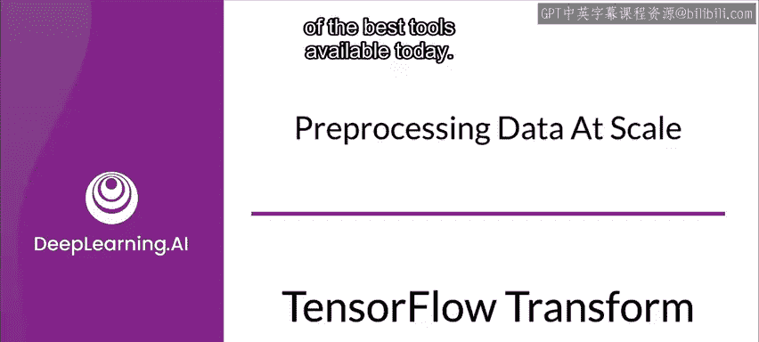
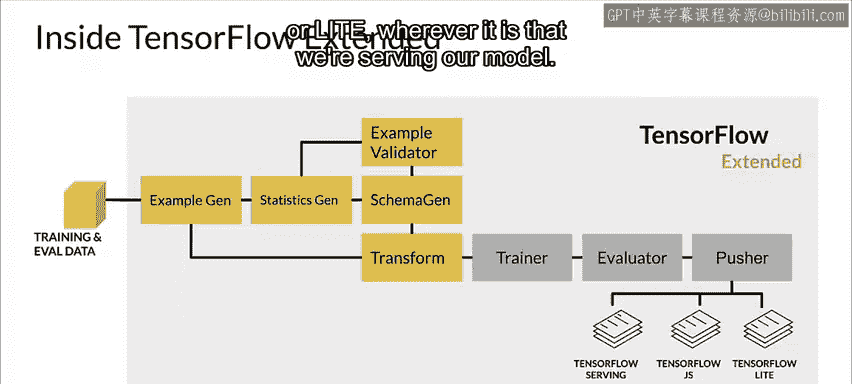
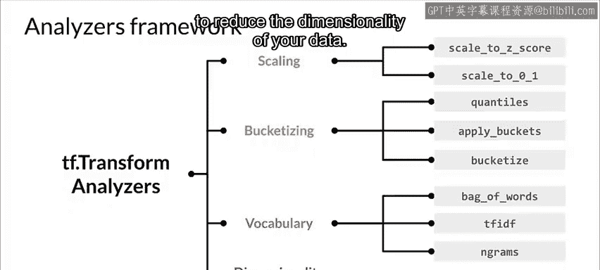
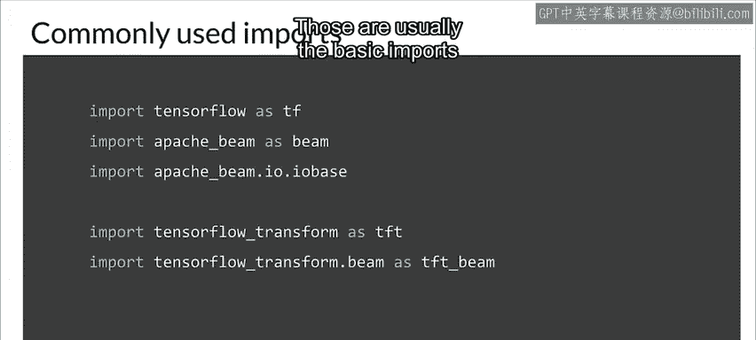

#  058：TensorFlow Transform 详解 🛠️



在本节课中，我们将深入学习 TensorFlow Transform（TFT）这一工具。我们将探讨它的工作原理、核心优势以及如何在实际的机器学习流水线中应用它进行大规模数据预处理。

## 概述：为什么需要 TensorFlow Transform？

为了进行大规模的数据预处理，我们需要高效的工具。TensorFlow Transform 是当前可用的最佳工具之一。

上一节我们介绍了大规模数据预处理的必要性，本节中我们来看看 TensorFlow Transform 的具体工作机制。

## TensorFlow Transform 的工作流程

首先，我们来看看它的工作流程。TensorFlow Transform 接收训练数据，对其进行处理，最终将处理结果部署到服务系统中。在这个过程中，一个流水线被使用，而元数据在组织和管理数据转换过程中产生的工件（Artifacts）方面扮演着关键角色。这很重要，原因之一是我们希望理解这些工件的来源，并能够追踪生成它们的操作链。

以下是其核心流程：
*   **输入**：训练数据作为系统输入，形成一个工件。
*   **转换**：Transform 组件接收原始数据，通过特征工程将其转换为实际可用的形式。
*   **训练**：转换后的数据被交给训练器（Trainer）进行模型训练。Transform 和 Trainer 都是 ML 流水线（特别是 TFX ML 流水线）中的组件。
*   **输出**：训练器产生一个训练好的模型（也是一个工件），该模型被交付给服务系统，用于运行推理。

从另一个视角看，流程始于训练和评估数据。数据集通过 ExampleGen 组件进行拆分。拆分后的数据被送入 StatisticsGen 组件（这些都是 TFX 流水线中的组件）。StatisticsGen 为数据计算统计信息，例如数值特征的均值、标准差、最小值、最大值等。这些统计信息被送入 SchemaGen 组件，后者推断每个特征的类型，从而创建一个模式（Schema）。下游组件（如 ExampleValidator）会使用这个模式和统计信息来检查数据中的问题。

接着，Transform 组件登场。它会接收生成的模式（Schema）和原始拆分的数据集，并执行我们的特征工程。因此，Transform 是特征工程发生的地方。处理后的数据交给 Trainer，由 Evaluator 评估结果，最后由 Pusher 推送到部署目标（如 TensorFlow Serving、TensorFlow Lite 或 TensorFlow.js）。



## Transform 组件的内部机制

如果我们深入观察 Transform 组件内部，它会接收来自 ExampleGen 和 SchemaGen 的输入，即原始拆分的数据和生成的模式。这个模式很可能已经过开发者的审查和改进，这个过程称为“模式治理”（curating the schema）。

Transform 还需要接收大量用户代码，因为我们需要通过代码来表达想要进行的特征工程类型。例如，如果要标准化一个特征，我们需要提供用户代码来指示 Transform 执行此操作。

Transform 的输出是一个 TensorFlow 计算图（称为转换图）以及转换后的数据本身。转换图以 TensorFlow 图的形式表达了我们对数据所做的所有转换。转换后的数据就是执行这些转换的结果。这两者都会被提供给 Trainer 用于训练。

## 核心概念：分析器与转换图

我们使用 TF Transform API 来表达想要进行的特征工程。Transform 组件将此代码提交给 Apache Beam 分布式处理集群进行处理。这使我们有能力处理可能高达 TB 级别的数据。

在这个过程中，分析器（Analyzers）发挥着关键作用。分析器会对整个数据集进行一次完整的遍历，以收集进行特征工程时所需的常量。例如，如果我们要进行最小-最大缩放，就需要遍历整个数据集以了解每个相关特征的最小值和最大值。分析器会收集这些常量，并表达将要执行的操作。它们的行为类似于 TensorFlow 操作，但只在训练期间运行一次，然后被保存为图的一部分。

例如，使用 `tft.min`（Transform SDK 中的一个方法）会计算张量在整个训练数据集上的最小值。

其应用方式如下：
1.  我们有一个代表特征工程的图。
2.  我们运行分析器遍历数据集以收集所需的常量。
3.  这使得我们能够在后续将常量应用到转换图中，从而能够转换单个样本，而无需再次遍历整个数据集。

这个图在训练期间被应用，并且在服务期间应用完全相同的图。这消除了训练和服务之间因代码路径不同而导致差异的可能性，确保了转换的一致性。

## TensorFlow Transform 的主要优势

使用 TensorFlow Transform 带来了多重好处：
*   **统一的转换图**：Transform 生成的图包含了所有必要的常量和转换。
*   **训练时专注预处理**：它专注于在训练时进行数据预处理并生成转换图。
*   **训练与服务一致性**：该图在训练和服务期间以相同的方式内联运行，并被预置到训练模型中。因此，在服务时不需要额外的预处理代码。
*   **平台无关性**：无论部署到哪个平台（TensorFlow Serving、TensorFlow Lite 移动设备或 TensorFlow.js 浏览器环境），都能一致地应用这些转换。

## 分析器框架的功能

分析器框架支持多种特征转换操作：
*   **缩放**：例如使用 Z-score 标准化，或在 0 和 1 之间进行缩放。
*   **分桶**：例如按分位数进行分桶，或设置一组桶并将数值分配到这些桶中，从而为数值范围创建分类值。
*   **词汇表处理**：例如在文本处理中，运行 TF-IDF、词袋模型或 N-grams 时，通常需要处理词汇表。
*   **降维**：例如可以执行 PCA 转换来降低数据的维度。

## 代码示例：编写预处理函数

现在让我们看一些代码。我们将创建一个预处理函数，这是定义用户代码的入口点，用于表达我们要进行的特征工程。

例如，我们可能遍历数据寻找浮点型特征，并对它们进行 Z-score 标准化。以下是一个示例代码风格：

```python
def preprocessing_fn(inputs):
    # 假设 FLOAT_FEATURE_KEYS 是一个浮点特征键的列表
    outputs = {}
    for key in FLOAT_FEATURE_KEYS:
        outputs[key] = tft.scale_to_z_score(inputs[key])
    return outputs
```

对于词汇表特征，处理方式非常相似：

```python
def preprocessing_fn(inputs):
    outputs = {}
    # 假设 VOCAB_FEATURE_KEYS 是需要词汇表处理的特征键列表
    for key in VOCAB_FEATURE_KEYS:
        outputs[key] = tft.compute_and_apply_vocabulary(inputs[key])
    return outputs
```



对于分桶特征，逻辑类似，`BUCKET_FEATURE_KEYS` 常量只是我们想要分桶的特征键列表。

## 必要的导入

使用 Transform 时，通常需要以下基本导入：

```python
import tensorflow as tf
import apache_beam as beam
from apache_beam.io import tfrecordio  # 用于不同格式的I/O
import tensorflow_transform as tft
import tensorflow_transform.beam as tft_beam
```

请注意，Transform 使用 Apache Beam 在集群上分布式处理。你也可以在单机（如笔记本电脑）上使用 Beam 的 Direct Runner，这在开发阶段处理小量数据时非常有用。在正式部署中，除非数据量很小，否则可能需要更强的计算能力。

## 总结



本节课中，我们一起深入学习了 TensorFlow Transform。我们了解了它如何在大规模机器学习流水线中作为核心预处理工具，通过分析器收集数据集常量并生成统一的转换图，确保了从训练到服务整个流程中特征工程的一致性、高效性和平台无关性。我们还通过代码示例，了解了如何编写预处理函数来定义具体的特征转换逻辑。掌握 TensorFlow Transform 是构建可靠、可扩展的机器学习生产系统的重要一步。