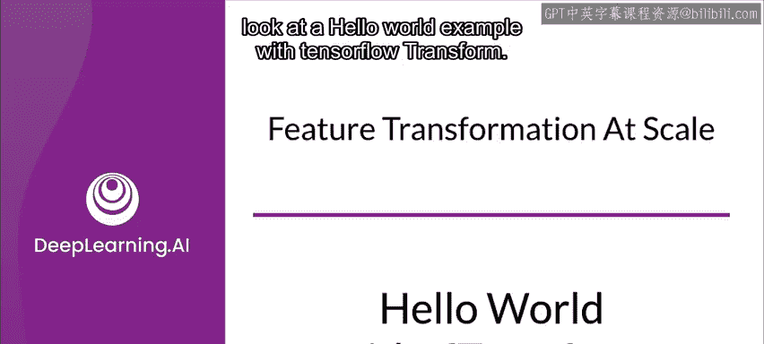
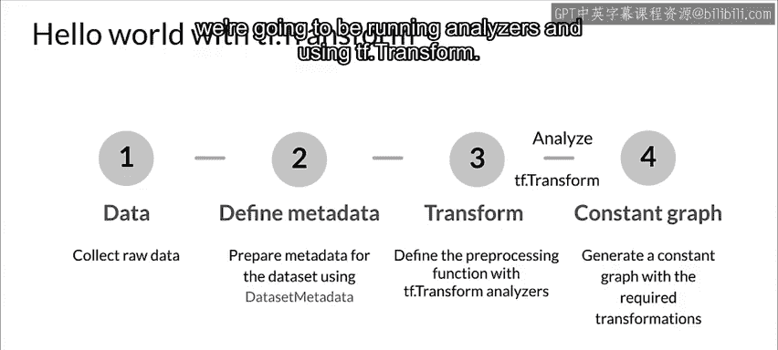
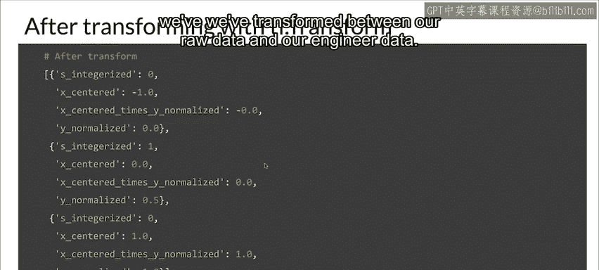
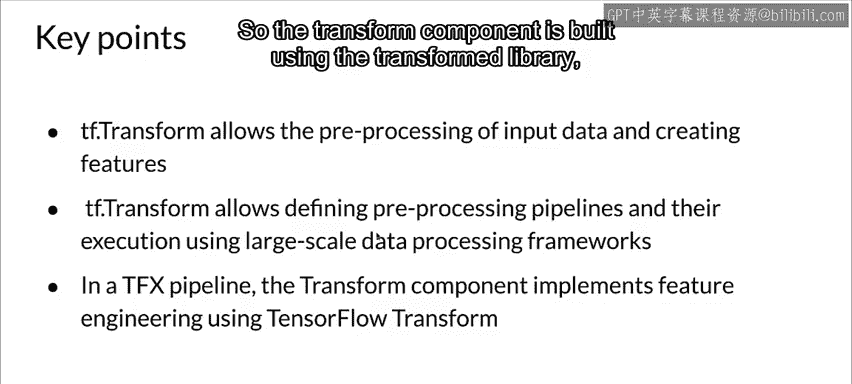
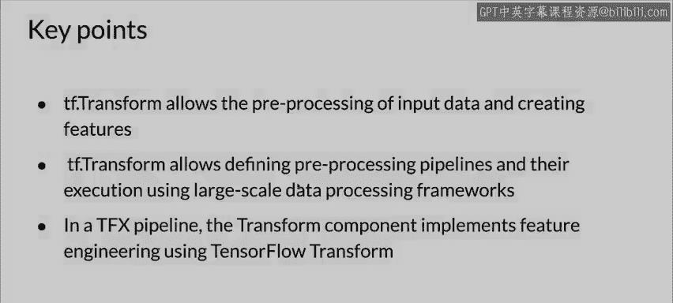

#  059：使用 TF Transform 的 Hello World 🌟



在本节课中，我们将学习如何使用 TensorFlow Transform 进行特征工程。我们将通过一个简单的示例，展示如何将原始数据转换为可用于机器学习模型的特征。我们将涵盖数据收集、元数据定义、预处理函数编写以及使用 Apache Beam 执行转换的完整流程。

---

## 数据收集与元数据定义



首先，我们需要收集一些原始数据。在本示例中，我们使用一些为演示创建的静态数据。数据包含三个特征：`X`、`Y` 和 `S`。

接下来，我们使用 TensorFlow Transform 的元数据模块来定义这些特征的类型和信息。我们通过创建一个特征规范（Feature Spec）来实现这一点。特征规范描述了每个特征的类型和结构。

以下是定义元数据的代码示例：

```python
import tensorflow_transform as tft

# 定义特征规范
feature_spec = {
    'X': tf.io.FixedLenFeature([], tf.float32),
    'Y': tf.io.FixedLenFeature([], tf.float32),
    'S': tf.io.FixedLenFeature([], tf.string)
}
```

在这个示例中，`X` 和 `Y` 是固定长度的浮点特征，而 `S` 是固定长度的字符串特征。

---

## 编写预处理函数

预处理函数是用户代码的入口点，用于定义特征工程的具体操作。在这个函数中，我们将对原始数据进行转换，生成新的特征。

以下是预处理函数的代码示例：

```python
def preprocessing_fn(inputs):
    # 提取输入特征
    x = inputs['X']
    y = inputs['Y']
    s = inputs['S']
    
    # 对 X 进行中心化处理
    x_centered = x - tft.mean(x)
    
    # 对 Y 进行归一化处理，缩放到 [0, 1] 范围
    y_normalized = tft.scale_to_0_1(y)
    
    # 为字符串特征 S 创建词汇表并转换为整数
    s_integerized = tft.compute_and_apply_vocabulary(s)
    
    # 创建特征交叉：X_centered * Y_normalized
    feature_cross = x_centered * y_normalized
    
    # 返回转换后的特征
    return {
        'x_centered': x_centered,
        'y_normalized': y_normalized,
        's_integerized': s_integerized,
        'feature_cross': feature_cross
    }
```

在这个预处理函数中，我们执行了以下操作：
- 对 `X` 进行中心化处理，减去其均值。
- 对 `Y` 进行归一化处理，将其缩放到 [0, 1] 范围。
- 为字符串特征 `S` 创建词汇表，并将其转换为整数。
- 创建了一个特征交叉，将中心化后的 `X` 与归一化后的 `Y` 相乘。

---

## 执行转换流程

现在，我们将使用 Apache Beam 来执行转换流程。虽然在实际的 TFX 管道中，我们通常会使用 Transform 组件，但这里我们直接使用 TensorFlow Transform 库来演示。

以下是执行转换的代码示例：

```python
import apache_beam as beam
import tensorflow_transform.beam as tft_beam

def main():
    # 建立 Apache Beam 上下文
    with beam.Pipeline() as pipeline:
        # 定义 Beam 管道
        raw_data = pipeline | 'ReadRawData' >> beam.Create([...])  # 原始数据
        raw_data_metadata = ...  # 原始数据元数据
        
        # 执行转换
        transform_fn = (
            (raw_data, raw_data_metadata)
            | tft_beam.AnalyzeAndTransformDataset(preprocessing_fn)
        )
        
        # 获取转换后的数据和元数据
        transformed_data, transform_metadata = transform_fn
        
        # 打印结果
        print("原始数据：", raw_data)
        print("转换后的数据：", transformed_data)

if __name__ == "__main__":
    main()
```

在这个示例中，我们使用 Apache Beam 管道来执行转换。`AnalyzeAndTransformDataset` 函数会调用我们的预处理函数，并返回转换后的数据和元数据。

---

## 转换结果对比

在执行转换之前，原始数据如下所示：

```
原始数据：
X: [1, 2, 3]
Y: [10, 20, 30]
S: ["a", "b", "c"]
```

执行转换后，我们得到以下特征：

```
转换后的数据：
x_centered: [-1, 0, 1]
y_normalized: [0.0, 0.5, 1.0]
s_integerized: [0, 1, 2]
feature_cross: [-0.0, 0.0, 1.0]
```



通过转换，原始数据被成功转换为可用于机器学习模型的特征。

---

## 核心要点总结

在本节课中，我们一起学习了如何使用 TensorFlow Transform 进行特征工程。以下是本课程的核心要点：

1. **数据预处理与特征工程**：TensorFlow Transform 允许对输入数据进行预处理，并创建新的特征。
2. **大规模数据处理**：通过 Apache Beam，可以在大规模数据处理框架（如 Spark、Flink 或 Google Cloud Dataflow）上运行预处理管道。
3. **TFX 集成**：在 TFX 管道中，Transform 组件使用 TensorFlow Transform 库来实现特征工程。





通过本课程的学习，你应该能够理解如何使用 TensorFlow Transform 进行简单的特征工程，并将其应用于实际的数据处理流程中。