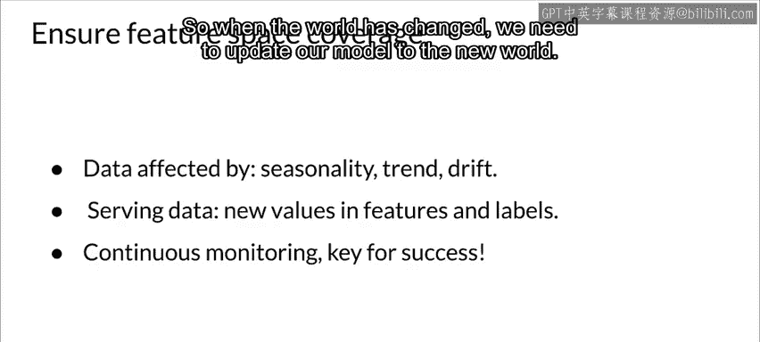

#  060：19_特征空间 🧭

在本节课中，我们将要学习**特征空间**这一核心概念。特征空间是理解数据分布和模型行为的基础。我们将探讨特征空间的定义、重要性，以及如何确保训练数据与生产数据在特征空间上的一致性。

---

## 特征空间简介 🗺️

特征空间是由数据特征定义的N维空间。如果你的数据有两个特征，特征空间就是二维的；如果有三个特征，就是三维的，以此类推。特征空间仅包含特征本身，不包括目标标签。

假设你的特征向量是 **x**，其维度为 **D**，那么它就定义了一个D维空间。例如，一个三维特征向量定义了一个三维空间。

我们可以用散点图来可视化二维特征空间，这对于人类理解来说相对容易。

---

## 特征空间在模型中的作用 ⚙️

让我们通过一个房屋预测的例子来理解。特征可能包括房间数量、房屋面积和地理位置，模型 **F** 在这个特征空间中运作，并产生一个预测结果 **y**（例如价格）。

在分类问题中，我们同样在特征空间中工作。理想情况下，不同类别的样本在特征空间中是线性可分的。但在现实中，样本分布可能更复杂，可能需要非线性模型或特征投影来划分决策边界。

模型的任务就是学习这个决策边界。一旦确定了边界，模型就能对新的输入样本进行分类。

---

## 特征空间覆盖的重要性 ✅

一个关键点是，用于训练和评估模型的数据，其特征空间必须能够代表模型上线后将遇到的数据。

这意味着：
*   对于数值特征，训练数据和未来数据应具有相同的数值范围。
*   对于分类特征，应包含相同的类别。
*   对于图像数据，需要具有相似的视觉特征。
*   对于自然语言处理，词汇的语法和语义特征需要一致。

对于时间序列问题，我们需要考虑季节性、趋势和漂移。生产数据中可能出现新的值或标签，这会导致概念漂移，正如我们之前讨论过的。

因此，我们需要设计流程来处理这种变化，而**持续监控**是确保模型在变化世界中保持成功的关键。请记住，模型只学习了世界的一个“快照”，当世界改变时，我们需要更新模型以适应新世界。

---

## 特征选择方法简介 🔍

上一节我们介绍了特征空间本身，本节中我们来看看如何从特征空间中选择最重要的特征，即特征选择。

特征选择主要有三种方法：

以下是三种主要的特征选择方法：

1.  **过滤法**：在训练模型之前，根据特征的统计属性（如与目标的相关性）进行筛选。
2.  **包装法**：使用模型的性能作为评价标准，来搜索最佳特征子集。例如递归特征消除。
3.  **嵌入法**：特征选择过程嵌入在模型训练中。例如，Lasso回归（L1正则化）的系数可以自动进行特征选择。

---

## 总结 📝

本节课中我们一起学习了：
1.  **特征空间**是由数据特征定义的多维空间，是模型学习决策边界的基础。
2.  确保**训练数据与生产数据在特征空间上覆盖一致**至关重要，否则模型性能会下降。
3.  对于动态数据（如时间序列），需要持续监控以应对**概念漂移**。
4.  介绍了**特征选择**的三种基本方法：过滤法、包装法和嵌入法，它们能帮助我们从原始特征空间中挑选出最相关的特征。

理解并管理好特征空间，是构建鲁棒、可投入生产的机器学习系统的重要一步。