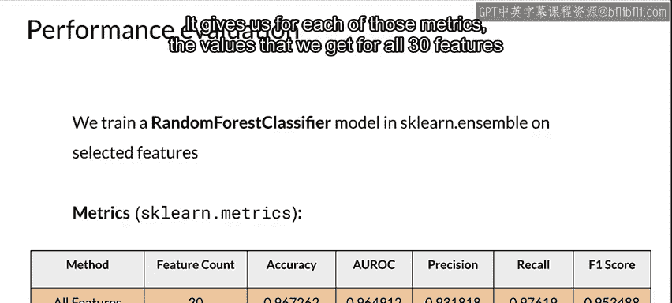

#  061：特征选择 🎯


在本节课中，我们将学习特征选择的概念、重要性以及几种常见的实现方法。特征选择是机器学习流程中的关键步骤，它帮助我们识别并保留对预测目标最有价值的特征，同时剔除无关或冗余的特征，从而提升模型效率与性能。

---

## 什么是特征选择？

上一节我们介绍了特征工程的基础，本节中我们来看看特征选择。特征选择是指从所有可用特征中，挑选出对预测目标变量最有贡献的一个子集的过程。

我们通常拥有许多特征，但实际建模时可能并不需要全部。特征选择旨在识别最能代表特征与预测目标之间关系的特征，并移除那些对结果影响甚微的特征。这能有效减少特征空间的大小。

**公式**：若原始特征集为 `F = {f1, f2, ..., fn}`，特征选择的目标是找到一个子集 `F' ⊆ F`，使得模型性能 `P(F')` 最优或接近使用 `F` 时的性能，同时满足 `|F'| < |F|`。

每增加一个特征，特征空间的维度会指数级增长。减少特征数量可以降低数据处理所需的资源开销，同时也能简化模型复杂度。

---

## 为什么需要特征选择？

特征选择主要有以下几个目的：

1.  **降低存储与I/O需求**：更少的特征意味着更小的数据体积，节省存储空间和读写时间。
2.  **最小化训练与推理成本**：尤其是在模型部署后，面对海量的推理请求时，每个请求的处理成本都与特征数量相关。减少特征能直接降低计算开销。
3.  **缓解维度灾难**：在高维空间中，数据变得稀疏，模型需要更多数据才能有效学习，且更容易过拟合。
4.  **提升模型可解释性**：使用更少、更相关的特征有助于我们理解模型决策的依据。

---

## 特征选择的方法

特征选择方法主要分为无监督和有监督两大类。

### 无监督特征选择

无监督特征选择不利用目标变量（标签）的信息。它主要关注特征本身之间的关系，目标是移除冗余的特征。

以下是其核心思路：
*   它分析特征间的相关性。
*   当两个或多个特征高度相关时，它们所提供的信息大量重叠，通常只需保留其中一个。

### 有监督特征选择

有监督特征选择则会利用标签信息。它评估每个特征与目标变量之间的关系，并选择那些对正确预测目标贡献最大的特征。

我们将重点介绍几种有监督的特征选择方法，主要包括过滤法、包装法和嵌入法。

---

## 实践案例：乳腺癌诊断数据集

为了具体说明这些方法，我们将使用一个乳腺癌诊断数据集作为示例。我们的目标是预测肿瘤是良性（benign）还是恶性（malignant）。

**代码**：加载数据集的示例代码结构如下（以Python的pandas库为例）：
```python
import pandas as pd
from sklearn.datasets import load_breast_cancer

data = load_breast_cancer()
df = pd.DataFrame(data.data, columns=data.feature_names)
df['target'] = data.target
```
我们的特征列表中包含30个特征。此外，为了演示，数据集中特意添加了一个名为“Unnamed: 32”的无关特征（通常由数据读取错误产生，值全为NaN）。在实际项目中，无关特征可能以缺失值过多或与业务逻辑明显不符等形式出现。

---

## 性能评估基线

在应用任何特征选择方法之前，我们需要建立一个性能基线。我们将使用包含全部30个特征的数据集，训练一个随机森林分类器，并计算多项评估指标。

以下是使用的评估指标：
*   **准确率**：正确预测的样本比例。
*   **AUC分数**：衡量模型区分能力的指标。
*   **精确率**：在被预测为正类的样本中，实际为正类的比例。
*   **召回率**：在实际为正类的样本中，被正确预测为正类的比例。
*   **F1分数**：精确率和召回率的调和平均数。

使用所有特征得到的各项指标值，将作为我们比较后续特征选择结果的基准。

---

## 总结



本节课中我们一起学习了特征选择的核心知识。我们了解了特征选择的定义及其在减少资源消耗、提升模型效率方面的重要性。我们区分了无监督与有监督特征选择的基本原理，并引入了过滤法、包装法和嵌入法这三大类有监督方法。最后，我们以乳腺癌诊断数据集为例，建立了模型性能的评估基线。在接下来的课程中，我们将深入探讨具体的特征选择算法及其应用。