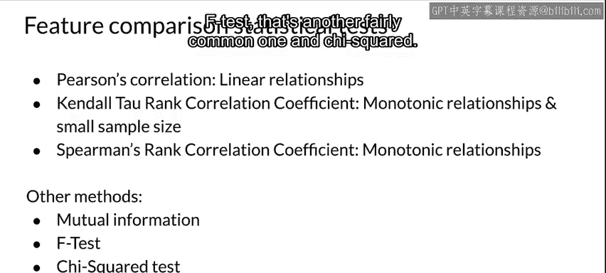
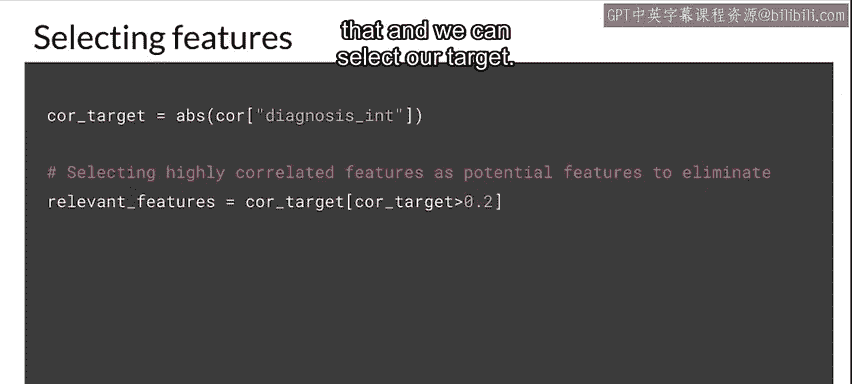
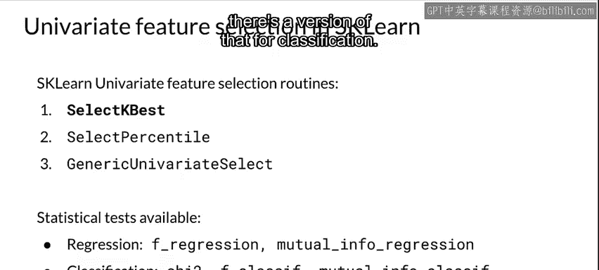
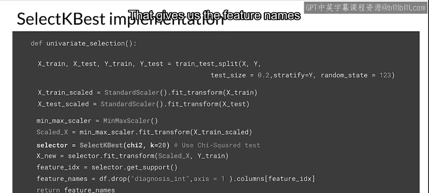
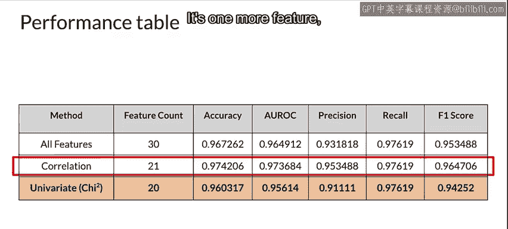

#  062：特征选择之过滤法 🔍


在本节课中，我们将要学习特征选择的一种重要方法——过滤法。我们将了解其核心思想、常用技术，并通过代码示例展示如何在实际项目中应用过滤法来选择对模型最有价值的特征。

---

## 概述

特征选择是机器学习流程中的关键步骤，旨在从原始特征集中筛选出最相关、信息量最大的子集，以提升模型性能、降低计算成本并增强模型可解释性。过滤法是一种监督式特征选择方法，它主要依据特征与目标变量之间的统计相关性来评估特征的重要性。

上一节我们介绍了特征选择的基本概念和重要性，本节中我们来看看过滤法的具体实现。

## 什么是过滤法？

过滤法是一种特征选择方法，它独立于任何机器学习模型，通过分析数据本身的统计特性来评估特征。它属于监督式特征选择，因为其评估过程依赖于目标变量。除了过滤法，监督式特征选择还包括包装法和嵌入法。

过滤法主要利用相关性分析来寻找那些包含用于预测目标变量信息的特征。单变量特征选择也因其高效性而被频繁使用。

## 过滤法的核心思想

相关性高的特征通常是冗余的。正如我们之前讨论的，当两个特征彼此高度相关时，通常表明它们是冗余的。因此，你希望选择其中一个，而移除另一个。

以下是过滤法的基本流程：
1.  我们从所有特征开始。
2.  我们选择最佳的特征子集。
3.  我们将这个子集提供给模型进行训练。
4.  模型使用这个特征子集将给出其性能表现。

## 常用过滤方法

以下是几种流行的过滤方法：

*   **皮尔逊相关系数**：这是最常用的相关性计算方法之一。它用于计算特征之间以及特征与标签之间的线性相关性。这正是它被称为监督方法的原因。
*   **肯德尔等级相关系数**：这是一种等级相关系数，用于检测单调关系。它通常在样本量较小且追求效率时使用。
*   **斯皮尔曼等级相关系数**：另一种等级相关系数，同样用于检测单调关系。
*   **互信息**：互信息方法具有一些优良特性，可以捕捉线性和非线性关系。
*   **F检验**：这是另一种相当常见的方法，用于检验特征与目标变量之间的线性关系是否显著。
*   **卡方检验**：这也是一个相当常见的方法，主要用于分类问题中检验特征与目标变量之间的独立性。

## 可视化工具：相关性矩阵

可视化过滤过程的一种方式是使用相关性矩阵。我们可以寻找两个或多个特征之间存在相关性的特征。相关性矩阵有助于展示特征之间以及特征与目标变量之间的关系。

需要强调的是，特征之间高度相关是不利的，你通常只需要保留其中一个。当然，你确实希望特征与目标变量相关。

相关性系数的取值范围在 **-1** 到 **1** 之间。**1** 表示高度正相关，**-1** 表示高度负相关。

## 代码实现：皮尔逊相关

让我们看看如何使用皮尔逊相关系数在代码中实现过滤法。这里使用 `pandas` 库。

```python
import pandas as pd
import seaborn as sns
import matplotlib.pyplot as plt

# 假设 df 是一个包含特征和标签的 DataFrame
# 计算皮尔逊相关系数矩阵
correlation_matrix = df.corr(method='pearson')

# 绘制热力图
plt.figure(figsize=(12, 10))
sns.heatmap(correlation_matrix, annot=True, fmt=".2f", cmap='coolwarm', center=0)
plt.title('Feature Correlation Matrix')
plt.show()
```

上述代码会生成一个相关性矩阵的热力图。通过观察热力图，我们可以识别出高度相关的特征对。



接下来，我们可以基于特征与目标变量的相关性绝对值来选择特征。



```python
# 假设目标变量列名为 'target'
target_corr = correlation_matrix['target'].abs().sort_values(ascending=False)

# 选择与目标变量相关性最高的前N个特征
selected_features = target_corr[1:22].index.tolist()  # 排除目标变量自身，选择前21个
```

通过这种方法，我们可能从原始的30个特征中剔除了7个高度相关或与目标无关的特征，最终得到21个特征。

使用这个特征子集训练模型后，我们可能会发现：
*   准确率有所提升。
*   AUC（曲线下面积）有所提升。
*   精确率有所提升。
*   召回率保持不变（至少到小数点后五位）。
*   F1分数略有提升。

移除冗余特征不仅提升了几乎所有评估指标，还减少了处理21个特征（而非30个）所需的计算资源。这可能是我们目前得到的最佳结果。

## 单变量特征选择

现在，让我们看看单变量特征选择。我们将使用 `scikit-learn` 库来实现。

`scikit-learn` 提供了多种单变量特征选择工具：
*   `SelectKBest`：选择得分最高的K个特征。
*   `SelectPercentile`：选择得分最高的指定百分比的特征。
*   `GenericUnivariateSelect`：一个通用的单变量选择器，可以通过策略参数配置。
*   可用的统计检验包括：
    *   对于回归问题：互信息和F检验。
    *   对于分类问题：卡方检验、分类专用的F检验版本以及分类专用的互信息版本。

以下是使用卡方检验进行单变量特征选择的代码示例：

```python
from sklearn.feature_selection import SelectKBest, chi2
from sklearn.preprocessing import StandardScaler, MinMaxScaler
from sklearn.model_selection import train_test_split

# 分割数据集
X_train, X_test, y_train, y_test = train_test_split(X, y, test_size=0.2, random_state=42)

# 数据标准化（某些特征选择方法需要）
scaler = StandardScaler()
X_train_scaled = scaler.fit_transform(X_train)
X_test_scaled = scaler.transform(X_test)

# 也可以使用 MinMaxScaler
# scaler = MinMaxScaler()

# 初始化选择器，使用卡方检验选择最好的20个特征
selector = SelectKBest(score_func=chi2, k=20)



# 在训练集上拟合并转换
X_train_selected = selector.fit_transform(X_train_scaled, y_train)
X_test_selected = selector.transform(X_test_scaled)

# 获取被选中的特征索引或名称
selected_feature_indices = selector.get_support(indices=True)
selected_feature_names = X.columns[selected_feature_indices]

print("Selected features:", selected_feature_names)
```

这段代码定义了一个用于单变量选择的函数。它接收已分割的训练集和测试集，使用 `StandardScaler` 或 `MinMaxScaler` 进行缩放，然后使用 `SelectKBest` 结合卡方检验来寻找最佳的20个特征。通过 `fit_transform` 得到选中的特征，并在原始数据集中剔除其他特征。



那么它的性能如何呢？
使用卡方检验的单变量测试要求选择20个特征，因此我们得到了20个特征。
*   准确率略有下降。
*   AUC略有下降。
*   精确率略有下降。
*   有趣的是，召回率仍然完全相同。
*   遗憾的是，F1分数也略低一些。

因此，基于相关性分析的方法（得到21个特征）仍然是我们目前的最佳结果。

---

## 总结



本节课中我们一起学习了特征选择中的过滤法。我们了解到过滤法是一种基于统计指标（如相关性）来评估特征重要性的监督式方法。我们探讨了皮尔逊相关、卡方检验等具体技术，并通过代码示例演示了如何计算相关性矩阵、可视化特征关系以及使用 `scikit-learn` 进行单变量特征选择。实践表明，通过移除冗余特征，我们可以在提升模型性能的同时降低计算复杂度。虽然不同的过滤方法可能产生不同数量的特征和模型表现，但核心目标始终是找到最有效、最简洁的特征子集。