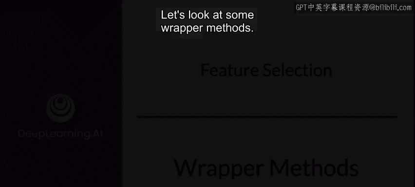
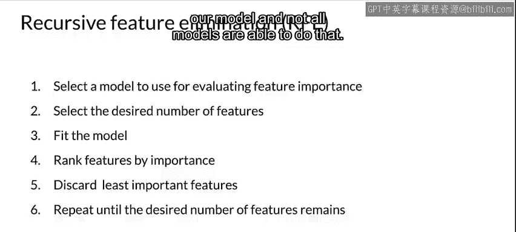
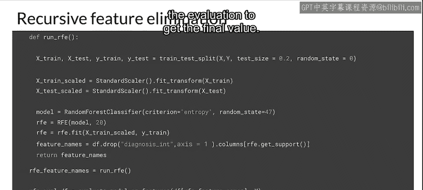
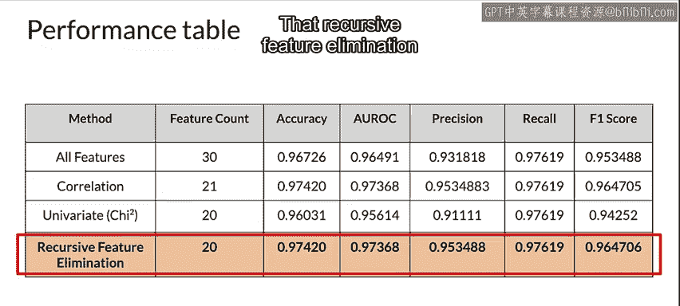

#  063：包装法特征选择 📦



在本节课中，我们将学习特征选择中的“包装法”。包装法是一种监督式特征选择方法，它通过迭代搜索，并使用一个机器学习模型来评估特征子集的有效性，从而找到最优的特征组合。

上一节我们介绍了基于统计的过滤法，本节中我们来看看如何使用模型本身来指导特征选择。

## 包装法的工作原理

包装法的工作方式有所不同。它仍然是一种监督方法，但会与一个具体的模型结合使用。其核心思想是：通过迭代搜索特征空间，并使用选定模型的性能作为衡量特征子集优劣的指标。

基本流程如下：
1.  从所有特征开始。
2.  生成一个特征子集。
3.  将该子集输入模型进行训练和评估。
4.  根据模型性能（作为反馈），生成下一个待评估的特征子集。
5.  重复此过程，直至找到性能最优的特征子集。

这样就形成了一个使用模型性能作为度量的反馈循环，最终选出最佳特征子集。

## 常见的包装法

以下是几种常用的包装法实现策略。

### 前向选择

前向选择是一种迭代的贪心算法。
*   **起点**：从一个空特征集或单个特征开始。
*   **过程**：每次迭代中，尝试添加一个尚未使用的特征，并评估模型性能。选择能带来最大性能提升的那个特征加入集合。
*   **终止**：重复此过程，直到添加任何新特征都无法显著提升模型性能。

### 后向消除

理解了前向选择，后向消除就很容易想象了。
*   **起点**：从包含所有特征的全集开始。
*   **过程**：每次迭代中，尝试移除一个现有特征，并评估模型性能。移除对性能影响最小的那个特征（或移除后性能下降最少的特征）。
*   **终止**：重复此过程，直到移除任何特征都会导致模型性能显著下降。

### 递归特征消除

递归特征消除是另一种强大的包装法。
*   **步骤1**：选择一个能评估特征重要性的模型（例如，随机森林、线性模型）。
*   **步骤2**：设定最终想要保留的特征数量。
*   **步骤3**：用全部特征训练模型，并根据模型输出对特征进行重要性排序。
*   **步骤4**：丢弃重要性最低的特征。
*   **步骤5**：用剩余的特征重复步骤3和4，直到特征数量达到预设目标。

**一个重要的前提是**：所使用的模型必须能够提供特征重要性度量，并非所有模型都具备此功能。

## 递归特征消除代码示例

让我们通过代码来看看递归特征消除的具体实现。以下示例使用 `scikit-learn` 库中的 `RFECV`（带交叉验证的递归特征消除）。

```python
# 导入必要的库
from sklearn.datasets import make_classification
from sklearn.model_selection import train_test_split
from sklearn.preprocessing import StandardScaler
from sklearn.ensemble import RandomForestClassifier
from sklearn.feature_selection import RFECV
from sklearn.metrics import accuracy_score

# 1. 准备数据（这里使用模拟数据）
X, y = make_classification(n_samples=1000, n_features=50, n_informative=20, random_state=42)
X_train, X_test, y_train, y_test = train_test_split(X, y, test_size=0.2, random_state=42)

# 2. 特征缩放（通常是个好习惯）
scaler = StandardScaler()
X_train_scaled = scaler.fit_transform(X_train)
X_test_scaled = scaler.transform(X_test)

# 3. 选择基础模型（此处使用能提供特征重要性的随机森林）
model = RandomForestClassifier(n_estimators=100, random_state=42, criterion='entropy')



# 4. 创建递归特征消除器，使用交叉验证自动选择最佳特征数量
rfecv = RFECV(estimator=model, step=1, cv=5, scoring='accuracy')
rfecv.fit(X_train_scaled, y_train)

# 5. 输出结果
print(f"最优特征数量: {rfecv.n_features_}")
print(f"被选中的特征掩码: {rfecv.support_}")
print(f"特征排名（1为最佳）: {rfecv.ranking_}")

# 6. 使用选出的特征转换数据集
X_train_selected = rfecv.transform(X_train_scaled)
X_test_selected = rfecv.transform(X_test_scaled)

# 7. 用选出的特征重新训练并评估最终模型
final_model = RandomForestClassifier(n_estimators=100, random_state=42)
final_model.fit(X_train_selected, y_train)
y_pred = final_model.predict(X_test_selected)
accuracy = accuracy_score(y_test, y_pred)
print(f"使用 {rfecv.n_features_} 个特征后的模型准确率: {accuracy:.4f}")
```



在这段代码中：
1.  我们生成了包含50个特征的数据集，其中只有20个是真正有信息的。
2.  使用 `RandomForestClassifier` 作为评估特征重要性的基础模型。
3.  `RFECV` 对象会通过交叉验证自动决定最优的特征数量。
4.  最终，我们使用筛选出的特征子集训练了一个新模型，并评估其性能。

## 方法对比与总结

与之前介绍的单变量过滤法相比，递归特征消除的表现如何？

在课程示例中，递归特征消除成功地将特征数量缩减到了目标值（20个）。其模型准确率、AUC（曲线下面积）和召回率等指标，均与基于相关性的过滤法表现相当，甚至在某些指标（如F1分数）上略有优势。同时，它使用的特征数量（20个）比相关性方法（21个）更少。

因此，在这个具体案例中，**递归特征消除取得了最佳的综合结果**。



本节课中我们一起学习了特征选择的包装法。我们了解了其核心思想是利用模型性能作为反馈来迭代搜索最优特征子集，并介绍了前向选择、后向消除和递归特征消除三种具体策略。最后，我们通过代码示例演示了递归特征消除的实现过程，并看到它能够有效地平衡特征数量与模型性能。