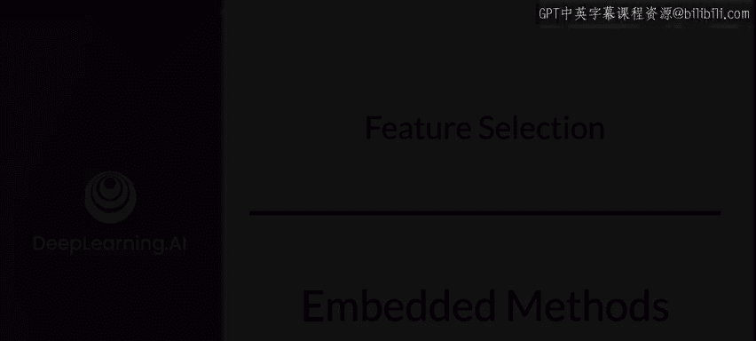
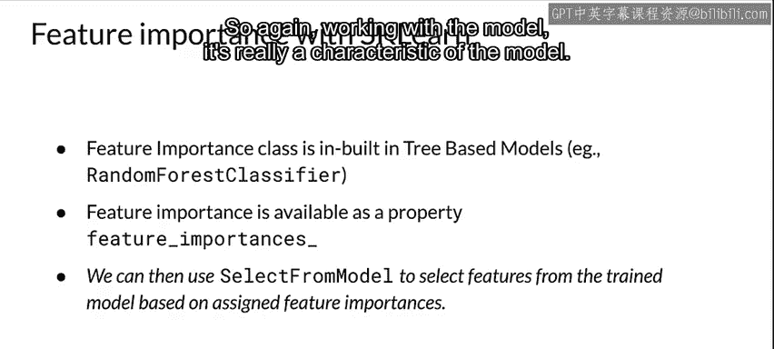
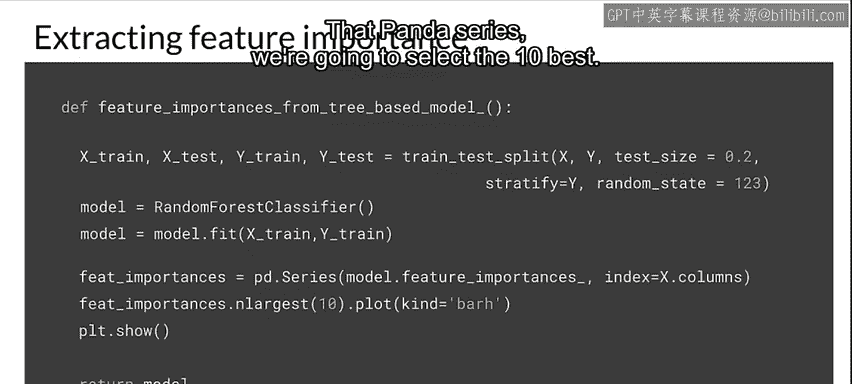
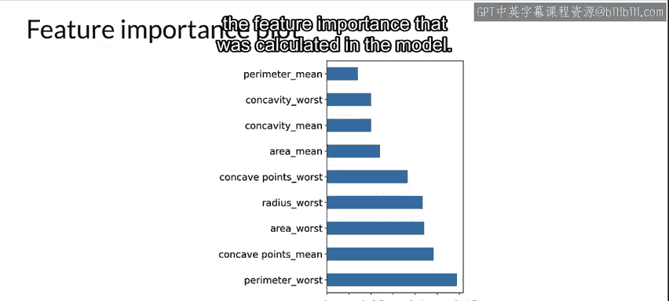
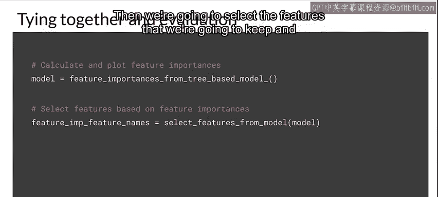
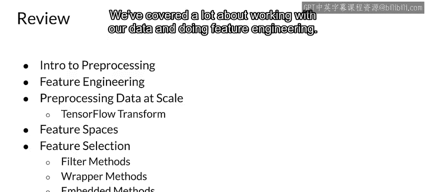

#  064：第23课 嵌入法 🧩

在本节课中，我们将要学习特征选择的第三种主要方法：嵌入法。嵌入法是一种监督式的特征选择技术，它将特征选择过程与模型训练本身紧密结合。

上一节我们介绍了包装法，本节中我们来看看嵌入法。

## 什么是嵌入法？ 🤔

嵌入法是一种监督式的特征选择方法。它与我们之前学习的过滤法和包装法不同，其核心在于特征选择过程是模型训练流程的一个**内在组成部分**。

以下是嵌入法的两个主要示例：
*   **L1或L2正则化**：本质上是一种通过惩罚项进行特征选择的嵌入方法。
*   **特征重要性**：另一种嵌入方法，直接评估模型中每个特征的贡献度。

这两种方法都与你所使用的**模型高度相关**。L1正则化和特征重要性更像是你所使用模型的一种**固有特性**。它们为数据中的每个特征分配分数或权重，并通过将某些特征的权重设置为零或接近零来“丢弃”这些特征，从而实现特征选择。

## 在Scikit-learn中实现嵌入法 💻

在Scikit-learn中，我们可以利用基于树的模型内置的`feature_importance_`属性。

我们继续使用贯穿本课程的随机森林分类器作为示例模型，这是一种包含特征重要性属性的模型类型。

我们可以使用`SelectFromModel`来根据模型分配的特征重要性分数，从已训练的模型中选择特征。这再次体现了嵌入法与模型本身的紧密联系。

### 代码实现步骤

以下是基于树模型计算特征重要性的函数实现步骤：

1.  准备数据：数据已被分割为训练集和测试集，并且标签已被分离。
2.  定义模型：使用随机森林分类器。
3.  训练模型：在训练数据上拟合模型。
4.  提取特征重要性：从训练好的模型中提取`feature_importances_`属性，这将得到一个Pandas Series序列。
5.  选择特征：从该序列中选择重要性得分最高的前10个特征并进行展示。

### 可视化与特征选择

执行上述步骤后，我们可以得到特征重要性的可视化图表。图表展示了模型计算出的最重要的10个特征。

接下来，我们利用这些信息进行特征选择：

1.  使用`SelectFromModel`根据重要性阈值选择特征，得到一个新的模型转换器。
2.  调用`get_support()`方法获取被选中特征的索引。
3.  根据这些索引，从原始特征向量中删除未被选中的特征，从而得到我们最终保留的特征名称列表。

### 性能评估

将上述步骤整合后，我们首先通过`feature_importance_from_tree_based_model`函数计算并绘制特征重要性，然后基于此选择要保留的特征，最后评估模型性能。

在本案例中，我们最终选择了14个特征。观察其性能指标：
*   **准确率**略有下降。
*   **ROC-AUC**略有上升，几乎回到了使用全部特征时的水平。
*   **精确率**略有下降。
*   **召回率**基本保持不变。
*   **F1分数**回到了使用全部特征时的水平。

## 方法对比与选择考量 ⚖️

递归特征消除法（RFE）目前仍然是我们得到的最佳结果。然而，通过特征重要性嵌入法，我们成功将特征数量减少到了14个。

这里出现了一个需要权衡的问题：**我们更看重性能指标，还是更看重降低计算资源消耗？**
*   如果**节省计算资源**至关重要，我们可能会选择使用特征重要性法筛选出的14个特征。
*   如果我们更关注**维持或提升模型性能指标**，那么递归特征消除法（RFE）仍然是更好的选择。

## 本周内容总结 📚

本周我们涵盖了大量内容：
1.  我们首先介绍了数据预处理的基础知识。
2.  我们深入探讨了特征工程及其在机器学习，尤其是生产环境中的重要性。
3.  我们学习了大规模数据预处理，这在处理海量数据或大型模型时至关重要，并特别介绍了TensorFlow Transform工具。
4.  我们研究了特征空间，理解了它的工作原理以及在特征选择时为何需要考虑它。
5.  我们详细学习了三种不同的特征选择方法：**过滤法**、**包装法**和**嵌入法**。

本节课中我们一起学习了嵌入法特征选择，理解了其如何将选择过程嵌入模型训练，并通过代码实践了基于特征重要性的选择流程。至此，关于数据处理和特征工程，我们已经学习了相当丰富的内容。