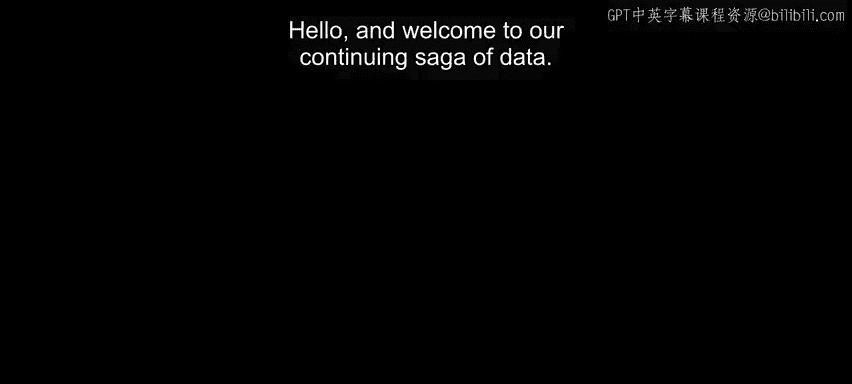
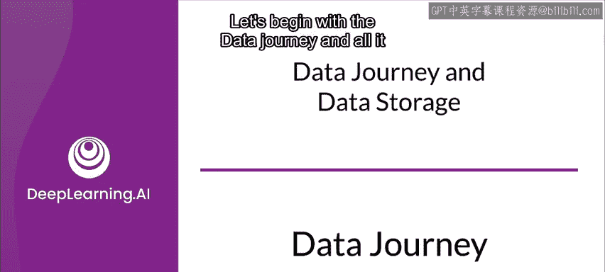
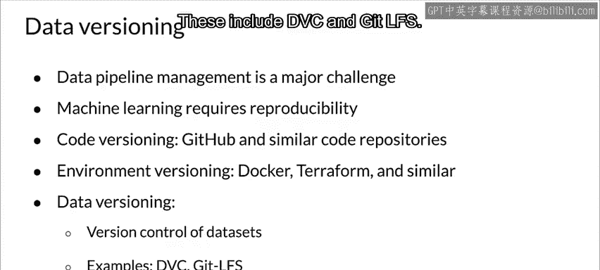

#  065：数据之旅与存储 📊

在本节课中，我们将学习数据在机器学习生产流程中的流转过程（数据之旅），以及如何有效地存储和管理数据。我们将重点探讨元数据、数据模式（Schema）以及数据版本控制等核心概念，这些对于理解数据演变、确保实验可复现性至关重要。

---

## 数据之旅：理解数据的生命周期 🔄

上一节我们介绍了课程的整体安排，本节中我们来看看数据在生产流水线中的完整旅程。理解数据来源（Data Provenance）需要理解数据在整个生产流水线生命周期中的流转过程，更具体地说，是关注数据和模型在整个流程中的演变。

ML元数据（ML Metadata）是一个用于应对这些挑战的多功能库，它有助于调试和保证可复现性。具体而言，它允许我们回顾和追踪在训练过程中发生的数据和模型变化。

理解数据来源始于数据之旅。这段旅程从我们拥有的各种来源的原始特征和标签开始。数据描述了一个函数，该函数将训练集中的输入映射到我们试图预测的标签。在训练期间，模型学习从输入到标签的函数映射，以尽可能达到高准确度。

数据作为训练过程的一部分会发生转换和变化。当数据在流程中流动时，它会经历转换，例如改变数据格式、应用特征工程以及训练模型进行预测。

理解这些数据转换与解释模型结果之间存在双重联系。因此，密切追踪和记录这些变化非常重要。

以下是数据转换的几个关键环节：
*   **数据格式转换**：例如，从CSV文件转换为TFRecord格式。
*   **特征工程**：应用如标准化、归一化或创建新特征等操作。
*   **模型训练**：数据被用于调整模型参数以进行预测。

---

## 数据工件与溯源 📦

流水线组件执行时会创建数据工件（Data Artifacts）。那么，究竟什么是工件？每当一个组件产生结果时，它就会生成一个工件。这基本上包括了流水线产生的一切，包括不同转换阶段的数据（通常是特征工程的结果）、模型本身，以及模式（Schema）、指标等等。基本上，产生的每一个结果都是一个工件。

术语“数据来源”（Data Provenance）和“数据谱系”（Data Lineage）基本上是同义词，可以互换使用。数据来源或谱系，是我们在流水线中移动时所创建的工件序列。这些工件与我们创建的代码和组件相关联。

追踪这些序列对于调试、理解训练过程以及比较可能相隔数月发生的不同训练运行至关重要。数据来源非常重要，它帮助我们理解流水线并进行调试。

调试和理解需要检查训练过程中每个点的那些工件，这可以帮助我们理解这些工件是如何创建的，以及结果的实际含义。溯源还允许你从流程中的任何一点回溯整个训练运行。

此外，溯源使得比较不同训练运行并理解它们产生不同结果的原因成为可能。根据GDPR（通用数据保护条例），组织需要对个人数据的来源、变更和位置负责。个人数据高度敏感，因此追踪其在流水线中的来源和变化是合规的关键。

数据谱系是企业和组织快速确定数据如何被使用以及在流经流水线时执行了哪些转换的好方法。因此，数据溯源是解释模型结果的关键。模型理解与此相关，但只是其中一部分。模型本身是训练集中数据的一种表达。因此，在某种意义上，我们可以将模型视为数据的一种转换。溯源还有助于我们理解模型在训练和优化过程中是如何演变的。

---

## 数据版本控制 🔄

让我们在此添加一个重要成分：追踪不同的数据版本。管理数据流水线是一个巨大的挑战，因为数据会随着项目在多次不同训练运行中的自然生命周期而演变。一个正确执行的机器学习项目，应该能够产生可以相当一致地复现的结果。自然会有一些差异，但结果应该接近。

代码版本控制可能是你熟悉的概念。GitHub是最流行的基于云的代码仓库之一，当然还有其他选择。环境版本控制也很重要，因此像Docker和Terraform这样的工具帮助我们创建可重复的环境和配置。

然而，数据版本控制同样重要，并且在追踪来源和谱系方面扮演着重要角色。数据版本控制本质上是数据文件的版本控制，以便你可以追踪随时间发生的变化并在需要时恢复早期版本。

但是，相关工具有些不同，原因之一是我们处理的文件大小。这些文件通常（或可能）比代码文件大得多。因此，用于数据版本控制的工具才刚刚开始出现，其中包括DVC和Git LFS（LFS代表大文件存储）。

---

## 总结 📝

本节课中，我们一起学习了数据在机器学习生产流程中的完整旅程。我们探讨了如何通过追踪数据工件和理解数据谱系来确保流程的可解释性与可复现性。同时，我们认识到数据版本控制与代码、环境版本控制同等重要，是管理数据演变、支持调试和合规要求的关键工具。掌握这些概念，是构建可靠、可维护的机器学习系统的基础。