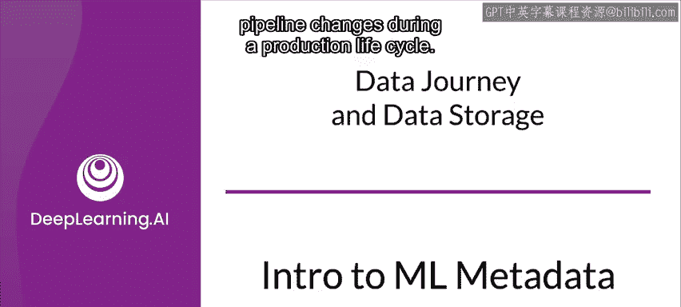
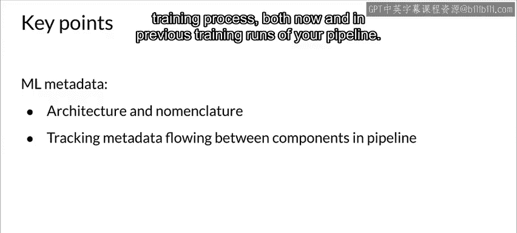

#  066：机器学习元数据简介 📊

在本节课中，我们将要学习机器学习元数据（ML Metadata，简称MLMD）的基本概念、架构及其在生产环境中的重要性。元数据是记录机器学习工作流中各个组件、执行过程和生成结果的关键信息，它对于调试、审计和理解模型训练过程至关重要。

---

现在我们来讨论元数据。在讨论这个话题时，需要考虑法律和监管方面的因素。

随着机器学习越来越多地用于做出重要的商业决策、医疗决策和金融决策，法律责任成为一个因素。能够解释模型，并能够追溯用于训练模型的数据的血统或来源，对于限制风险暴露变得越来越重要。

好的，让我们开始吧。现在让我们开始探索机器学习元数据如何帮助你在生产生命周期中跟踪工件和流水线变更。

---

## 什么是机器学习元数据？🔍

上一节我们提到了元数据的重要性，本节中我们来看看它的具体定义和作用。

生产机器学习流水线的每次运行都会生成元数据，这些元数据包含关于各个流水线组件及其执行（或训练运行）的信息，以及生成的工件（例如，训练好的模型）。在流水线行为异常或出现错误的情况下，可以利用这些元数据来分析流水线组件的血统，并帮助你调试问题。

可以将这些元数据视为软件开发中的日志记录。机器学习元数据帮助你理解和分析机器学习流水线中所有相互关联的部分，而不是孤立地分析它们。

---

## 元数据在流水线中的作用 🏗️

上一节我们介绍了元数据的定义，本节中我们来看看它在实际流水线中是如何工作的。

考虑你目前看到的机器学习工程中的两个阶段。首先，你进行了数据验证。然后，你将结果传递给数据转换或特征工程。这是任何模型训练过程的第一部分。

但是，如果你有一个集中式的存储库，每次运行一个组件时，都将该阶段的结果、更新或任何其他输出存储到该存储库中，会怎样呢？这样，每当任何更改导致不同结果时，你无需担心到目前为止取得的进展丢失，你可以检查之前的结果，试图理解发生了什么，并进行纠正或利用改进。

让我们更仔细地看一下。除了运行代码的执行器之外，每个组件还包括两个额外的部分：驱动程序和发布器。

*   **执行器**：组件工作完成的地方，这也是不同组件之间的区别所在。
*   **驱动程序**：为执行器提供所需的任何输入，这些输入从元数据存储中获取。
*   **发布器**：将运行执行器的结果推送回元数据存储。

大多数时候，你不需要自定义驱动程序或发布器。创建自定义组件几乎总是通过创建自定义执行器来完成。

---

## 机器学习元数据（MLMD）库 📚

上一节我们了解了组件结构，本节中我们专门看看机器学习元数据库。

机器学习元数据是一个用于跟踪和检索与机器学习开发者和数据科学家工作流相关的元数据的库。机器学习元数据可以作为机器学习流水线的一个组成部分使用，也可以独立使用。然而，当与机器学习流水线集成时，你可能甚至不需要显式地与机器学习元数据对象交互。

存储在机器学习元数据中的对象被称为**工件**。机器学习元数据在关系数据库中存储每个工件的属性，并将大型对象（如数据集）存储在磁盘、文件系统或块存储中。

当你使用机器学习元数据时，需要了解数据如何在不同的连续组件之间流动。这个数据流中的每一步都通过一个你需要熟悉的实体来描述。

---

## 机器学习元数据的数据实体 🧱

上一节我们提到了“实体”，本节中我们来详细看看机器学习元数据中的核心数据实体。

在机器学习元数据的最高层级，有一些可以被视为单元的数据实体。

以下是这些核心实体：

*   **工件**：输入到机器学习元数据存储中的基本数据单元，作为每个组件的输入被消耗或作为输出生成。
*   **执行**：机器学习流水线工作流期间任何组件运行的记录，及其相关的运行时参数。
*   **上下文**：用于将同一类型组件的工件和执行聚类在一起的分组。一个上下文可能包含正在运行的项目、正在进行的实验、流水线详情等的元数据。
*   **类型**：定义存储在元数据中的各种单元（如工件类型、执行类型）的模板，包括该类型的属性。
*   **关系**：存储与其他单元交互时生成或消耗的各种单元之间的关系。例如，**事件**是记录工件与执行之间关系的记录。

所以，机器学习元数据存储了关于流水线组件结果和执行运行的广泛信息。它存储工件，存储流水线中每个组件的执行，还存储每个生成的工件的血统信息。所有这些信息都表示在元数据对象中，并且这些元数据存储在后端存储解决方案中。

---

## 机器学习元数据架构 🏛️

上一节我们介绍了核心实体，本节中我们来看看它们是如何组织在一起的。

让我们看一下机器学习元数据的架构。顶部是任何机器学习流水线中存在的各种组件。所有这些组件都单独连接到一个集中的机器学习元数据存储，以便每个组件可以在流水线的任何阶段独立访问元数据。

一个机器学习流水线可以选择性地拥有一个图形用户界面控制台，可以直接从元数据存储访问数据，以跟踪每个组件的进度。

在元数据存储的核心是**工件**，它由其对应的**工件类型**描述。工件成为任何依赖它们的流水线组件的输入，而组件对工件的相应使用记录在**执行**中。

工件输入到组件由**输入事件**描述，组件输出新工件由**输出事件**描述。工件和执行之间的这种交互通过归因和关联的关系由**上下文**表示。

最后，元数据存储生成的所有数据都存储在各种类型的后端存储中，如SQLite和MySQL，大型对象则存储在文件系统或块存储中。

---

## 总结 📝

本节课中我们一起学习了机器学习元数据的架构和术语，以及包含其中的工件和实体。这应该让你对如何利用机器学习元数据来跟踪元数据和流经流水线的结果有了初步了解，从而更好地理解你当前以及之前流水线训练运行的过程。