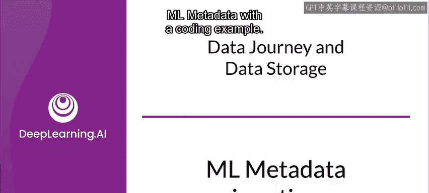
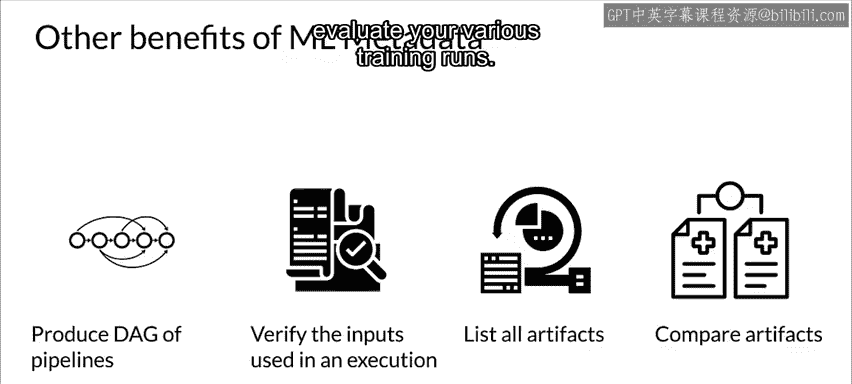
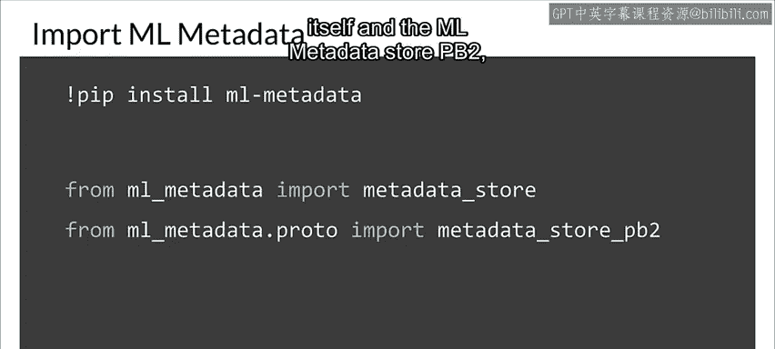
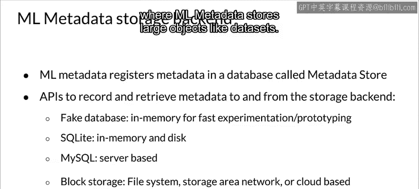
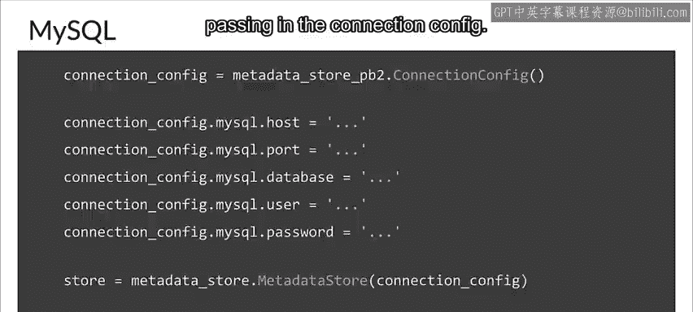
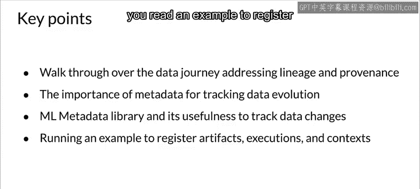

#  067：机器学习元数据实战 🧠 - 课程 P67




在本节课中，我们将学习如何使用机器学习元数据（ML Metadata）库，并通过一个具体的编码示例来理解其核心功能，包括数据溯源、组件执行图的构建以及实验结果的追踪与比较。

---

## 配置存储后端

首先，我们需要设置 ML Metadata 的存储后端。`MetadataStore` 是一个数据库，用于注册与项目相关的所有元数据。ML Metadata 提供了连接多种数据库的 API，包括用于快速原型设计的伪数据库、SQLite 和 MySQL。此外，我们还需要一个块存储或文件系统来存储数据集等大型对象。



以下是三种主要存储后端的配置方法：

**伪数据库（内存存储）**
```python
from ml_metadata import metadata_store
from ml_metadata.proto import metadata_store_pb2



connection_config = metadata_store_pb2.ConnectionConfig()
connection_config.fake_database.SetInParent()  # 使用内存数据库
store = metadata_store.MetadataStore(connection_config)
```

**SQLite 数据库**
```python
connection_config = metadata_store_pb2.ConnectionConfig()
connection_config.sqlite.filename_uri = ‘./my_metadata.db’
connection_config.sqlite.connection_mode = 3  # READWRITE_OPENCREATE 模式
store = metadata_store.MetadataStore(connection_config)
```



**MySQL 数据库**
```python
connection_config = metadata_store_pb2.ConnectionConfig()
connection_config.mysql.host = ‘localhost’
connection_config.mysql.port = 3306
connection_config.mysql.database = ‘metadata_db’
connection_config.mysql.user = ‘root’
connection_config.mysql.password = ‘password’
store = metadata_store.MetadataStore(connection_config)
```

无论使用哪种存储，`store` 对象都是与 ML Metadata 交互的核心。

---

## 结合 TFDV 的工作流示例

上一节我们介绍了如何配置存储后端，本节中我们来看看如何将 ML Metadata 应用于解决实际问题。我们将通过一个结合 TensorFlow Data Validation（TFDV）的工作流示例进行说明。

本实验选用一个包含多个特征的表格数据集。在完整的机器学习流水线中，ML Metadata 能够自动理解组件间的数据流并执行其必要职责。但为了帮助初学者更好地理解其原理，本实验将在流水线之外显式地编程使用 ML Metadata。实验还将展示 ML Metadata 与 TFDV 的集成。

通过本实验，您将直观了解 ML Metadata 如何跟踪进度，以及如何利用它来追踪训练过程和流水线。

---



## 核心优势与应用

除了数据溯源，使用 ML Metadata 还能带来其他几项好处。

**构建执行有向无环图（DAG）**
ML Metadata 能够构建流水线中组件执行的有向无环图。这对于调试非常有用，您可以验证某次执行中具体使用了哪些输入。

**汇总与比较实验结果**
您可以汇总一系列实验后生成的所有特定类型的工件。例如，您可以列出所有训练过的模型，然后对它们进行比较，以评估不同的训练运行效果。

---

## 课程总结

在本节课中，我们一起学习了以下内容：
1.  首先，我们了解了用于应对 ML 流水线生命周期中数据演变问题的**数据溯源**概念。
2.  接着，我们探讨了用于追踪这些数据变化的**元数据**。
3.  然后，我们审视了 **ML Metadata 库的架构**。
4.  最后，在未评分的实验中，您运行了一个示例，**注册了工件、执行过程和上下文**，进行了实际操作。



通过以上学习，您应该对 ML Metadata 的核心功能及其在机器学习工程化中的实践价值有了初步的认识。