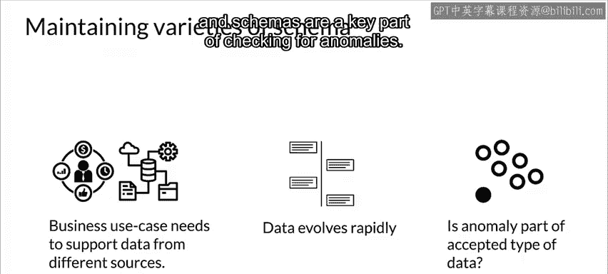
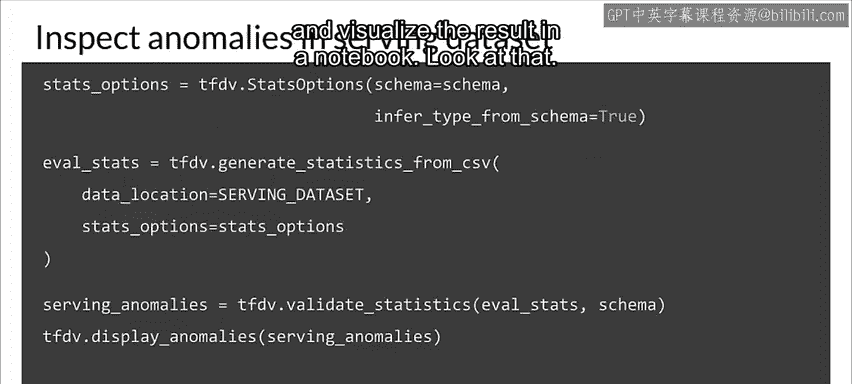
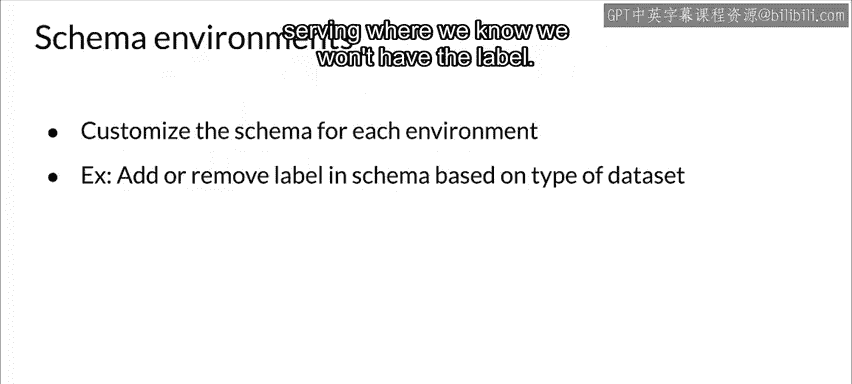
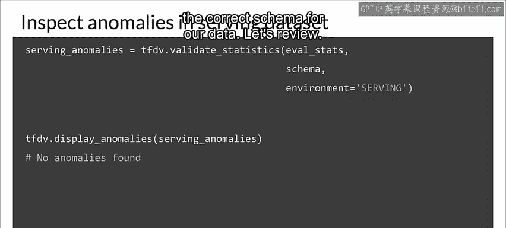
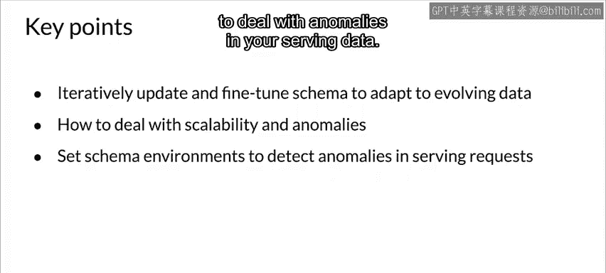

#  069：模式环境 🧩

在本节课中，我们将要学习模式环境的概念及其在机器学习生产管道中的重要性。随着业务和数据的发展，数据模式也会随之演变。我们将探讨如何管理多个模式版本，以及如何利用模式环境来检测和处理数据异常，确保模型的可靠性和可扩展性。

---

现在我们来讨论模式环境。你的业务和数据在整个生产管道的生命周期中都会不断演变。

通常情况下，随着数据的演变，你的模式也会演变。

当你开发代码来处理模式变化时，你可能同时有多个版本的模式处于活动状态。

你可能有一个用于开发的模式，一个当前正在测试的模式，以及另一个当前正在生产环境中使用的模式。对你的模式进行版本控制，就像对你的代码进行版本控制一样，有助于管理这种情况。

在某些情况下，你可能需要不同的模式来支持不同数据环境下的多种训练和部署场景。

例如，你可能希望在服务器和移动应用程序上使用相同的模型。

但想象一下，某个特定特征在这两种环境中是不同的，可能在一个环境中是整数，而在另一个环境中是浮点数。你需要为每种情况使用不同的模式，以反映数据的差异。

与此同时，你的数据正在演变，可能在你所有不同的数据环境中同时进行。

但同时，你还需要检查数据是否存在问题或异常，而模式是检查异常的关键部分。

---

让我们看一个例子，了解模式如何帮助你检测服务请求数据中的错误，以及为什么多个模式版本很重要。

我们将从推断服务模式开始，并使用 TensorFlow Data Validation（TFTV）来完成这个任务。

然后，我们将为服务数据集生成统计信息。

接着，我们将使用 TFTV 来查找此数据是否存在任何问题，并在笔记本中可视化结果。

---

哦，看这里。TFDV 报告称服务数据中存在异常。

但由于这是一个包含预测请求的数据集，这实际上并不令人惊讶。

标签（即覆盖类型）缺失了，但模式告诉 TFTV 覆盖类型特征是必需的，因此它将其标记为异常。我们如何解决这个问题？

在需要维护同一模式的多种类型的情况下，你通常需要保留模式环境。这在训练数据和服务数据之间的差异中最为常见。

你可以根据要处理的情况选择自定义模式。例如，在这种情况下，设置是维护两个模式：一个用于训练数据（其中标签是必需的），另一个用于服务（我们知道不会有标签）。

---

多个模式环境的代码相当直接。在我们现有的环境中，我们已经有了一个训练模式。

然后，我们创建两个名为 `training` 和 `serving` 的环境。

我们通过移除覆盖类型特征来修改服务环境，因为我们知道在服务中，我们的特征集中不会有该特征。

最后，代码设置服务环境并使用它来验证服务数据。现在，由于我们为数据使用了正确的模式，没有发现异常。

---

那么，让我们回顾一下。首先，我们讨论了如何迭代更新和微调你的模式以适应不断演变的数据。

然后，我们关注了数据演变周期中的可靠性和可扩展性。

接着，你实现了模式环境来处理服务数据中的异常。

---

本节课中，我们一起学习了模式环境的核心概念。我们了解到，随着数据和业务需求的变化，维护多个模式版本是必要的。通过创建不同的模式环境（如训练环境和服务环境），我们可以有效地处理数据差异并检测异常，从而确保机器学习管道在生产中的稳定运行。