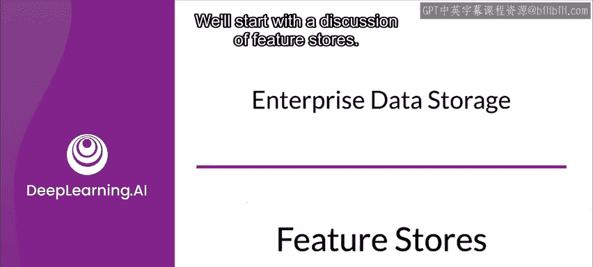
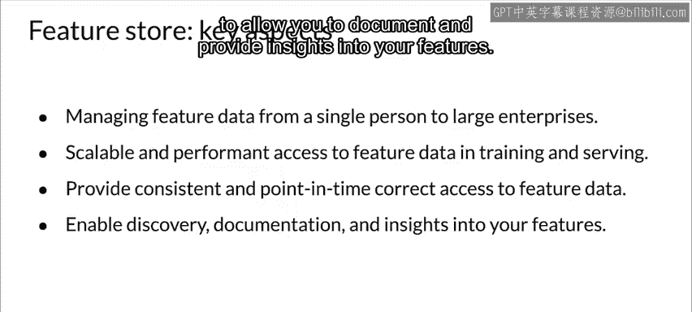

#  070：特征存储 🗄️

在本节课中，我们将要学习数据存储的核心概念之一——特征存储。我们将探讨它的定义、价值、工作原理以及在实际应用中的关键考量。

接下来三个主题，我们将讨论数据存储。这三个部分没有需要提交的作业，但我强烈建议你认真学习。这里包含了一些非常重要的信息，尤其是关于特征存储的部分，正变得越来越重要。不过，根据你所在的环境和已有资源，你可能需要利用数据仓库或数据湖，因此理解这些概念也变得至关重要。现在，让我们开始学习。

现在，我们转向应该在哪里存储数据的问题。我们将从讨论特征存储开始。

---

## 什么是特征存储？🤔

特征存储是一个用于存储**经过文档化、精心整理且访问受控的特征**的中央仓库。使用特征存储能使团队共享、发现和使用这些高质量的特征。特征存储让特征的发现和消费变得容易。

特征可以同时用于在线或离线场景，服务于模型训练和预测。

人们常常发现，许多建模问题会使用相同或相似的特征。因此，相同的数据经常在多个建模场景中被使用。在许多情况下，特征存储可以被视为特征工程和模型开发之间的接口。

特征存储是有价值的、集中的特征仓库，它能减少冗余工作。它们之所以有价值，还因为它们使团队能够共享数据，并发现已有的可用数据。一个组织内可能有不同的团队在解决不同的业务问题，但他们可能在使用完全相同或非常相似的数据。基于这些原因，对于大型项目和组织的机器学习应用，特征存储正成为企业数据存储的主流选择。

---

## 特征存储的功能与优势 ⚙️

以下是特征存储提供的一些关键功能：

*   **数据处理与转换**：特征存储通常允许对数据进行转换，从而避免在不同的独立流水线中重复进行相同的处理。
*   **访问控制**：对特征存储中数据的访问可以基于角色权限进行控制。
*   **特征聚合与衍生**：存储中的数据可以被聚合以形成新的特征。
*   **数据治理**：数据可以被匿名化，甚至根据法规要求（例如为符合GDPR的“被遗忘权”）进行清除。

---

## 离线与在线特征处理 🔄

上一节我们介绍了特征存储的基本功能，本节中我们来看看它在不同场景下的具体应用。

特征处理通常分为离线和在线两种模式。

**对于离线处理**，这可以定期进行，例如通过一个定时任务。想象一下，你需要运行一个任务来摄取数据，然后可能对其进行一些特征工程，并从中生成额外的特征（例如特征交叉）。这些新特征也会被发布到特征存储中。在处理和调整数据时，你还可以将其与监控工具集成，再次进行离线监控。这些处理后的特征被存储起来供离线使用。

**对于在线特征使用**，当预测需要实时返回时，延迟要求通常非常严格。你需要确保能快速访问数据。例如，如果你需要将用户账户信息与单个预测请求进行关联，这种关联操作必须快速完成。这很好，但通常很难在线以高性能的方式计算某些特征。因此，预先计算并存储这些特征通常是个好主意。如果你预先计算并存储了这些特征，那么之后就可以以较低的延迟使用它们。

你也可以在批处理环境中进行类似操作。同样，你不希望延迟太长，但要求可能不像在线请求那样严格。

---

## 关键考量：避免数据穿越 🚫

从预先计算和加载（尤其是历史特征）的角度看，过程往往相当简单。对于批处理环境中的历史特征，通常也很直接。

然而，在训练模型时，你需要确保只包含在服务请求发生时**可用的数据**。包含在服务请求发生**之后**的某个时间才可用的数据被称为“数据穿越”，许多特征存储都包含防护措施来避免这种情况。此外，这违反了物理定律，我们不应该这样做。

你可能会每隔几小时或每天定时进行预计算。当然，为了避免训练-服务偏差，你将使用相同的数据进行训练和服务。

---

## 特征存储的设计目标 🎯

大多数特征存储的目标是提供一种统一的管理特征数据的方法，这种方法可以从单个人扩展到大型企业。它需要具备高性能。你希望在训练模型和服务模型时都尝试使用相同的数据。

你需要一致性，并能按时间点正确访问特征数据。例如，你希望避免在服务模型时，使用未来才可用的数据来进行预测。换句话说，如果你试图预测明天早上会发生的事情，你要确保没有包含来自明天的数据。它应该只包含今天之前的数据。

大多数特征存储提供工具来支持特征发现，并允许你记录特征信息，提供对特征的洞察。

---

## 总结 📝

本节课中，我们一起学习了特征存储。我们了解到，特征存储是一个集中化管理、文档化和访问控制特征的中央仓库，它能促进团队协作、减少冗余工作，并确保训练与服务数据的一致性。我们探讨了其离线与在线处理模式，并重点强调了避免“数据穿越”以确保预测有效性的重要性。特征存储是现代机器学习工程中实现高效、可扩展数据管理的关键组件。