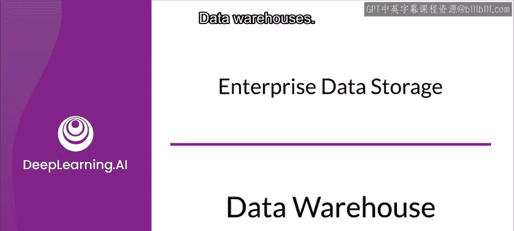
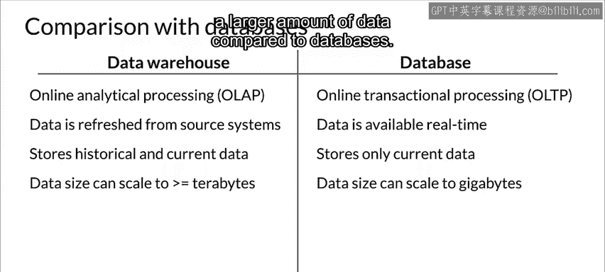

#  071：数据仓库 📊

在本节课中，我们将要学习数据仓库的概念。数据仓库是一种在企业中广泛使用的数据存储解决方案，尤其适用于大数据、商业智能以及生产环境中的机器学习运维（MLOps）。我们将探讨其定义、关键特性、优势以及与常见数据库的区别。

---

现在，我们来讨论数据仓库。需要说明的是，数据仓库最初是为大数据和商业智能应用而开发的，但它对于生产环境中的机器学习运维同样是一个非常有价值的工具。

一个**数据仓库**是一种技术，它聚合来自一个或多个来源的数据，以便进行处理和分析。数据仓库通常用于运行时间较长的批处理作业，其存储针对读取操作进行了优化。进入仓库的数据可能不是实时的。当你在数据仓库中存储数据时，你的数据需要遵循一致的**模式**。

---

上一节我们介绍了数据仓库的基本定义，本节中我们来看看它的一些关键特性。

以下是数据仓库的几个关键特性：

*   **主题导向**：存储在其中的信息围绕一个主题展开。例如，数据仓库中的数据可能专注于组织的客户或供应商等。
*   **集成性**：数据仓库中的数据可能从多种类型的来源收集，例如关系数据库或文件等。
*   **时变性**：收集在数据仓库中的数据通常会打上时间戳，以维护其生成时的上下文。
*   **非易失性**：这意味着添加新数据时，不会擦除旧版本的数据。因此，你可以按时间函数访问存储在数据仓库中的数据，并理解数据是如何演变的。

---

了解了数据仓库的特性后，我们来看看它的主要优势。

以下是数据仓库的一些优势：

*   **增强的分析能力**：通过为数据打上时间戳，数据仓库有助于维护上下文，从而增强分析能力。
*   **提高数据质量和一致性**：当数据存储在数据仓库中时，它遵循一致的**模式**，这有助于提高数据质量和一致性。
*   **高投资回报率**：研究表明，对于许多用例，数据仓库的投资回报率往往相当高。
*   **高效的读取和查询**：数据仓库的读取和查询效率通常很高，能让你快速访问数据。

---

你可能熟悉数据库，那么一个很自然的问题是：数据仓库和数据库有什么区别？

以下是两者的一些比较：

*   **用途**：数据仓库用于分析数据，而数据库通常用于事务处理。
*   **数据可用性**：在数据仓库中，存储数据与数据在系统中反映出来之间可能存在延迟。但在数据库中，数据通常在存储后立即可用。
*   **历史数据**：数据仓库将数据作为时间的函数存储，因此历史数据也可用。数据库则不一定。
*   **数据规模**：与数据库相比，数据仓库通常能够存储更大量的数据。
*   **查询性质**：数据仓库中的查询本质复杂，且往往运行时间较长。而数据库中的查询简单，倾向于实时运行。
*   **规范化**：数据仓库不一定需要规范化，但数据库应使用规范化。

---

在本节课中，我们一起学习了数据仓库。我们了解了数据仓库是一种用于聚合和分析数据的存储技术，其关键特性包括主题导向、集成性、时变性和非易失性。我们还探讨了数据仓库在增强分析能力、保证数据一致性等方面的优势，并重点比较了数据仓库与传统数据库在用途、数据可用性、查询方式等方面的主要区别。理解这些概念对于构建高效的数据处理和分析管道至关重要。