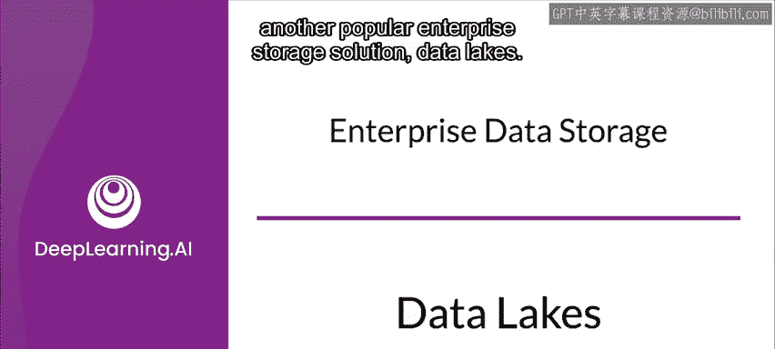
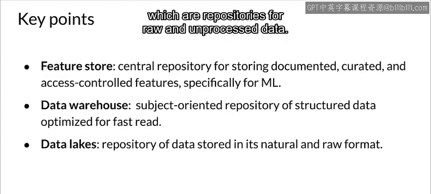

#  072：吴恩达《机器学习工程师的生产实践（MLOps）》第31讲 🏞️

## 概述

在本节课中，我们将要学习企业级数据存储解决方案中的另一个重要概念——数据湖。我们将探讨数据湖的定义、特点，并将其与之前介绍过的数据仓库进行比较，以帮助你理解它们各自的应用场景和差异。

---

## 什么是数据湖？

上一节我们介绍了数据仓库，它是一种面向主题、经过优化用于读取的数据存储库。本节中我们来看看数据湖。

数据湖是一个以数据原始、自然格式存储的系统或存储库。其存储形式通常是二进制大对象或文件。

数据湖与数据仓库类似，也汇聚了来自企业各种数据源的信息。然而，数据湖可以包含多种类型的数据：

以下是数据湖可能包含的数据类型：
*   **结构化数据**：例如关系型数据库中的数据。
*   **半结构化数据**：例如CSV文件。
*   **非结构化数据**：例如图像集合或文档集合等。

由于数据湖以原始格式存储数据，它通常不进行任何处理，也不遵循固定的模式。

---

## 数据湖 vs. 数据仓库

了解了数据湖的基本概念后，我们将其与数据仓库进行对比，以明确两者的核心区别。

以下是数据湖与数据仓库的主要区别：
*   **数据格式与模式**：
    *   在**数据仓库**中，数据以遵循特定模式的**一致格式**存储。
    *   在**数据湖**中，数据通常以其**原始格式**存储。
*   **存储目的**：
    *   **数据湖**存储数据的目的通常在存储时**并未预先确定**。
    *   **数据仓库**则通常为**特定目的**而存储数据。
*   **主要用户**：
    *   **数据仓库**常被业务专业人员使用。
    *   **数据湖**则通常仅由数据科学家等**数据专业人员**使用。
*   **灵活性与变更成本**：
    *   由于数据仓库中的数据格式一致，对其进行变更可能**复杂且成本高昂**。
    *   数据湖则**更加灵活**，更容易对数据进行更改。

---

## 企业数据存储方案回顾

在本周的学习中，我们探讨了多种企业数据存储方案。现在，让我们做一个简要的回顾。

首先，你学习了**特征存储**，它是为机器学习专门设计、高度精选的特征数据存储库。

接着，你了解了面向主题、为读取优化的数据存储库，即**数据仓库**。

最后，我们探索了存储原始、未处理数据的存储库——**数据湖**。

---

## 总结

本节课中我们一起学习了数据湖的概念及其与数据仓库的关键区别。我们了解到，数据湖以其存储原始、格式多样的数据以及高度的灵活性，为数据科学家的探索性工作提供了强大的支持。至此，我们完成了本周关于数据存储与管理的重要讨论。期待下次再见！😊