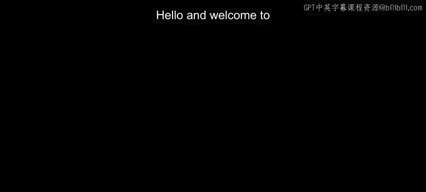
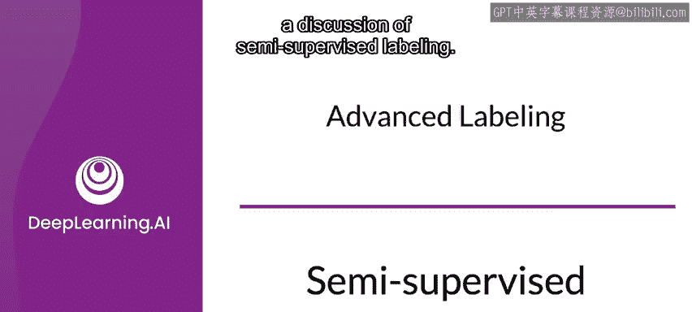
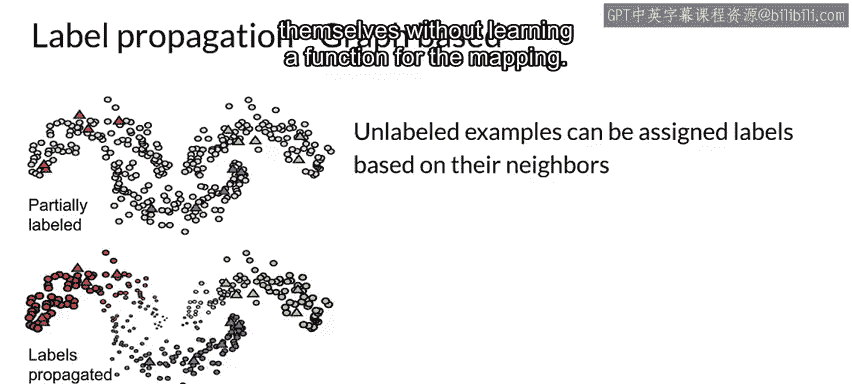

#  073：半监督学习 🧠

在本节课中，我们将要学习几种高级的数据标注技术，包括半监督标注、主动学习和弱监督。这些技术能帮助我们利用大量未标注数据，降低标注成本，同时提升模型性能。我们首先从半监督学习开始。

## 概述

机器学习无处不在，而监督学习需要标注数据。手动标注数据通常昂贵且困难，而未标注数据则相对廉价且易于获取。未标注数据中包含大量有助于改进模型的信息。高级标注技术旨在降低标注成本，同时利用大量未标注数据中的信息。

## 半监督标注

上一节我们概述了高级标注技术的重要性，本节中我们来看看半监督标注的具体工作原理。

半监督标注从一个相对较小、由人工标注的数据集开始。然后，将这个标注数据集与大量未标注数据结合。通过观察不同人工标注类别在特征空间中的聚类或结构方式，来推断未标注数据的标签。最后，使用这两个数据集的组合来训练模型。

这种方法基于一个假设：不同的标签类别会在特征空间内聚集在一起，或具有某种可识别的结构。

使用半监督标注主要有两个优势：
1.  结合标注和未标注数据可以提高机器学习模型的准确性。
2.  获取未标注数据通常成本很低，因为它不需要人工分配标签。未标注数据通常可以大量、轻易地获得。

## 标签传播算法

标签传播是一种为先前未标注的样本分配标签的算法。这使其成为一种半监督算法，其中数据点的子集拥有标签。该算法将标签传播到没有标签的数据点。

以下是其工作原理：
它基于已标注数据点和未标注数据点之间的相似性或社区结构来完成传播。这种相似性或结构被用来为未标注数据分配标签。

例如，在基于图的方法中（如上图所示），你可以看到一些已标注数据（图中的红、蓝、绿色三角形）和大量未标注数据（灰色圆圈）。通过这种方法，根据未标注样本的邻居为其分配标签。然后，标签会传播到集群的其余部分，如图所示的不同颜色。

需要说明的是，实现标签传播有多种不同方法。基于图的标签传播只是其中一种技术。标签传播本身被视为**转导学习**，这意味着我们直接从样本本身进行映射，而不学习一个映射函数。

## 总结

本节课中，我们一起学习了半监督学习的基本概念。我们了解到，通过从少量人工标注数据出发，并利用未标注数据在特征空间中的结构来推断其标签，可以有效地扩充训练集。这种方法能够以较低成本利用大量易得的未标注数据，从而潜在地提升模型性能。标签传播是实施半监督学习的一种具体算法示例。