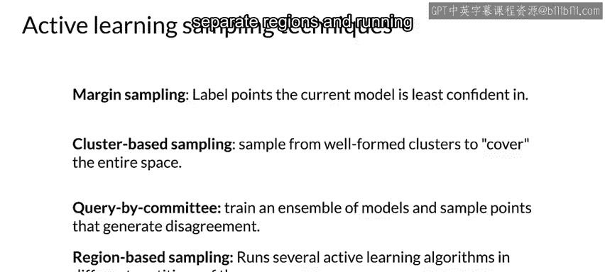

#  074：主动学习 🎯

在本节课中，我们将要学习一种名为“主动学习”的智能数据采样方法。主动学习旨在通过选择最具预测价值的未标记数据点进行标注，从而高效地提升模型性能。这对于数据标注预算有限、数据集不平衡或标准采样方法效果不佳的场景尤其有用。

## 什么是主动学习？🤔

主动学习是一种智能的数据采样方式。其核心在于，智能采样会选择那些能为模型带来最大预测价值的未标记数据点。

这种方法在多种情境下都非常有帮助。首先，在数据标注预算有限时，标注数据需要成本，尤其是当需要人类专家查看数据并分配标签时（例如在医疗保健领域）。主动学习有助于抵消这种成本和负担。其次，如果你有一个不平衡的数据集，主动学习是在训练阶段选择稀有类别的高效方法。最后，如果标准采样技术无助于提高准确性或其他目标指标，主动学习可以找到实现或帮助实现所需准确性的途径。

主动学习策略的工作原理是，在完全监督的设置下，选择最能帮助模型学习的样本进行标注。训练数据集仅包含你已标注的样本。在半监督设置中，你还可以利用这些样本来执行某种标签传播，这是对主动学习的补充。

## 主动学习的典型生命周期 🔄

以下是主动学习的典型工作流程。

*   **初始未标记数据池**：你从一个未标记的数据池开始。
*   **智能采样选择**：主动学习通过智能采样选择少量样本。
*   **数据标注**：你通过人工标注员或其他技术为这些数据添加注释。
*   **生成训练集**：这个标注过程会生成一个带标签的训练数据集。
*   **训练与预测**：最后，你使用这些已标注的数据来训练模型并进行预测。

这个循环会持续进行。但这引出了一个关键问题：我们如何进行智能采样？

## 如何进行智能采样？🎯

上一节我们介绍了主动学习的流程，本节中我们来看看一种广泛使用的智能采样技术：边界采样。

在边界采样中，你根据数据点与决策边界的距离，为最不确定的点分配标签。在这个示例中，数据属于两个类别。此外，还有一些未标记的数据点。在此设置下，最简单的策略是训练一个二元线性分类器模型（为了简化示例，我们使用线性模型）。我们在已标记数据上训练该模型，这将得到一个决策边界。

现在，在未标记数据中，最不确定的点是离决策边界最近的点。因此，通过主动学习，你将选择那个最不确定的点进行下一步标注，并将其添加到数据集中。然后，使用这个新标记的数据点作为数据集的一部分，重新训练模型以学习新的分类边界。移动边界后，模型能更好地分离这些类别。接下来，你再次找到最不确定的数据点并重复此过程，直到模型不再改进。

这张图显示了不同采样技术下，模型准确率随训练样本数量变化的函数关系。红线显示了随机选择点进行标注的结果。蓝线和绿线显示了使用主动学习的两种边界采样算法的性能。如图所示，与随机采样技术相比，边界采样方法用更少的训练样本实现了更高的准确率。当然，最终，当未标记数据中有更高比例被标注后，即使是随机采样也能赶上边界采样的性能，但这需要标注多得多的数据。

## 常见的主动学习采样技术 📊

除了边界采样，还有其他几种常见的主动学习采样技术。

*   **基于聚类的采样**：你通过特征空间上的聚类方法，选择一组多样化的点。
*   **委员会查询**：你训练多个模型，并选择这些模型之间分歧最大的数据点。
*   **基于区域的采样**：这是一种相对较新的算法。概括来说，该算法通过将输入空间划分为不同的区域，并在这些区域内运行主动学习算法来工作。

## 总结 📝

本节课中我们一起学习了主动学习的概念。主动学习通过智能选择最具信息量的未标记数据进行标注，能够有效降低标注成本、处理不平衡数据集，并更快地提升模型性能。我们探讨了其典型生命周期，并重点介绍了边界采样这一核心方法，同时也简要了解了基于聚类、委员会查询和基于区域等其他采样技术。掌握主动学习，能帮助你在资源有限的情况下更高效地构建机器学习模型。