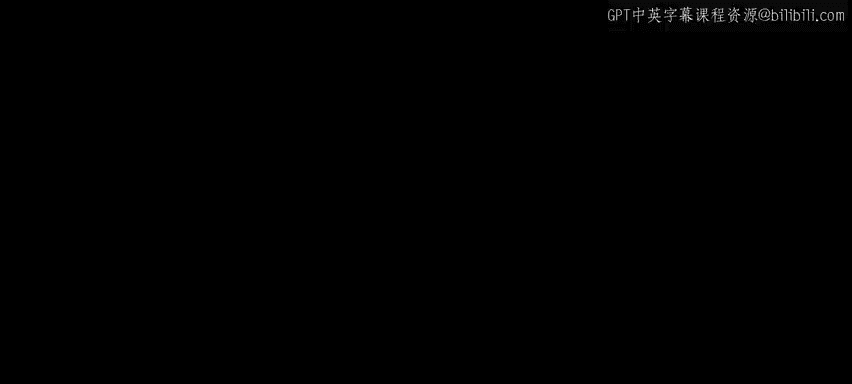
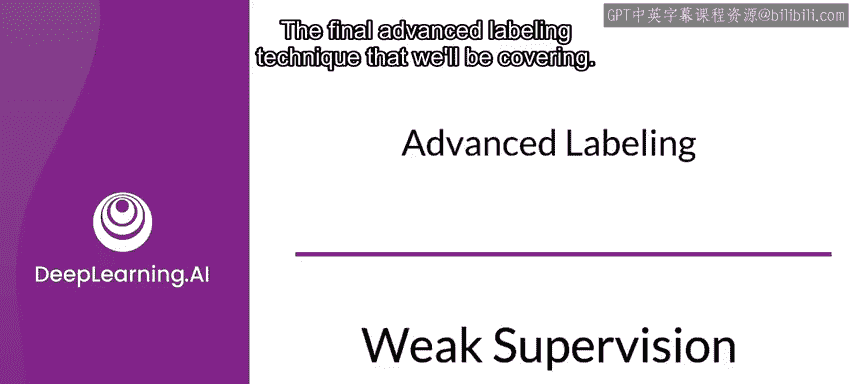
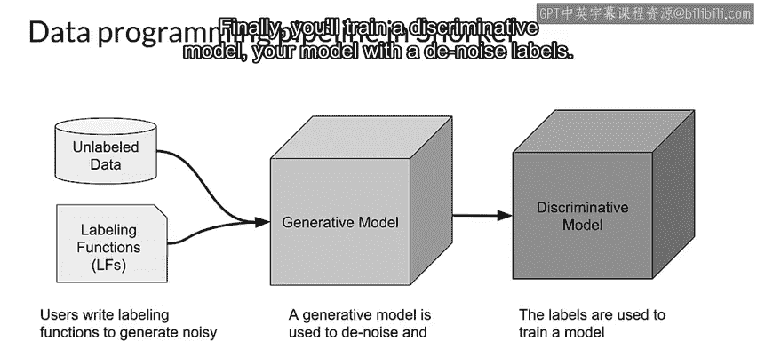
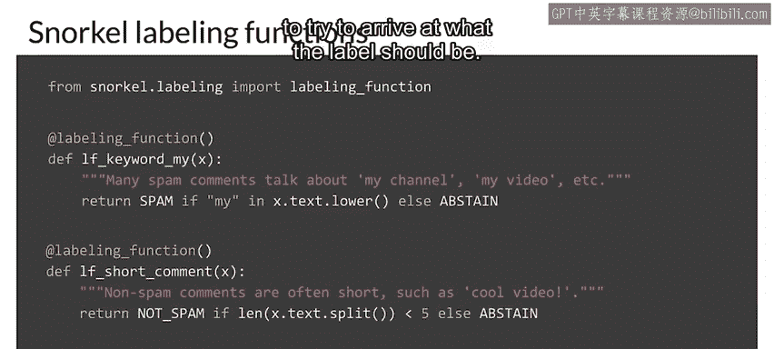
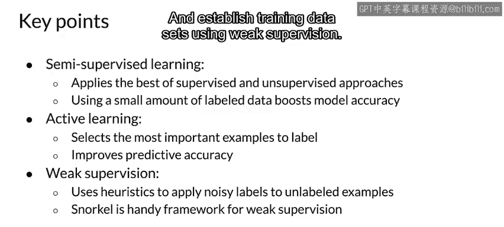

#  075：弱监督 📝



在本节课中，我们将学习一种高级数据标注技术——弱监督。我们将了解其核心概念、工作原理以及如何通过Snorkel框架来实践它。

---

## 概述



监督学习需要带标签的数据，但数据标注过程通常昂贵、困难且缓慢。为了解决这个问题，我们引入了多种高级标注技术。上一节我们介绍了主动学习，本节中我们来看看最后一种技术：弱监督。这是一种利用来自一个或多个信息源的噪声标签来生成训练数据的方法。

---

## 什么是弱监督？🤔

弱监督是一种利用来自一个或多个信息源的信息来生成标签的方法。这些信息源通常是领域专家设计的启发式规则。由此产生的标签是带有噪声的，而非我们习惯的确定性标签。

更具体地说，弱监督包含一个或多个基于未标记数据的**噪声条件分布**。其主要目标是学习一个**生成模型**，以确定每个噪声源的相关性。

以下是弱监督流程的核心步骤：

1.  从**未标记数据**开始。
2.  添加一个或多个**弱监督源**。这些源是实现噪声和不完美自动标注的启发式程序列表。
3.  学习每个监督源的**可信度**。这是通过训练一个生成模型来完成的。

---

## Snorkel框架 🛠️

Snorkel框架于2016年由斯坦福大学提出，是实施弱监督最广泛使用的框架。它不需要手动标注，而是通过编程方式构建和管理训练数据集。Snorkel提供工具来清理、建模和整合通过弱监督流程产生的训练数据。

使用Snorkel的典型流程如下：

1.  从**未标记数据**开始。
2.  应用**标注函数**。这些是由领域专家设计的、用于生成噪声标签的启发式规则。
3.  使用**生成模型**对噪声标签进行去噪，并为不同的标注函数分配重要性权重。
4.  最后，使用去噪后的标签训练一个**判别模型**（即你的最终模型）。

---

## 标注函数示例 💻

以下是使用Snorkel创建简单标注函数来识别垃圾邮件的代码示例。我们使用多个标注函数来共同决定标签。



首先，从Snorkel导入标注函数：

```python
from snorkel.labeling import labeling_function
```

然后，定义第一个标注函数。如果消息包含单词“my”，则将其标记为垃圾邮件（这只是一个简单的示例）：

```python
@labeling_function()
def lf_contains_my(x):
    return SPAM if "my" in x.text.lower() else ABSTAIN
```

接着，定义第二个标注函数。如果消息长度超过5个单词，则将其标记为垃圾邮件：

```python
@labeling_function()
def lf_long_message(x):
    return SPAM if len(x.text.split()) > 5 else ABSTAIN
```



我们所展示的是使用多个标注函数来尝试确定应有的标签。

---

## 高级标注技术要点回顾 📋

以下是几种高级标注技术的关键点总结：

*   **半监督学习**：一种介于无监督学习和监督学习之间的方法。它通过将少量带标签数据与大量未标记数据相结合来提高学习准确性。
*   **主动学习**：依赖于智能采样技术，选择最重要的样本进行标注并添加到数据集中。它在最小化标注成本的同时提高了预测准确性。
*   **弱监督**：在监督学习环境中利用噪声、有限或不准确的标签源来生成训练数据集。Snorkel是一个用于管理弱监督所有操作、并建立训练数据集的紧凑且用户友好的系统。

---

## 总结



本节课中，我们一起学习了弱监督技术。我们了解到，弱监督通过利用领域专家设计的启发式规则作为噪声标签源，能够以编程方式高效地生成训练数据。借助Snorkel这样的框架，我们可以整合多个标注函数，通过生成模型去噪并加权，最终训练出强大的判别模型。这为解决数据标注瓶颈提供了一种强有力的实践方案。