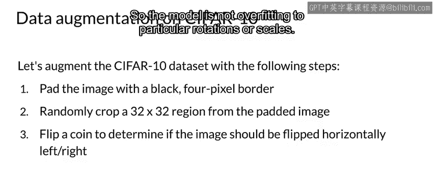
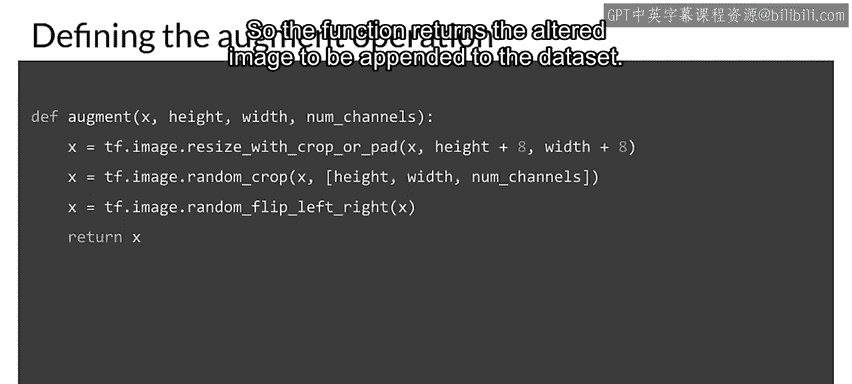
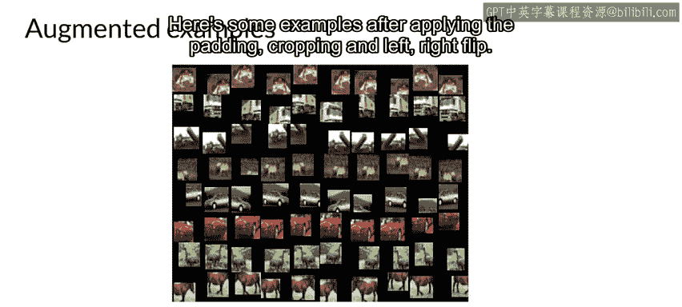
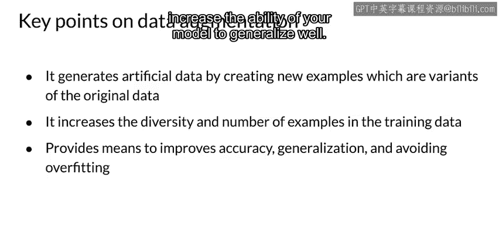

#  076：数据增强 📈

在本节课中，我们将学习数据增强技术。数据增强是一种通过修改现有数据或生成合成数据来扩展数据集的方法，旨在提升模型的性能和泛化能力。我们将从基本概念入手，通过一个图像数据增强的实例，最后简要介绍一些高级技术。


---

## 概述

上一节我们讨论了通过标注未标注数据来获取更多训练样本的方法。本节中，我们来看看另一种策略：数据增强。数据增强通过对现有数据进行合理的微小修改或扰动，生成新的、有效的训练样本，从而扩大数据集规模并提升其多样性。

## 什么是数据增强？

数据增强通过向数据集中添加经过轻微修改的现有数据副本，或基于现有数据创建新的合成数据来扩展数据集。

利用现有数据，通过对样本进行微小的改变或扰动，可以创建更多数据。对于图像数据，简单的操作如翻转或旋转，可以轻松地将数据集中的图像数量翻倍或增至三倍。

下图展示了这类变换的示例：


数据增强是提升模型性能的一种方式。它通过添加新的、有效的样本来覆盖特征空间中未被真实样本覆盖的区域，从而改善特征空间的覆盖度。

需要注意的是，如果添加了无效的样本，可能会导致模型学到错误的答案，或至少引入不必要的噪声。因此，务必确保仅以有效的方式进行数据增强。

## 使用 CIFAR-10 数据集进行实践

CIFAR-10 数据集是加拿大高级研究所收集的一组图像，常用于训练机器学习和计算机视觉模型。它是机器学习研究中使用最广泛的数据集之一。CIFAR-10 包含 60,000 张 32x32 的彩色图像，共有 10 个不同的类别，每个类别有 6,000 张图像。

接下来，我们以 CIFAR-10 数据集为例，实际看看数据增强的过程。我们将对图像进行边框填充，这个新生成的样本是完全有效的。然后，我们将填充后的图像裁剪回 32x32 大小，并根据随机变量（如抛硬币的结果）对填充并裁剪后的图像进行翻转或旋转。这样做的目的是防止模型对特定的旋转或尺度产生过拟合。

由于彩色图像是张量，TensorFlow 提供了非常有用的函数来对图像数据集执行增强操作。



## 代码示例：左右翻转

以下是封装了执行左右翻转步骤的一段代码：

首先，我们定义一个用于增强图像数据集的函数。


```python
import tensorflow as tf

def augment_image(image):
    # 使用填充或裁剪调整图像大小，这里我们选择填充
    image = tf.image.resize_with_crop_or_pad(image, target_height=40, target_width=40)
    # 随机裁剪回原始尺寸
    image = tf.image.random_crop(image, size=[32, 32, 3])
    # 随机进行左右翻转
    image = tf.image.random_flip_left_right(image)
    return image
```

*   `tf.image.resize_with_crop_or_pad` 允许你调整图像大小或进行裁剪，在本例中我们将进行填充。
*   `tf.image.random_crop` 生成一个指定高度和宽度的裁剪区域，作用于所有通道。
*   `tf.image.random_flip_left_right` 随机对图像进行左右翻转。

该函数返回修改后的图像，以便将其添加到数据集中。

下图展示了应用填充、裁剪和左右翻转后的一些示例：





## 其他高级数据增强技术

除了简单的图像操作，还有其他高级的数据增强技术。

例如，半监督数据增强技术，如无监督数据增强（UDA），或使用基于策略的数据增强方法，如 AutoAugment。

右侧是一个电影评论的例子。通过使用策略增强，我们生成了一个变体样本。这样，我们就通过增强得到了一个全新的、完全有效的样本，并且我们可以重复这个过程，生成另一个样本。



## 总结

本节课中，我们一起学习了数据增强技术。总而言之，数据增强是增加数据集中已标注样本数量的绝佳方法。

*   它增加了数据集的规模和样本多样性，从而带来更好的特征空间覆盖。
*   数据增强可以减少过拟合，并提高模型的泛化能力。


通过合理应用数据增强，我们能够用有限的数据训练出更强大、更稳健的机器学习模型。