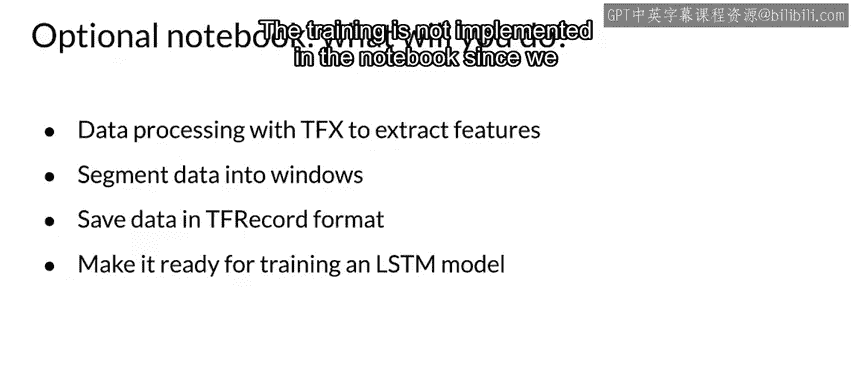

#  077：时间序列数据处理 📊

## 概述

在本节课中，我们将学习如何处理时间序列数据。时间序列数据是按时间顺序记录的数据点序列，常见于传感器读数、气象记录等领域。我们将以气象数据为例，探讨其关键特性、预处理方法以及如何为模型训练（如LSTM）准备数据。

---

## 数据类型的多样性

上一节我们介绍了课程背景，本节中我们来看看不同类型的数据。

根据你处理的问题和拥有的数据，你可能会遇到多种数据类型，每种类型都需要不同的预处理方法，有时甚至需要不同的建模技术。例如，你可能处理图像、视频、文本、音频或时间序列数据。本课程无法详尽讨论所有数据类型，因此我们提供了一些可选材料供你自行探索。

以下是可选材料列表：
*   一个用于处理CIFAR-10图像数据集的可选笔记本。
*   两个用于处理时间序列数据的笔记本：一个基于气象数据，另一个基于大多数手机上都有的加速度计和其他传感器数据。

在列出的所有数据类型中，时间序列可能是大多数开发者最不熟悉的一种。因此，让我们从回顾时间序列的关键方面开始。

---

## 什么是时间序列？

时间序列是按时间顺序排列的数据点序列，通常来自记录的事件，其中时间维度指示事件发生的时间。原始数据中的时间序列可能有序也可能无序，但为了建模，你几乎总是希望它们按时间顺序排列。

在典型情况下，我们希望预测未来的值。具体来说，我们希望基于先前的测量值，预测未来某个时间点T的y值。目标是训练一个模型，以可接受的准确度预测未来的输出。

卡尔·克里斯蒂安·克劳斯曾指出，做出预测是困难的，尤其是关于未来的预测。当然，其推论是，预测过去相对容易，因为那已经发生了。时间序列预测正是试图预测未来，它通过分析过去的数据来实现这一点。

这需要有时间索引的数据。例如，为了预测某个地点未来的温度，我们可以使用过去记录的其他气象变量，如大气压力、风向和风速等。

---

## 气象预测实例

让我们看一个进行气象预测的具体例子。

在这个例子中，你将处理一个由马克斯·普朗克生物地球化学研究所记录的时间序列数据集。该数据集包含14个不同的特征，包括气温、大气压力和湿度。这些数据从2003年开始，每10分钟记录一次。

你的任务是使用TFX管道预处理这些特征，并将数据转换为时间序列格式。这种格式是训练循环神经网络（如长短期记忆模型或LSTM）所必需的。

让我们更仔细地看看数据的组织和收集方式。

以下是数据的关键信息列表：
*   共有14个变量，包括与湿度、风向和风速、温度及大气压力相关的测量值。
*   预测目标是温度。
*   采样率为每10分钟一次观测，即每小时6次观测，每天144次观测（6 * 24）。

这些是部分特征随时间变化的图表，以及目标变量T（温度）。你可以看到数据中存在一种模式，在特定的时间间隔内重复出现。这里存在明显的季节性，我们在为此数据进行特征工程时需要加以考虑。

我们应该考虑进行季节性分解，但为了简化本例，我们不会这样做。数据表现出明显的周期性或季节性，在这种情况下，很可能与一年中典型的季节变化有关。但请记住，数据的季节性特征通常与实际的年季节无关，它实际上是关于周期性的。

---

## 窗口化策略

采用窗口化策略来观察与过去数据的依赖关系似乎是一条自然的路径。幸运的是，TFX已经内置了此功能。在笔记本中，你将看到TF Data的`window`函数，我们将使用它将数据集分组到窗口中。

那么，让我们以气象数据为例，确切地看看这是如何工作的。

时间序列中的窗口化策略变得非常重要，并且它们对于时间序列和类似类型的序列数据来说是相当独特的。

以下是两个窗口化示例：
*   **示例一**：你有一个模型，可用于预测未来一小时的情况。给定6小时的历史记录，将使用窗口大小为6、偏移量为1的滑动窗口。因此，总窗口大小为7（6 + 1）。
*   **示例二**：假设你预测未来24小时的情况，给定24小时的历史记录。那么，你的历史记录大小为24，偏移量大小也为24。因此，你可以使用总窗口大小为48（历史记录加上输出偏移量）。

同样重要的是要考虑“现在”是什么时候，并且不要包含未来的数据，这被称为“时间旅行”。在这个例子中，如果“现在”是t=24，那么我们需要小心，不要将t=25到t=47的数据包含在我们的训练数据中。我们可以通过特征工程或通过缩小窗口仅包含历史记录和标签来实现这一点。

---

## 采样策略

让我们谈谈采样策略。你已经知道在我们的例子中每小时有6次观测（每10分钟一次）。一天中，将有144次观测。

如果你取过去5天的观测值，并预测未来6小时的情况，这意味着我们的历史记录大小将是 5 * 144 = 720 次观测。输出偏移量将是 12 * 6 = 72。因此，时间上的总窗口大小为792。

由于一小时内观测值的变化可能不大，让我们每小时采样一次观测值。因此，我们将从每10分钟一次变为每小时一次。

以下是采样策略说明：
*   我们可以取每小时内的第一次观测作为样本。
*   或者，更好的方法是取每小时内观测值的中位数。

那么，我们的历史记录大小变为 5 * 24 * 1 = 120，我们的输出偏移量变为6，因此我们的总窗口大小变为126。这样，我们通过在每个小时内采样或通过取中位数聚合每小时的数据，将特征向量的大小从792减少到126。

我知道这里的数字可能有点令人困惑，但重要的是思考我们如何处理窗口中的数据。

---

## 在可选笔记本中你将做什么？

那么，在可选笔记本中你将做什么呢？

在笔记本中，你将首先使用TFX预处理天气时间序列数据集。你将使用 `tf.data.Dataset.window` 来创建用于构建样本的窗口。你将把转换和预处理后的数据以TFRecord格式保存。最后，你将创建训练和测试数据集，以便这些特征可以轻松地用于训练LSTM模型（使用TensorFlow或Keras的窗口化策略或其他框架）。由于我们专注于数据本身，笔记本中没有实现训练部分。

---

## 总结

本节课中，我们一起学习了时间序列数据的基本概念。我们了解了时间序列是按时间顺序排列的数据点，用于预测未来值。我们以气象数据为例，探讨了其季节性特征，并重点介绍了为模型训练准备数据的关键技术：窗口化策略和采样策略。通过合理设置窗口大小、偏移量并进行采样（如每小时取中位数），我们可以有效地构建用于训练循环神经网络（如LSTM）的特征数据集。