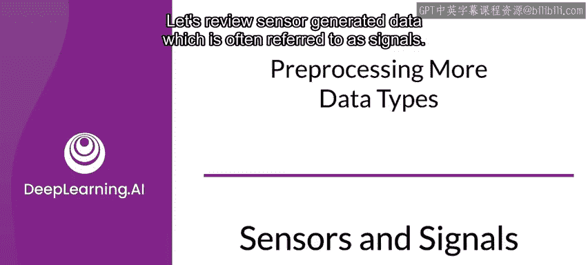
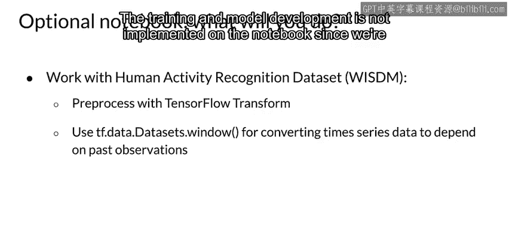

#  078：传感器与信号 📡

在本节课中，我们将学习传感器生成的数据，这类数据通常被称为“信号”。我们将通过一个具体的例子来理解相关的重要术语，并探讨如何处理和分析这类时间序列数据，特别是针对人类活动识别这一应用场景。

---

## 传感器与信号基础

上一节我们介绍了课程的主题。本节中，我们来看看传感器数据的基本概念。

传感器是一种能够检测和测量物理属性的设备。信号则是传感器实时收集到的数据序列。由于数据点按时间戳 `t` 索引，因此这类数据被称为**时间序列数据**，我们将使用**时间序列分析**方法来处理它。

---

## 一个具体问题：人类活动识别

理解了基本概念后，我们来看一个具体的应用问题：人类活动识别。其核心问题是：我们能否根据加速度计随时间变化的模式，推断出人的活动？

以下是人类活动识别面临的一些挑战：
*   传感器数据波动剧烈。
*   需要从连续数据流中准确识别出代表特定活动的片段。

---

## 关键步骤：数据分段

成功进行活动识别的关键在于对传感器数据进行正确的分段。这类似于我们之前讨论天气数据时使用的窗口化策略。

惯性数据随时间波动很大，因此分段是检测正确活动片段的关键。在数据分段过程中，原始的、与时间相关的加速度数据集被分割成多个片段。

**所有后续的相关操作，包括特征提取、分类和验证等，都基于这些片段进行。** 片段的长度取决于应用场景、上下文和传感器的采样率。对于人类活动识别，片段长度通常在 **1 到 10 秒** 之间。

---

## 数据转换与特征提取

数据被分段后，我们来谈谈典型的转换方法。为了提高模型的准确性和性能，应对分段后的数据进行转换。

以下是几种转换数据的方法：
*   **频谱图**：惯性信号的频谱图是将信号表示为频率和时间函数的一种新形式。它是一种强大的方法，用于提取可解释的特征，这些特征代表了不同惯性数据点之间的强度差异。
*   **归一化与编码**
*   **多通道处理**
*   **应用傅里叶变换**

---

## 实践练习概览

最后，我们简要了解一下将在可选笔记本中进行的实践内容。

你将尝试从传感器数据中识别人类活动。所使用的无线传感器数据挖掘数据集是在受控实验室条件下收集的。该数据集是使用手机加速度计数据进行活动识别的测试平台。

在该笔记本中，你将在 TfX 流水线中预处理数据。你将使用 `tf.data.Dataset.window` 将数据分组为窗口，这些窗口可用于 RNN 或类似模型。由于我们在此重点关注数据本身，笔记本中未实现训练和模型开发部分。

---

本节课中，我们一起学习了传感器信号的基本概念，探讨了人类活动识别这一应用，并深入了解了数据处理的关键步骤：分段与转换。这些是处理时间序列传感器数据的核心基础。