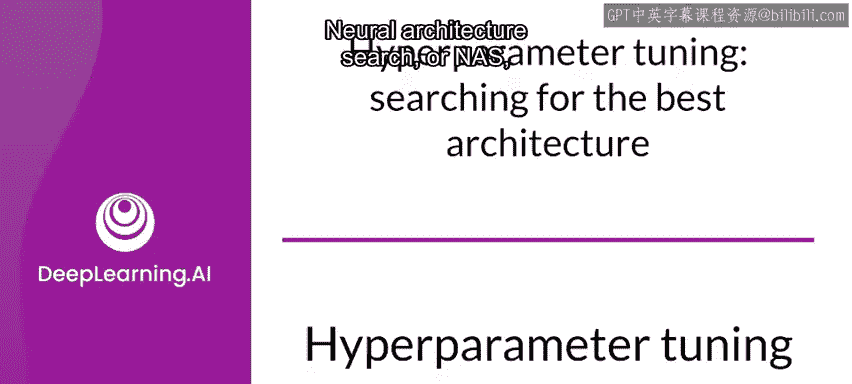
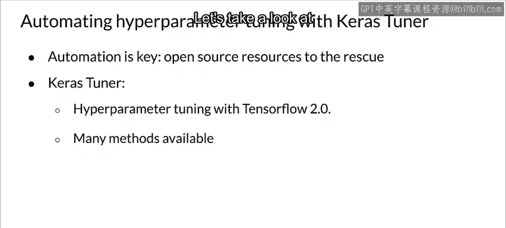

#  079：超参数调优 🎯

在本节课中，我们将学习超参数调优的基本概念，并了解其与神经架构搜索的关联。我们将探讨超参数调优的重要性，并介绍如何使用工具（如Keras Tuner）来自动化这一过程。

## 超参数调优与神经架构搜索

上一节我们介绍了课程的整体安排，本节中我们来看看超参数调优。神经架构搜索在近期的机器学习发展中扮演着重要角色。

本质上，它是一种自动化设计神经网络的技术。通过神经架构搜索发现的模型，在许多问题上常常能与手工设计的架构相媲美甚至更优。

神经架构搜索的目标是找到最优的架构。需要记住的是，现代神经网络覆盖了巨大的参数空间，因此使用像AutoML这样的工具来自动化搜索非常有意义。

在深入探讨AutoML之前，让我们通过分析机器学习建模中最繁琐的过程之一——超参数调优，来理解它所要解决的问题。

## 模型参数与超参数

在机器学习模型中，存在两种类型的参数。

*   **模型参数**：这些是模型必须使用训练集学习的参数，它们是我们模型的拟合或训练参数。通常这指的是**权重和偏置**。
*   **超参数**：这些是可调整的参数，必须经过调优才能创建出具有最佳性能的模型。但与模型参数不同，超参数不会在训练过程中自动优化。它们需要在模型训练开始之前设定，并影响模型的训练方式。

超参数调优对模型性能有重大影响。不幸的是，即使对于小型模型，超参数的数量也可能相当可观。

以下是浅层神经网络中可能需要做出选择的超参数类别：

*   架构选项
*   激活函数
*   权重初始化策略
*   优化器超参数
*   以及其他

## 自动化调优的必要性

执行手动的超参数调优可能非常费神，因为你需要跟踪已经尝试过的配置并启动不同的实验。这样的手动过程是繁琐的。

尽管如此，如果操作得当，超参数调优能显著提升模型性能。

## 超参数调优工具

已经创建了多个使用不同方法进行超参数调优的开源库。Keras团队发布了其中最好的一个——**Keras Tuner**。

这是一个可以轻松与TensorFlow 2.0配合进行超参数调优的库。它提供了多种不同的调优方法，包括：

*   随机搜索
*   Hyperband
*   贝叶斯优化

在下一节视频中，我们将看一个具体的例子。

---

本节课中，我们一起学习了超参数调优的基本概念，区分了模型参数与超参数，并理解了自动化调优工具（如Keras Tuner）的重要性。我们还初步了解了神经架构搜索与超参数调优之间的相似性。