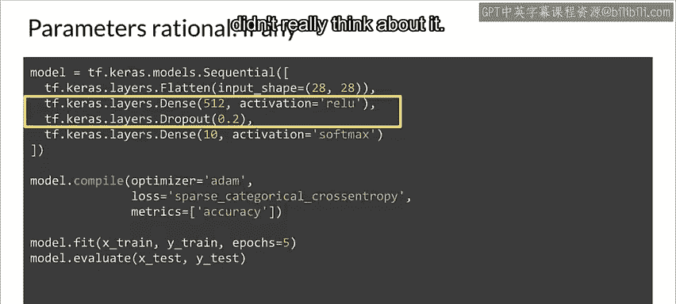
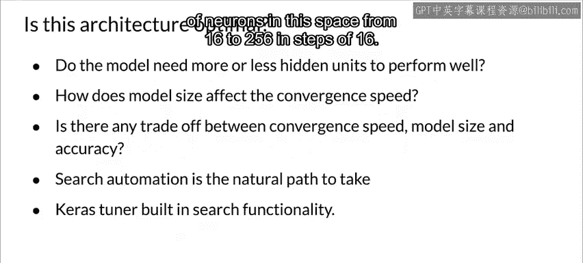
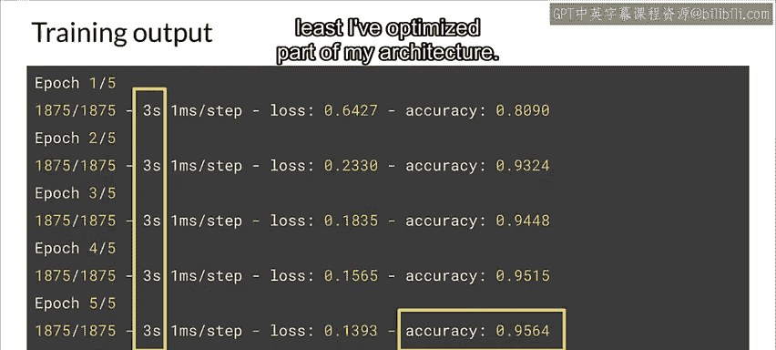

#  080：Keras AutoTuner 演示 🧠


在本节课中，我们将学习如何使用 Keras AutoTuner 来自动化神经网络超参数的调优过程。我们将从一个手动设置超参数的简单模型开始，逐步演示如何利用 AutoTuner 自动寻找更优的架构配置，从而提高模型性能或训练效率。

---

## 手动构建基础模型

首先，我们从一个手动设置超参数的模型开始。这个模型用于分类 MNIST 数据集中的时尚物品。为了简化，我们采用最基本的神经网络架构，包含一个输入层、一个隐藏层和一个输出层。

以下是实现该模型的 Keras 代码。这可以说是深度学习的“Hello World”示例，目标是在一个时尚物品数据集上构建一个基础识别模型。

```python
import tensorflow as tf

# 加载数据
mnist = tf.keras.datasets.fashion_mnist
(training_images, training_labels), (test_images, test_labels) = mnist.load_data()

# 数据归一化
training_images = training_images / 255.0
test_images = test_images / 255.0

# 定义模型
model = tf.keras.models.Sequential([
  tf.keras.layers.Flatten(input_shape=(28, 28)),
  tf.keras.layers.Dense(512, activation='relu'),
  tf.keras.layers.Dropout(0.2),
  tf.keras.layers.Dense(10, activation='softmax')
])

# 编译模型
model.compile(optimizer='adam',
              loss='sparse_categorical_crossentropy',
              metrics=['accuracy'])

# 训练模型
model.fit(training_images, training_labels, epochs=5)

# 评估模型
model.evaluate(test_images, test_labels)
```

运行此代码，我们得到了约 98.66% 的准确率，每个训练周期（epoch）耗时略超过 10 秒。

---

## 引入超参数调优的思考



一个自然的问题是：我们能否做得更好？在展示上述代码后，我常被问到：“这些数字（如 512 个神经元，Dropout 为 0.2）是从哪里来的？为什么不是其他数字？” 答案通常是，这些数字来自大量的试错，或者是从一个可运行的示例中直接复制而来，并未深入思考。

我们需要思考：这是否是最优的选择？模型使用更多或更少的隐藏单元会更好吗？更少的单元会学得更快吗？更小的架构能否在不损失准确性的前提下达到相同效果？

你可以通过手动更改这些值、重新运行、再更改、再运行来进行实验，但这需要大量工作。如果能自动化这个过程就好了。这时，Keras Tuner 就能派上用场。

---



## 安装与使用 Keras AutoTuner

上一节我们介绍了手动调参的局限性，本节中我们来看看如何安装并使用 Keras Tuner 来自动化超参数搜索。

安装 Keras Tuner 非常简单，只需使用 pip 命令：

```bash
pip install keras-tuner
```

然后，在代码中导入它。在本例中，我们将其导入为 `kt`。

```python
import keras_tuner as kt
```

现在，让我们回到模型定义部分。我们将不再硬编码隐藏层为 512 个神经元，而是使用以下代码：

```python
def build_model(hp):
    model = tf.keras.models.Sequential([
        tf.keras.layers.Flatten(input_shape=(28, 28)),
        tf.keras.layers.Dense(
            units=hp.Int('units', min_value=16, max_value=512, step=16),
            activation='relu'
        ),
        tf.keras.layers.Dropout(0.2),
        tf.keras.layers.Dense(10, activation='softmax')
    ])
    model.compile(
        optimizer='adam',
        loss='sparse_categorical_crossentropy',
        metrics=['accuracy']
    )
    return model
```

请注意，第一个密集层（Dense layer）的单元数被设置为 `hp.Int('units', min_value=16, max_value=512, step=16)`。这定义了一个整数值范围，从 16 开始，到 512 结束，步长为 16。Keras Tuner 将运行模型多次，每次收集指标，并优化出最佳值。

---

## 配置搜索策略与执行调优

接下来，你需要定义搜索策略。Keras Tuner 支持多种策略，你可以像下面这样指定要使用的策略：

```python
tuner = kt.Hyperband(
    build_model,
    objective='val_accuracy',
    max_epochs=10,
    factor=3,
    directory='my_dir',
    project_name='intro_to_kt'
)
```

在这个例子中，我使用了 Hyperband 策略。它也支持随机搜索、贝叶斯优化和 SKLearn 策略。你可以在 [Keras Tuner 官网](https://keras-team.github.io/keras-tuner/) 了解更多关于这些策略的细节。

你选择的参数会根据策略而变化，但需要注意的一个重要参数是 `objective`。在本例中，我们的目标是验证准确率（`val_accuracy`），因此我们希望最大化验证准确率。你可以在 Keras 官网上找到其余参数的详细信息。

搜索可能需要一段时间才能完成，并且会使用大量计算资源。但你可以配置一个早停回调（early stopping callback），在满足条件时停止搜索。例如：

```python
stop_early = tf.keras.callbacks.EarlyStopping(monitor='val_loss', patience=5)
```

这里，我监控验证损失（`val_loss`），并将耐心值（`patience`）设置为 5。这意味着如果验证损失在连续 5 个周期内没有显著改善，则停止对此迭代的搜索。你可以将此回调设置为搜索的一个参数。

其余参数指定了如何搜索，例如数据和标签、训练的周期数以及验证集划分比例（即，有多少数据将用于验证训练集）。

在搜索过程中，你将看到每次试验（trial）的结果。我们只搜索一个参数：密集隐藏层中的单元数。正如你所见，随着搜索更新，你可以跟踪迄今为止的最佳值。在幻灯片所示的例子中，最佳值是 48。

---

## 应用调优结果并重新训练

搜索完成后，我可以返回并再次尝试我的架构，这次使用 Keras Tuner 的结果来手动设置单元数，即使用 48 个神经元（这是我们从 Keras Tuner 得到的最佳值）。

```python
# 使用最佳超参数构建最终模型
best_hps = tuner.get_best_hyperparameters(num_trials=1)[0]
model = build_model(best_hps)

# 重新训练模型
model.fit(training_images, training_labels, epochs=5, validation_split=0.2, callbacks=[stop_early])

# 评估最终模型
test_loss, test_acc = model.evaluate(test_images, test_labels)
print(f"测试准确率: {test_acc}")
```

重新训练后，你会看到结果。虽然只训练了 5 个周期，且验证准确率可能没有之前手动设置的模型高，但我们的每个训练周期速度比之前快了三倍。因此，我知道至少已经优化了部分架构，并且可以尝试训练更长时间以获得更好的结果。

---

## 总结



本节课中，我们一起学习了 Keras AutoTuner 的基本用法。我们从手动设置超参数的基础模型出发，探讨了自动化调优的必要性，并逐步演示了如何安装 Keras Tuner、定义可调超参数、配置搜索策略以及应用调优结果。通过自动化搜索，我们能够更高效地探索神经网络架构的可能性，从而在模型性能与训练效率之间找到更好的平衡点。