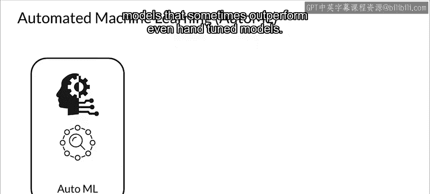
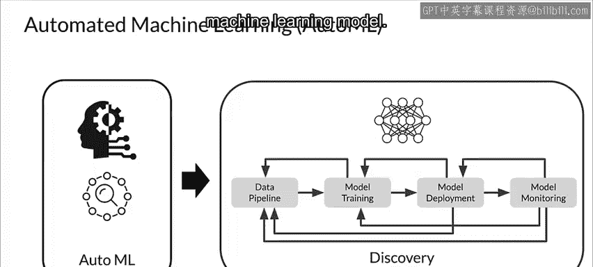
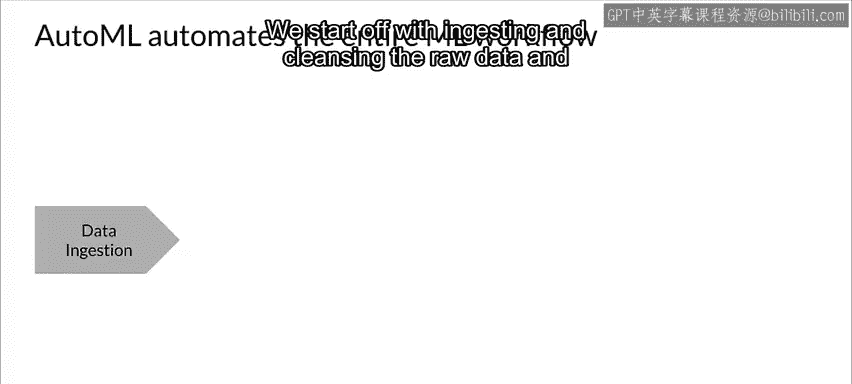
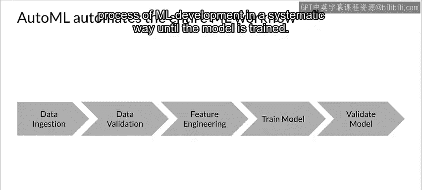
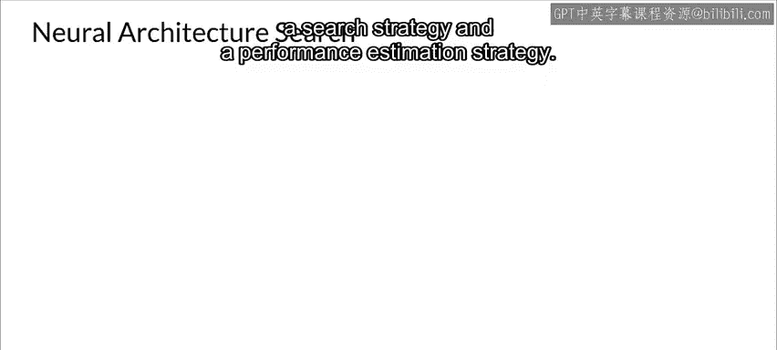
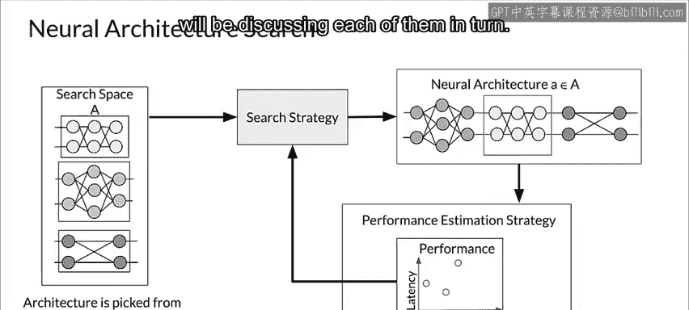
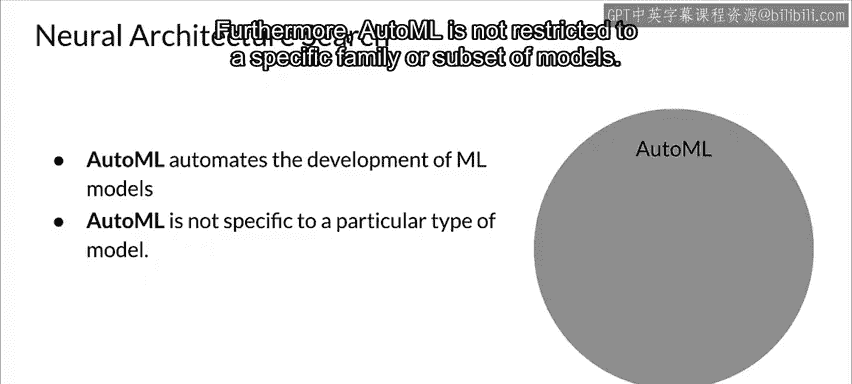
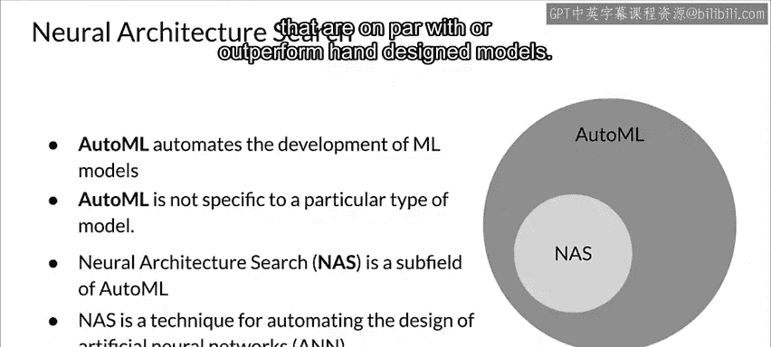
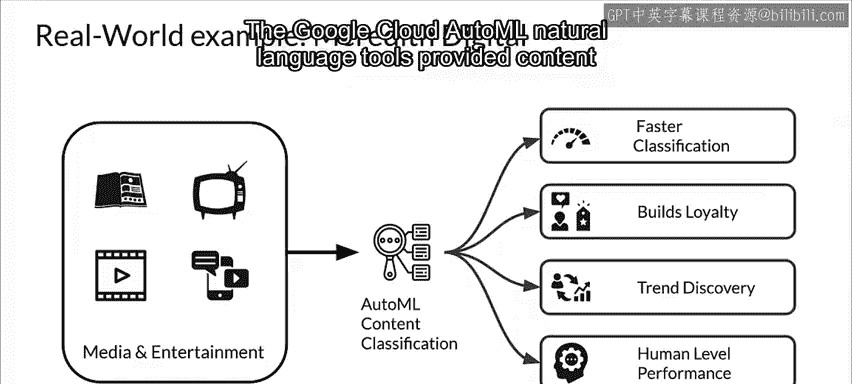

#  081：AutoML简介 🤖

在本节课中，我们将学习自动化机器学习（AutoML）的基本概念。我们将了解AutoML如何端到端地自动化机器学习流程，其核心组件神经架构搜索（NAS），以及它在实际应用中的价值。

---

上一节我们介绍了超参数调优，本节中我们来看看实际的AutoML。AutoML是一套功能多样的工具，旨在端到端地自动化机器学习过程。

## 什么是AutoML？

找到合适的模型是机器学习拼图中的重要一块。自动化机器学习（AutoML）旨在让机器学习经验很少的开发者也能利用机器学习模型和技术。

它试图端到端地自动化机器学习过程，以产生简单的解决方案，加快解决方案和模型的创建速度，有时甚至能产生优于手动调优模型的模型。AutoML将机器学习和搜索技术应用于创建机器学习模型和流水线的过程。

它涵盖了从原始数据集到可部署机器学习模型的完整流水线。

## 传统机器学习 vs. AutoML

在传统机器学习中，我们需要为流程的所有阶段编写代码。

我们从摄取和清理原始数据开始，然后进行特征选择和特征工程。我们为任务选择一个模型架构，训练模型，并进行超参数调优（可能是手动的，或使用像Keras Tuner这样的调优器）。

然后我们验证模型的性能。传统机器学习需要大量手动编程和高度专业化的技能。

AutoML旨在自动化整个机器学习工作流。如果我们能为AutoML系统提供原始数据和模型验证要求，它就会遍历机器学习工作流中的所有阶段，并以系统化的方式执行机器学习开发的迭代过程，直到模型训练完成。

## 神经架构搜索（NAS）

神经架构搜索（NAS）是AutoML的核心。神经架构搜索包含三个主要部分：**搜索空间**、**搜索策略**和**性能评估策略**。

*   **搜索空间**定义了架构的范围。为了减少搜索问题的规模，我们需要将搜索空间限制在最适合我们试图建模的问题的架构上。这有助于缩小搜索空间，但也意味着会引入人为偏见，这可能会阻止神经架构搜索找到超越当前人类知识的架构模块。

*   **搜索策略**定义了我们如何探索搜索空间。我们希望快速探索搜索空间，但这可能导致过早收敛到搜索空间中的次优区域。
*   **性能评估策略**有助于测量和比较各种架构的性能。

神经架构搜索的目标是找到在我们的数据上表现良好的架构。搜索策略从预定义的架构搜索空间中选择一个架构。选定的架构被传递给性能评估策略，该策略将其估计的性能返回给搜索策略。搜索空间、搜索策略和性能评估策略是神经架构搜索的关键组成部分，我们将依次讨论它们。

## AutoML与NAS的关系

AutoML以自动化方式促进模型构建。此外，AutoML不局限于特定的模型家族或子集。

神经架构搜索是AutoML的一个子领域。它特别关注AutoML工作流中的模型选择部分和神经网络的设计。神经架构搜索已被用于设计出与手动设计模型相当或优于手动设计模型的架构。

## AutoML的实际应用案例

让我们看一个AutoML在现实世界中的应用。

Meredith Digital是一家专注于多种媒体和娱乐形式的出版公司。Meredith Digital使用AutoML（主要是基于自然语言的模型）来训练模型，以自动化内容分类。AutoML通过将流程从几个月缩短到仅仅几天来加速分类过程。它还通过提供有洞察力、可操作的建议来帮助建立客户忠诚度。😊 此外，它还有助于识别新的用户趋势和客户兴趣，从而调整内容以更好地服务客户。

为了测试其有效性，他们进行了一项测试，将AutoML与他们手动生成的模型进行比较，结果非常显著。Google Cloud AutoML自然语言工具提供的内容分类性能可与人类水平相媲美。

---

本节课中我们一起学习了AutoML的基本概念。我们了解到AutoML旨在自动化端到端的机器学习流程，其核心是神经架构搜索，它由搜索空间、搜索策略和性能评估策略三个关键部分组成。最后，我们通过一个实际案例看到了AutoML如何显著提升模型开发效率并达到优异性能。