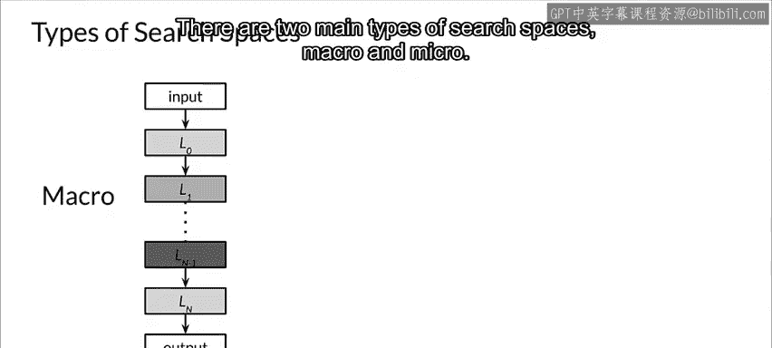
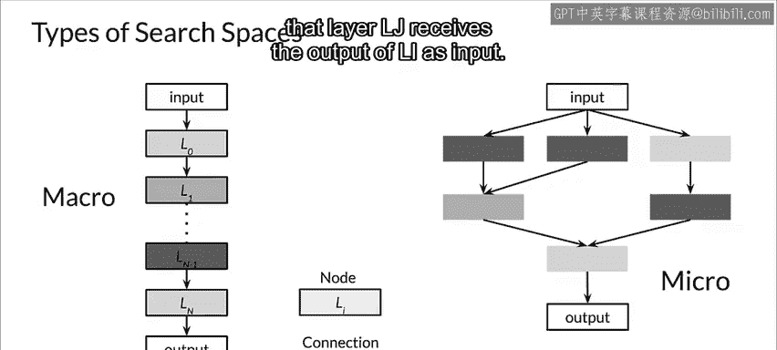
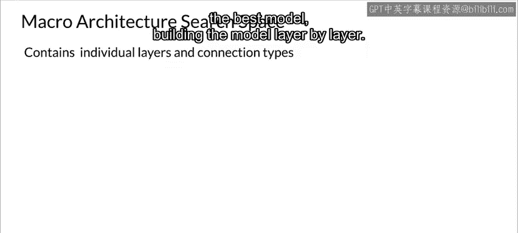
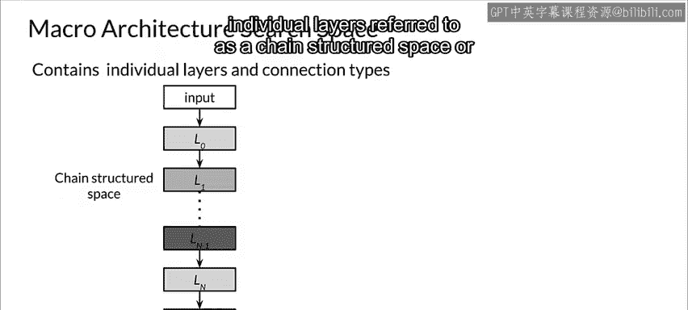
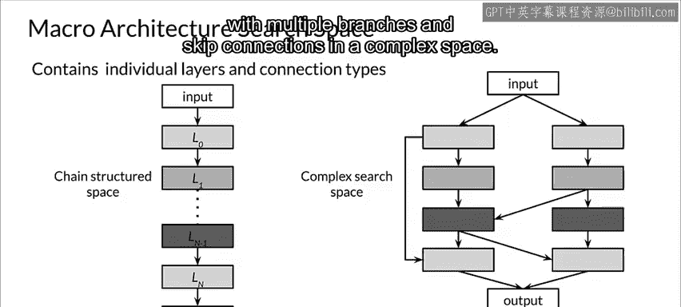
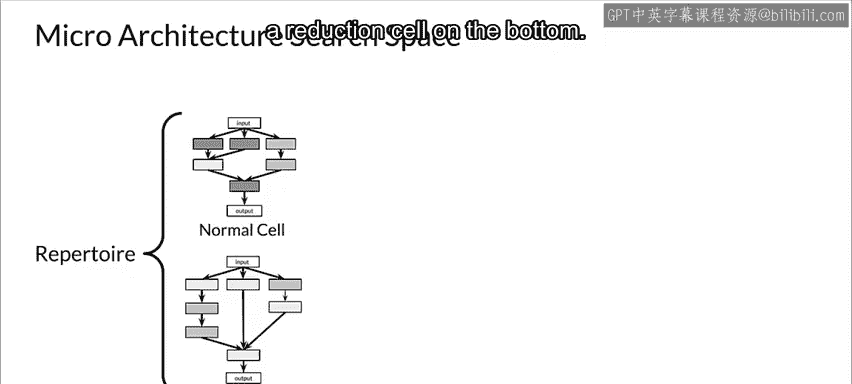
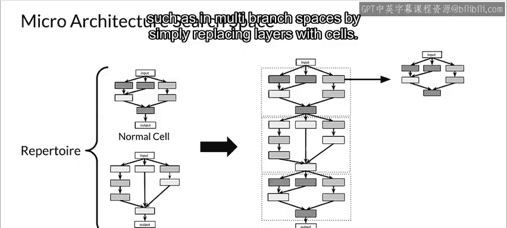

#  082：理解搜索空间 🔍

在本节课中，我们将继续讨论 AutoML，重点介绍其核心概念之一：**搜索空间**。我们将了解搜索空间的两种主要类型，并解释它们如何帮助自动构建高效的神经网络架构。

---

## 宏观与微观搜索空间

上一节我们介绍了 AutoML 的基本概念，本节中我们来看看其核心组成部分——搜索空间。搜索空间定义了神经网络架构的可能配置范围，AutoML 算法在其中寻找最优模型。

搜索空间主要有两种类型：**宏观搜索空间**和**微观搜索空间**。有趣的是，它们的名称与实际含义可能有些相反，但这是业界通用的叫法。接下来，我们将详细探讨这两种类型。

首先，我们需要明确一个基本概念：**节点**。在神经网络中，一个节点通常指代一个层，例如卷积层或池化层。

在架构图示中，不同颜色通常代表不同类型的层。从层 L_I 指向层 L_J 的箭头表示层 L_J 接收层 L_I 的输出作为其输入。

---

### 宏观搜索空间 🏗️

宏观搜索空间包含了神经网络的各个独立层及其连接方式。神经架构搜索（NAS）在此空间内寻找最佳模型，其构建过程是逐层进行的。

如下图所示，网络可以通过简单地堆叠各个层来构建，这种结构被称为**链式结构空间**。

或者，也可以在更复杂的空间中构建具有多个分支和跳跃连接的网络。

---

### 微观搜索空间 🧩

与宏观搜索空间不同，在微观搜索空间中，神经架构搜索通过组合**细胞**来构建神经网络。每个细胞本身就是一个较小的网络。

以下是两种不同类型的细胞示例：顶部的**普通细胞**和底部的**缩减细胞**。

通过堆叠这些细胞，最终形成完整的网络。研究表明，与宏观方法相比，这种微观细胞堆叠方法具有显著的性能优势。

下图展示了一个通过顺序堆叠细胞构建的架构。

需要注意的是，细胞也可以通过更复杂的方式组合，例如在多分支空间中，直接用细胞替换原有的层即可。

---

## 总结

本节课中，我们一起学习了 AutoML 中搜索空间的概念。我们明确了**节点**即神经网络中的层，并深入探讨了两种主要的搜索空间类型：**宏观搜索空间**（逐层构建网络）和**微观搜索空间**（通过堆叠预定义的细胞单元构建网络）。理解这两种空间是掌握自动机器学习如何高效探索并发现最优神经网络架构的关键一步。