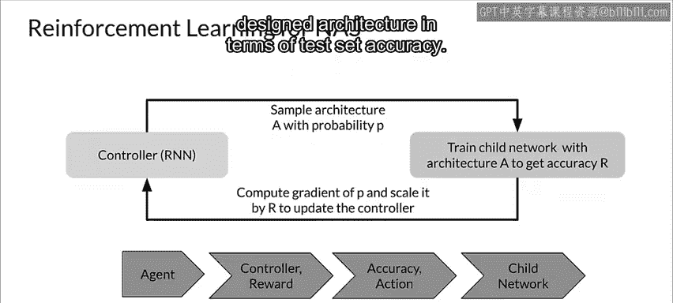

#  083：神经架构搜索的搜索策略 🔍

在本节课中，我们将学习神经架构搜索（NAS）如何决定在庞大的搜索空间中尝试哪些架构选项。核心在于其**搜索策略**。我们将探讨几种不同的搜索方法，了解它们的工作原理、适用场景以及优缺点。

上一节我们介绍了神经架构搜索的搜索空间，本节中我们来看看它如何在这个空间中进行高效探索。

神经架构搜索的目标是在搜索空间中找到能产生最佳性能的模型架构。为了实现这一目标，可以采用多种不同的搜索方法。

以下是几种主要的搜索策略：

*   **网格搜索**：这种方法会**穷举搜索**空间中的所有选项组合。其公式可以表示为：遍历所有 `(option_1, option_2, ..., option_n)` 的组合。
*   **随机搜索**：这种方法在搜索空间内**随机选择**下一个要尝试的架构选项。
*   **贝叶斯优化**：这是一种更复杂的方法。它假设模型架构的性能背后存在一个特定的概率分布（通常是**高斯分布**）。利用已测试架构的观测结果来约束这个概率分布，从而指导下一个选项的选择。
*   **进化算法**：这种方法模拟生物进化过程。以下是其工作原理：
    1.  随机生成一个包含 `n` 个不同模型架构的初始种群。
    2.  评估每个个体（即每个架构）的性能（依据我们下一节将讨论的**性能评估策略**）。
    3.  选择性能最好的 `X` 个架构作为父代，用于产生新一代。
    4.  新一代架构可能是父代的副本，并引入随机改变（**突变**），也可能是父代架构的组合。
    5.  再次使用性能评估策略评估后代的性能。
    6.  从种群中移除 `Y` 个架构（可能是性能最差的、最老的，或基于综合参数选择的个体）。
    7.  后代取代被移除的架构，形成新的种群，并重复此过程。
*   **强化学习**：在这种方法中，智能体在环境中采取行动以最大化奖励。在NAS的语境下：
    *   **环境** 是我们的搜索空间。
    *   **奖励函数** 是我们的性能评估策略。
    *   一个神经网络架构可以用一个**可变长度字符串**来指定，其中字符串的元素指定了各个网络层。这使得我们可以使用**循环神经网络**（RNN）来生成这个字符串，就像在自然语言处理模型中生成句子一样。这个生成字符串的RNN被称为**控制器**。
    *   控制器生成的架构（称为**子网络**）在真实数据上训练后，我们可以在验证集上测量其准确率。
    *   该准确率决定了强化学习的奖励。基于此奖励，我们可以计算策略梯度来更新控制器RNN。
    *   在接下来的迭代中，控制器将学会给那些在训练中能产生更高准确率的架构分配更高的生成概率。这样，控制器就能随着时间推移学会改进其搜索。

例如，在CIFAR-10数据集上，这种从零开始的方法可以设计出新的网络架构，其在测试集准确率上足以媲美最佳的人工设计架构。

---

本节课中我们一起学习了神经架构搜索的多种搜索策略。从简单的网格搜索和随机搜索，到更复杂的贝叶斯优化、进化算法和强化学习，每种策略都有其独特的探索方式。理解这些策略有助于我们根据搜索空间的规模和复杂性，选择合适的方法来自动化地发现高性能的神经网络架构。下一节，我们将探讨另一个关键部分：如何高效地评估这些候选架构的性能。