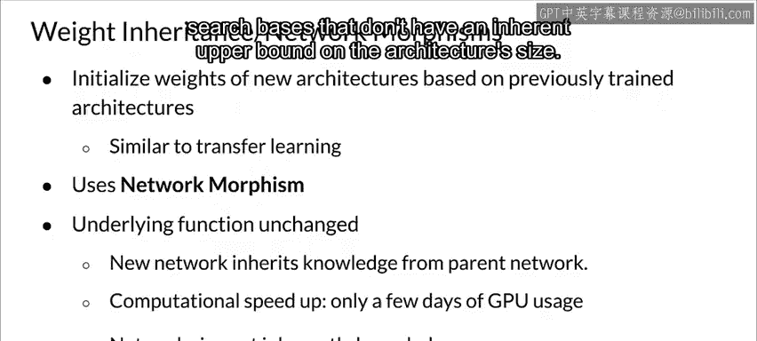

#  084：测量AutoML的功效 📊

在本节课中，我们将学习神经架构搜索（NAS）中用于评估不同架构性能的策略。理解这些策略对于高效、经济地应用AutoML技术至关重要。

神经架构搜索依赖于能够衡量其所尝试的不同架构的准确性或有效性。这需要一个性能评估策略。现在我们来讨论这个问题。

神经架构搜索中的搜索策略需要评估所生成架构的性能，以便能生成性能更优的架构。接下来，我们将讨论神经架构搜索中使用的一些性能评估策略。

## 性能评估策略概览

以下是几种主要的性能评估策略，旨在平衡计算成本与评估准确性。

### 1. 直接验证准确率法

最简单的方法是直接测量每个生成架构的验证准确率，正如我们在强化学习方法中看到的那样。

*   **优点**：评估结果直接、准确。
*   **缺点**：计算量巨大，尤其对于大型搜索空间和复杂网络。使用这种方法寻找最佳架构可能需要数百个GPU日，成本高昂且缓慢，使得神经架构搜索在许多用例中不切实际。

### 2. 降低保真度估计法

为了降低性能评估成本，研究者提出了多种策略，包括降低保真度估计、学习曲线外推法和权重继承或网络形态法。

降低保真度或低精度估计试图通过重构问题来减少训练时间，使其更容易解决。

*   **具体做法**：例如，在数据子集上训练、使用较低分辨率的图像、每层使用更少的滤波器或更少的单元。
*   **效果**：这大大降低了计算成本，但会导致性能被低估。
*   **关键假设**：只要能够确保架构的相对排名不因其低保真度估计而改变，这种方法就是可行的。但遗憾的是，最近的研究表明情况并非如此。

### 3. 学习曲线外推法

学习曲线外推法基于一个假设：存在能够可靠预测学习曲线的机制，因此外推是一个敏感且有效的选择。

*   **原理**：如上图右侧所示，不同架构有其学习曲线。该方法基于少量迭代和现有知识，外推初始学习曲线，并提前终止表现不佳的架构的训练。
*   **应用实例**：渐进式神经架构搜索算法（PNAS）就采用了类似的方法，它训练一个代理模型，并使用该模型根据架构属性来预测性能。

### 4. 权重继承与网络形态法

另一种加速架构搜索的方法，是基于已训练的其他架构的权重来初始化新架构的权重，其原理类似于迁移学习。实现此目标的一种方式被称为网络形态法。

*   **核心思想**：网络形态法在不改变底层功能的情况下修改架构。
*   **优势**：网络从父网络继承知识，这使得方法仅需少量GPU日即可设计和评估。它允许逐步增加网络容量并保持高性能，而无需从头开始训练。
*   **重要优点**：这种方法允许搜索空间在架构大小上没有固有的上限，提供了更大的灵活性。

## 总结

本节课我们一起学习了神经架构搜索中几种关键的**性能评估策略**。我们从计算成本最高的**直接验证法**开始，探讨了旨在降低成本的**低保真度估计法**及其局限性，接着介绍了基于预测的**学习曲线外推法**，最后学习了能高效利用已有知识的**权重继承与网络形态法**。理解这些策略的权衡，对于在实际项目中有效应用AutoML至关重要。