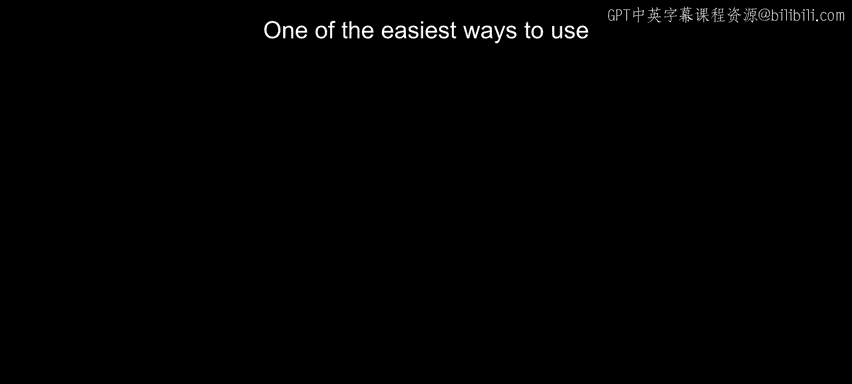
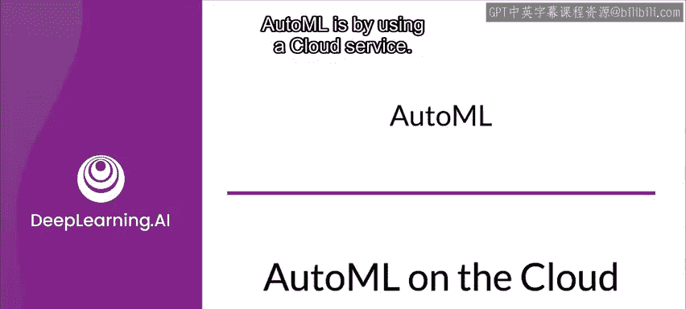
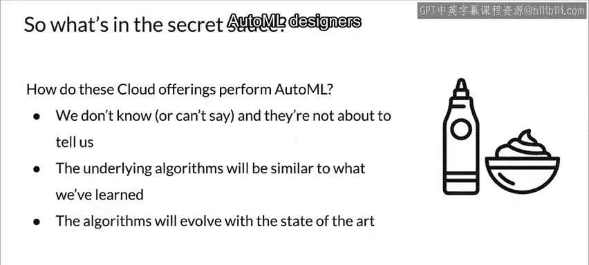

#  085：云端 AutoML 服务概览 🚀

在本节课中，我们将学习如何利用云服务来轻松实现 AutoML。我们将回顾三种主流的云端 AutoML 产品：Amazon SageMaker Autopilot、Microsoft Azure Automated Machine Learning 和 Google Cloud AutoML。课程最后，你将通过练习使用 Google Cloud AutoML 来训练一个模型。

---

## Amazon SageMaker Autopilot

上一节我们介绍了云端 AutoML 的概念，本节中我们来看看亚马逊的解决方案。

Amazon SageMaker Autopilot 能基于你的数据，自动训练和调优用于分类或回归任务的最佳机器学习模型，同时让你保持对过程的完全控制和可见性。

以下是其核心工作流程：

1.  **数据与目标设定**：从原始数据开始，你选择一个标签或目标变量。
2.  **自动搜索模型**：Autopilot 随后会为你搜索候选模型以供审阅和选择。
3.  **透明与可复现**：所有步骤都记录在可执行的 Notebook 中，确保过程的完全控制和可复现性。
4.  **模型排行榜**：系统会生成一个模型排行榜，帮助你根据需求选择最佳模型。
5.  **部署与迭代**：你可以将模型部署到生产环境，或者基于推荐方案进行迭代以进一步提升模型质量。

Autopilot 针对快速迭代进行了优化，能迅速生成高质量模型。在初始几轮迭代后，它会创建一个按性能排名的模型排行榜。你可以查看每个模型选择了数据集中的哪些特征，然后选择将模型部署到生产环境。

模型生成过程是完全透明的。Autopilot 允许你从其创建的任何模型中生成一个 SageMaker Notebook。你可以检查这个 Notebook 以深入了解模型实现的细节。如果需要，你可以在任何时候基于该 Notebook 优化并重新创建模型。

Amazon 建议 Autopilot 可应用于多种不同场景，例如：
*   **价格预测**：基于历史数据（如需求、季节性趋势、其他商品价格）预测未来价格，辅助投资决策。这在金融服务（预测股票价格）、房地产（预测房价）以及能源公用事业（预测自然资源价格）领域尤为有用。
*   **客户流失预测**：预测客户流失。公司始终在寻找减少流失的方法。流失预测通过学习现有数据中的模式，并识别新数据集中的模式，从而预测哪些客户最有可能流失。
*   **风险评估**：识别和分析可能对个人或公司产生负面影响的潜在事件。风险评估模型使用你的现有数据集进行训练，以便为你的业务优化模型预测。

---

## Microsoft Azure Automated Machine Learning

了解了亚马逊的方案后，我们接下来看看微软的云端 AutoML 服务。

Microsoft Azure Automated Machine Learning 旨在帮助专业和非专业的数据科学家快速构建机器学习模型。它自动化了模型开发中耗时且重复的任务，本质上就是执行 AutoML。

其流程始于自动特征选择，然后是模型选择以及对所选模型的超参数调优，从而为手头任务生成最优化的模型。

你可以通过两种方式创建模型：
*   使用**无代码 UI**。
*   使用**代码优先的 Notebook**。

你可以快速定制模型，对迭代次数、阈值、验证方式、禁用的算法以及其他实验标准应用控制设置。

该系统还提供工具以完全自动化特征工程过程。你可以轻松地可视化和分析数据，以发现趋势，以及数据中的常见错误和不一致之处。这有助于你更好地理解建议的操作并自动应用它们。

此外，它还提供以下功能以提升效率：
*   **智能停止**：节省计算时间，并优先考虑主要评估指标。
*   **子采样**：简化实验运行并加速获得结果。
*   **内置实验运行摘要和详细指标可视化**：帮助你理解模型并比较模型性能。
*   **模型可解释性**：评估模型对原始特征和工程特征的拟合度，并提供特征重要性洞察。你可以发现模式、执行假设分析，并加深对模型的理解，从而支持业务的透明度和信任度。

---

## Google Cloud AutoML

上一节我们讨论了微软的解决方案，本节中我们将重点介绍你将在后续练习中使用的 Google Cloud AutoML。

Google Cloud AutoML 是一套机器学习产品，使机器学习专业知识有限的开发人员能够训练符合其业务需求的高质量模型。它依赖于谷歌先进的迁移学习和神经架构搜索技术。

Cloud AutoML 利用了谷歌超过十年的研究成果，帮助你的机器学习模型实现更快的性能和更准确的预测。你可以使用 Cloud AutoML 简单的图形用户界面，基于你的数据来训练、评估、改进和部署模型。你只需几分钟就能获得自己的定制机器学习模型。

谷歌的人工标注服务还可以安排团队为你的标签进行标注或清理，确保你的模型是基于高质量数据训练的。

因为不同类型的问题和数据需要不同的处理方式，Cloud AutoML 不只是一个单一产品，而是一套针对特定用例和数据类型的系列产品。例如：
*   对于**图像数据**，有 **AutoML Vision**。
*   对于**视频数据**，有 **AutoML Video Intelligence**。
*   对于**自然语言**，有 **AutoML Natural Language**。
*   对于**翻译**，有 **AutoML Translation**。
*   对于通用的**结构化数据**，有 **AutoML Tables**。

其中一些产品还会进一步细分。例如，对于图像数据，既有视觉分类，也有视觉对象检测。并且这两者都有针对在移动应用或物联网设备等边缘端进行推理优化的“边缘”版本。对于视频，同样有视频智能分类和视频对象检测，专注于这些特定用例。

---

## 云端 AutoML 的底层原理与共性

那么，这三种不同的云服务在底层是如何运作的呢？

虽然没有人确切知道（或者为特定供应商工作的人不能说），但可以安全地假设，其核心算法与我们之前课程中讨论过的那些是相似的。

同时请记住，面向生产的机器学习工程是一个快速发展的领域，新技术和发展每隔几个月就会出现。这些新的进步通常会被 AutoML 提供商最大限度地吸收和利用。

另外请注意，这些不同的 AutoML 服务都执行着与你在训练模型时执行（或应该执行）的相同类型的操作，包括**特征选择**、**特征工程**和**清理标签**。AutoML 的设计者深刻理解这些活动的重要性。

---

## 总结

本节课中，我们一起学习了三种主流的云端 AutoML 服务：**Amazon SageMaker Autopilot**、**Microsoft Azure Automated Machine Learning** 和 **Google Cloud AutoML**。我们了解了它们如何通过自动化特征工程、模型选择和超参数调优等复杂步骤，降低机器学习应用门槛，并提供了透明、可控的模型开发流程。这些服务都旨在帮助用户快速构建和部署高质量模型，是实践 MLOps 的强大工具。在接下来的练习中，你将有机会亲手体验 Google Cloud AutoML 的强大功能。