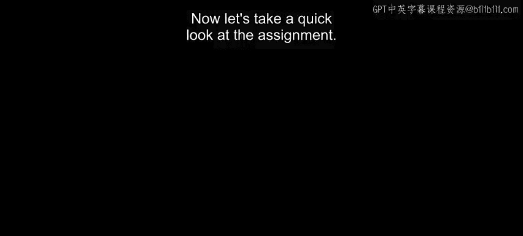
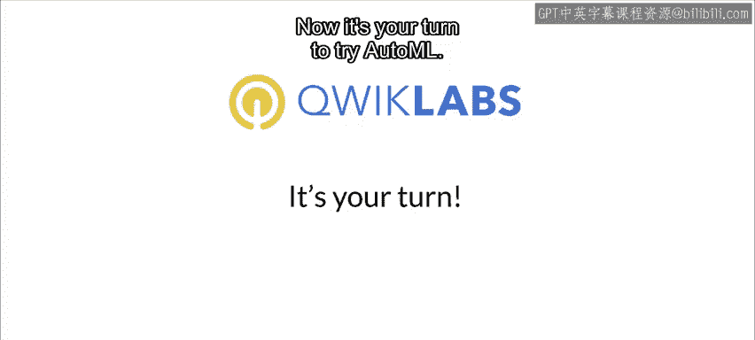

#  086：作业设置 🎯

在本节课中，我们将学习如何使用 Google Cloud AutoML Vision 对图像进行分类。我们将通过一个包含六个步骤的作业来实践这一流程，并在 Quicklabs 提供的真实云环境中完成操作。

---

## 作业概述 📋

本次作业的目标是使用 Google Cloud AutoML Vision 服务构建一个图像分类模型。整个过程分为六个清晰的步骤，从环境设置到模型部署与测试。

上一节我们介绍了 AutoML 的基本概念，本节中我们来看看具体的作业步骤。

以下是完成图像分类任务所需的六个步骤：

1.  设置 AutoML 环境。
2.  将图像上传至云存储。
3.  在 Vision 中创建数据集。
4.  启动 AutoML 训练以选择最佳模型。
5.  部署训练好的模型。
6.  使用已部署的模型生成预测以进行测试。

> **请注意**：数据集中包含的是“云朵”的图片，而我们的训练是在“云平台”上进行的，请注意区分这两个“云”的概念。

---

## 实践环境：Quicklabs ☁️

为了让大家在真实的云环境中完成练习，我们将使用 Quicklabs 平台。

Quicklabs 为开发者和IT专业人士提供真实的云环境，帮助学习如何应用云平台及相关软件。在本练习中，你将通过 Quicklabs 在 Google Cloud 上实际操作，学习如何使用 Google Cloud AutoML 训练模型。

以下是关于开始使用 Quicklabs 的指引：

*   请查阅附带的实验手册，了解如何启动 Quicklabs 的详细步骤。

---

## 总结与开始实践 🚀

本节课中，我们一起学习了使用 Google Cloud AutoML Vision 进行图像分类的完整工作流程，包括六个核心步骤以及实践平台 Quicklabs 的介绍。

现在，轮到你来尝试使用 AutoML 了。请按照步骤，在 Quicklabs 提供的 Google Cloud 环境中完成这六个步骤的练习。