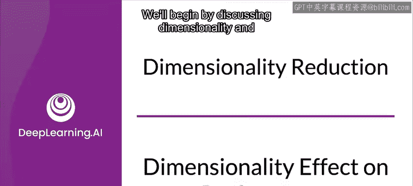
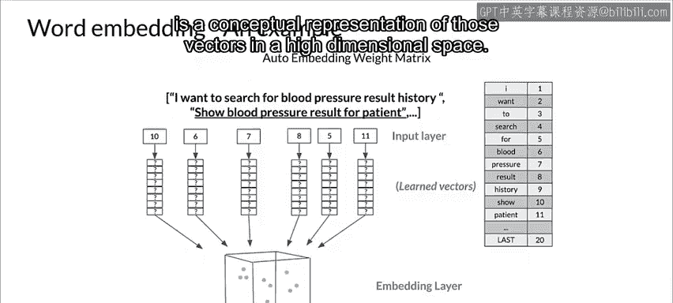
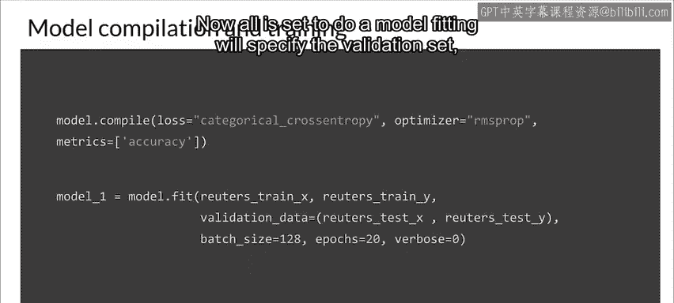
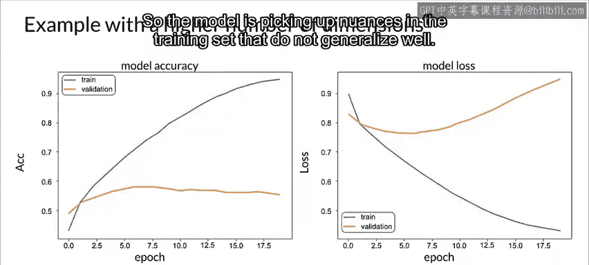
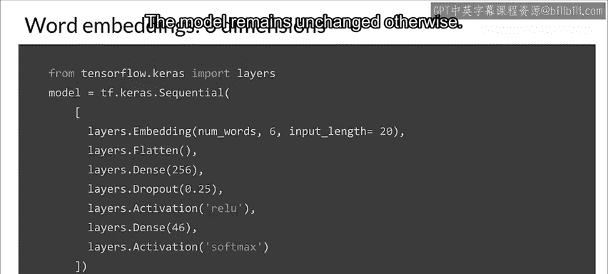
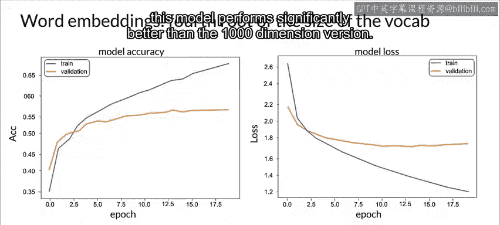

#  088：维度对性能的影响 📊

在本节课中，我们将学习模型优化与资源管理中的一个核心话题：数据维度如何影响模型性能与资源需求。我们将探讨高维数据的挑战，并通过一个具体的文本分类示例，展示降低维度如何帮助改善模型泛化能力。

## 概述：维度的重要性

上一节我们介绍了模型资源管理的整体背景。本节中，我们来看看数据维度这个具体因素。

计算、存储和I/O系统的需求决定了将模型投入生产及在其整个生命周期内维护它的成本。本周，我们将探讨一些有助于管理模型资源需求的重要技术。我们将从讨论维度及其如何影响模型性能和资源需求开始。

在过去，数据生成和数据存储的成本比今天高得多。那时，许多领域专家在设计实验和特征转换前，会仔细考虑测量哪些特征或变量。因此，数据集通常设计精良，可能只包含少量相关特征。

如今，数据科学更倾向于端到端地整合一切。生成和存储数据变得更快、更容易且成本更低。因此，人们倾向于测量所有能测量的东西，并包含更复杂的特征转换。结果，数据集通常是高维的，包含大量特征，尽管每个特征对于分析数据的相关性并不总是明确的。

在深入之前，让我们讨论一个关于神经网络的常见误解。许多开发者正确地认为，当他们训练神经网络模型时，模型本身作为训练过程的一部分，会通过将不提供预测信息的特征的权重减少到0或接近0来学会忽略它们。这虽然正确，但结果并非一个高效的模型。在运行推理生成预测时，模型的大部分可能最终被关闭，但这些未使用的模型部分仍然存在。它们占用空间，并且在模型服务器遍历计算图时消耗计算资源。这些不需要的特征还会给数据引入不必要的噪声，从而降低模型性能。

在模型本身之外，每个额外的特征仍然需要系统和基础设施来收集、存储、管理更新等数据，这增加了整个系统的成本和复杂性。这包括监控数据问题以及在问题发生时修复这些问题的工作。这些成本在你部署的产品或服务的整个生命周期内持续存在，可能长达数年。本课程后面你将学到更多关于优化权重接近零的模型的技术。但总的来说，你不应该只是把所有东西都扔给模型，并依赖训练过程来确定哪些特征真正有用。

## 高维数据的挑战

在机器学习中，我们经常需要处理高维数据。考虑一个例子，我们为每位购物者记录60个不同的指标。这意味着我们在一个60维的空间中工作。在其他情况下，如果你试图分析50x50的灰度图像，你就在一个2500维的领域中工作。如果图像是RGB的，维度则增加到7500维。在这种情况下，图像的每个像素的每个颜色通道对应一个维度。

某些特征表示，例如独热编码，在处理高维空间中的文本时存在问题，因为它们往往会产生非常稀疏的表示，且扩展性不好。克服这个问题的一种方法是使用嵌入层，它对句子进行标记化，并为每个单词分配一个浮点值。这导致了一个更强大的向量表示，它尊重给定句子中单词的时间和顺序。这种表示可以在训练过程中自动学习。图中标记为“嵌入层”的立方体是这些向量在高维空间中的概念表示。

## 实践示例：词嵌入与维度削减

让我们看一个使用Keras进行词嵌入的具体例子。

以下是构建和训练模型的关键步骤：

1.  **加载数据与库**：首先加载必要的库和模块，并定义一些重要参数。我们将使用的路透社新闻数据集包含11，228条新闻专线，标记为46个主题。文档已经过编码，每个单词由一个整数索引，代表其在数据集中的总体频率。加载数据集时，我们指定将处理1000个单词，以便最不常出现的单词被视为未知。
2.  **数据预处理**：进一步预处理数据，使其准备好训练模型。首先，将训练向量Y转换为分类变量（针对训练集和测试集）。接下来，将输入文本分割成20个单词长的序列。
3.  **构建网络**：下一步是构建网络。这里选择使用所有维度来嵌入1000个单词的词汇表。最后一层是维度为46的密集层，因为目标变量是一个46维的类别向量。
4.  **编译模型**：准备好模型结构后，通过指定损失函数、优化器和输出指标来编译模型。对于这个问题，自然的选择是分类交叉熵损失、RMSprop优化器，准确率作为指标。
5.  **训练模型**：现在一切就绪，可以进行模型拟合。我们将指定验证集、批大小和训练周期数。

图中，A是准确率随训练周期的变化，L是模型损失随训练周期的变化。请注意，大约两个周期后，与验证集相比，我们的训练数据产生了显著更高的准确率和更低的损失。这清楚地表明模型严重过拟合。这可能是使用数据所有维度的结果，因此模型捕捉到了训练集中泛化能力不佳的细微差别。

## 降低维度以改善性能

让我们尝试降低维度，看看这如何影响模型性能。为此，让我们将1000个单词的词汇表嵌入到6个维度中。

这大约是减少了四次方根的因子。除此之外，模型保持不变。

可能仍然存在一些过拟合，但仅通过这一改变，这个模型的性能就显著优于1000维版本。

## 总结

本节课中，我们一起学习了数据维度对机器学习模型性能与资源消耗的关键影响。我们了解到，并非所有特征都对预测有益，高维数据可能导致模型过拟合、计算资源浪费以及系统复杂性增加。通过一个具体的文本分类案例，我们实践了使用嵌入层降低维度的方法，并观察到降低嵌入维度能有效缓解过拟合，提升模型在验证集上的泛化能力。这为我们后续学习模型量化、剪枝等更深入的优化技术奠定了基础。记住，精心设计特征和合理控制模型复杂度，是构建高效、可维护的生产级机器学习系统的重要一步。