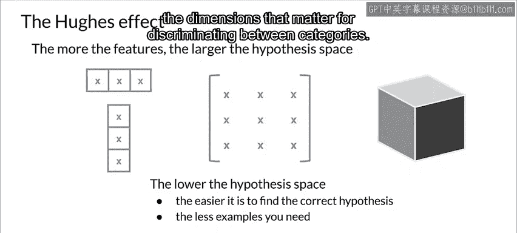

#  089：11_维度灾难 🧠

在本节课中，我们将要学习一个在构建模型时至关重要的概念——**维度灾难**。我们将探讨高维数据带来的挑战，理解为什么增加特征数量有时反而会损害模型性能，并了解其背后的数学原理。

---

## 什么是维度灾难？

许多常见的机器学习任务，如分割和聚类，都依赖于计算观测值之间的距离。例如，监督分类使用观测值之间的距离来分配类别。K近邻算法就是一个基本例子。支持向量机（SVM）则通过基于投影后观测值之间距离的核函数来处理观测值的投影。另一个例子是推荐系统，它使用用户和物品属性向量之间基于距离的相似性度量。甚至可能使用其他形式的距离。因此，距离在理解维度方面扮演着重要角色。

最常用的距离度量之一是**欧几里得距离**，它简单地表示多维空间中两点之间的线性距离。两个具有笛卡尔坐标的二维向量之间的欧几里得距离使用这个熟悉的公式计算：`distance = sqrt((x2 - x1)^2 + (y2 - y1)^2)`。

---

## 为什么高维空间中的距离会成为问题？

你可能会疑惑，为什么数据维度高会成为一个问题。在极端情况下，当我们拥有比观测值更多的特征时，我们面临模型严重过拟合的风险。但在更普遍的情况下，当特征过多时，观测值变得更难聚类。过多的维度会导致数据集中的每个观测值看起来与其他所有观测值都等距。

因为聚类使用诸如欧几里得距离这样的度量来量化观测值之间的相似性，这是一个大问题。如果所有距离都大致相等，所有观测值看起来都同样相似，就无法形成有意义的聚类。

随着维度的增长，常用度量提供的对比度会下降。换句话说，给定点分布中的范数分布趋于集中。这可能导致高维空间中出现意想不到的行为。这种现象被称为**维度灾难**。

它包括在这些高维空间中观察到的数据反直觉属性。这特别与距离和体积的可用性及解释有关。

---

## 维度灾难的两个方面

谈到维度灾难，有两件事需要考虑。一方面，机器学习擅长处理多维度数据。然而，我们人类并不擅长在可能分散在多个维度的数据中发现模式，特别是当这些维度以反直觉的方式相互关联时。另一方面，随着我们添加更多维度，我们也增加了分析数据所需的处理能力。同时，我们也增加了构建有意义模型所需的训练数据量。

如果你好奇的话，“维度灾难”这个术语是由理查德·贝尔曼在半个多世纪前的1961年，在他的著作《自适应控制过程：导览》中首次提出的。

---

## 添加更多特征可能引发的问题

因此，添加更多特征很容易引发问题。这可能包括数据中出现冗余或不相关的特征。此外，当特征不为我们的模型提供预测能力时，还会增加噪声。除此之外，更多的特征使得人们更难解释和可视化数据。最后，更多的特征意味着更多的数据，因此你需要更多的存储空间和处理能力来处理它。最终，拥有更多维度通常意味着我们的模型效率更低。

当你遇到模型性能问题时，你常常会忍不住尝试添加越来越多的特征。但随着你添加更多特征，你会达到一个临界点，模型的性能开始下降。

下图很好地展示了这一点：随着维度的增加，分类器的性能在达到最佳特征数量之前会提升。这里需要理解的一个关键点是，你是在不增加训练样本数量的情况下增加维度，这导致分类器性能持续下降。

---

## 维度灾难背后的数学原理

为了揭示这种行为背后的原因，让我们更深入地探讨为什么更多维度会损害你的模型。让我们从理解为什么函数的参数数量会影响学习该函数的难度开始。

以线性函数的参数为例。在这种情况下，列表是有限的。这仅仅意味着对特征进行离散化。让我们通过使用1到5的数字来简化这个问题，假设你有一个函数只有一个参数。那么这个参数只能取五个可能的值。

如果你添加第二个也可以取五个值的参数会发生什么？那么现在有 `5 * 5 = 25` 种可能的参数对。这是一个使用离散参数值的简单例子，但当然，对于连续变量情况会更糟。

如果你现在添加第三个参数呢？表示形式变成了一个立方体。你可能已经看到了这背后的公式：如果我们有 `n` 个参数可以取的值和 `M` 个参数，你最终会得到 `n^M` 种可能的参数值。参数值的数量呈指数级增长。现在，这个问题有多大？确实，这是一个非常大的问题，这就是为什么它被称为“维度灾难”。

---

## 高维空间中的数据稀疏性

数据集维度的增加意味着代表每个训练样本的特征向量中有更多条目。让我们聚焦于欧几里得空间和欧几里得距离度量。每个新维度都会向总和中添加一个非负项。因此，对于不同的向量，距离随着维度的增加而增加。换句话说，对于给定数量的训练样本，随着特征数量的增长，特征空间变得越来越稀疏，训练样本之间的距离越来越大。

正因为如此，较低的数据密度需要更多的训练样本来保持数据点之间的平均距离相同。同样重要的是，你添加的样本需要与样本中已有的样本有显著不同。这里的论证是使用欧几里得距离构建的，但对于任何正确定义的距离度量都是成立的。

---

## 对监督学习的影响

当观测值之间的距离增大时，监督学习变得更加困难，因为对新样本的预测不太可能基于从相似训练样本中学到的知识。特征空间的大小随着特征数量的增加呈指数级增长，使得有效泛化变得更加困难。方差增加，并且在更多维度中过拟合噪声的几率更高，导致泛化性能差。

在实践中，特征也可能相关或没有表现出太多变化。由于这些原因，有必要进行**降维**。挑战在于使用尽可能少的特征，同时保留尽可能多的预测信息。

---

## 分类中的休斯效应

无论你使用哪种建模方法，增加维度还有另一个问题，特别是对于分类，这被称为**休斯效应**。这种现象展示了分类性能随着特征数量的增加而提高，直到我们达到拥有足够特征的最佳点。在保持训练集大小不变的情况下添加更多特征，将会降低分类器的性能。我们在前面的图表中看到了这一点。

在分类中，目标是找到一个能区分两个或多个类别的函数。你可以通过在空间中搜索分隔这些类别的超平面来实现这一点。你拥有的维度越多，在训练期间找到超平面就越容易。但同时，在泛化到未见数据时，要匹配这种性能就越困难。你拥有的训练数据越少，你就越不确定自己识别出了对区分类别重要的维度。

---

## 总结

在本节课中，我们一起学习了**维度灾难**的概念。我们了解到，虽然增加特征数量有时能提升模型性能，但超过某个最佳点后，反而会导致数据稀疏、距离度量失效、模型过拟合和性能下降。其核心原因在于特征空间随维度呈指数级膨胀，而训练数据量却无法同步增长。这解释了为什么在实践中，**降维**和**特征选择**是构建高效、泛化能力强模型的关键步骤。理解维度灾难有助于我们在特征工程和模型构建中做出更明智的决策。