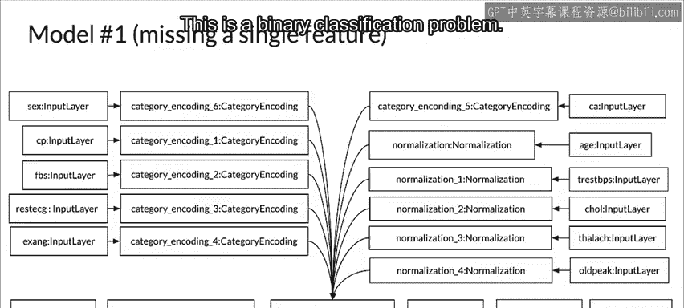
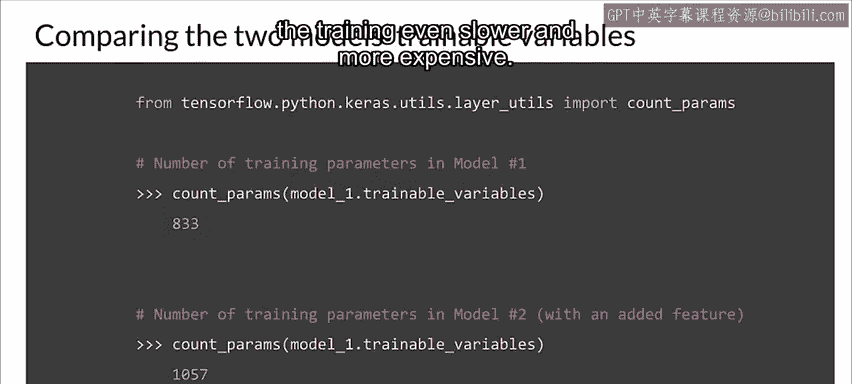
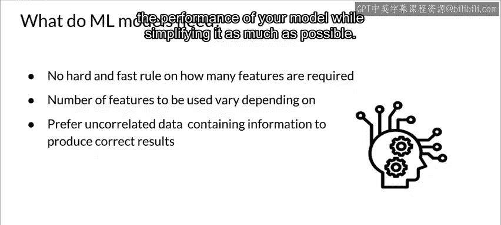

#  090：维度灾难示例 📊

在本节课中，我们将通过一个具体示例，探讨特征维度增加如何影响机器学习模型的性能与资源需求。我们将理解为何有时“更多”并不等同于“更好”。

---

## 维度增加带来的问题

上一节我们介绍了高维空间中距离和体积的直观变化。本节中我们来看看，除了这些几何问题，增加维度还会引发哪些实际挑战。

以下是维度增加可能带来的主要问题：

*   **计算资源需求非线性增长**：处理器和内存需求通常随维度增加而非线性增长。
*   **优化难度增加**：由于可行解数量呈指数级上升，许多优化方法难以找到全局最优解，容易陷入局部最优。
*   **特征相关性增强**：维度增加通常意味着特征间存在相关性的可能性变大。
*   **参数估计困难**：在回归模型中，参数估计常常会变得更具挑战性。

接下来，我们通过一个例子来具体看看更多特征如何使模型训练变得更困难。

---

## 特征增加对模型的影响

当你创建一个模型时，会为其设计特定数量的特征或维度。你可能会倾向于添加更多特征以获得更好的模型，但更多特征实际上可能损害模型性能。每个特征都包含信息，这些信息可能有助于也可能无助于模型进行准确预测。

随着添加的特征越来越多，你需要沿着这些特征的值域范围提供越来越多的训练样本。所需训练数据量随每个新增特征呈指数级增长。这意味着训练数据的“体积”呈指数增长。我们必须确保训练数据覆盖的特征空间区域，与我们将收到的预测请求所覆盖的区域相同。所有这些都可能降低模型的泛化能力。

与此同时，模型中可训练变量的数量也会增加。为了证明这一点，我们来看一个为克利夫兰心脏病数据集构建二元分类模型的例子，观察添加一个额外特征时发生的变化。

---

## 示例：克利夫兰心脏病数据集

我们首先为克利夫兰心脏病数据集创建一个结构化分类模型。该数据集包含 **14个特征**，用于预测患者是否患有心脏病。这是一个二元分类问题。

第一个模型省略了原始特征中的一个，名为 `foul`。我们将观察这一点，并看看向数据集中添加一个特征如何影响模型中可训练变量的数量。

现在，让我们将第一个模型中移除的那个额外特征添加回来。为此，我们使用 TensorFlow 中提供的 Keras 预处理层，将其编码为一个分类字符串特征。

接下来，我们看看添加它如何影响原始模型的可训练参数数量。如果你比较两者的可训练参数数量，即使只添加一个特征，也会导致参数数量 **增加27%**。

这至少意味着参数数量有了显著增长，这将使训练速度更慢、成本更高。你还需要增加训练数据集的大小，这会使训练变得更慢、更昂贵。

---

## 核心结论与权衡

本节的核心要点是：**当数据维度变得过大时，分类器的性能会下降，而对资源的需求会增加**。

随之而来的问题是：“过大”究竟意味着什么？遗憾的是，对于机器学习问题中应使用多少特征，并没有固定的规则。事实上，这取决于可用训练数据的数量、数据的方差、决策面的复杂性以及所使用的分类器类型。

它还取决于哪些特征真正包含有助于模型训练的预测信息。你的目标是：在尽可能简化模型的同时，拥有足够的数据、最佳的特征、这些特征值有足够的多样性，并且这些特征中包含足够的预测信息，以最大化模型的性能。

---

## 总结

本节课中，我们一起学习了维度灾难的一个具体示例。我们看到，向模型添加更多特征会导致可训练参数显著增加，进而需要更多训练数据，并可能损害模型的泛化能力。关键在于在模型复杂度和特征信息量之间找到平衡，使用足够多且高质量的特征，而非盲目追求数量。