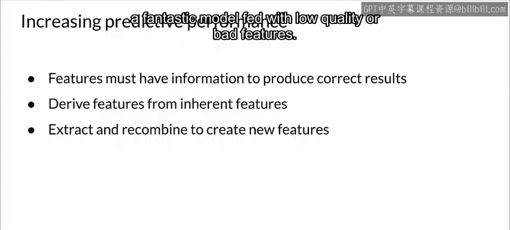
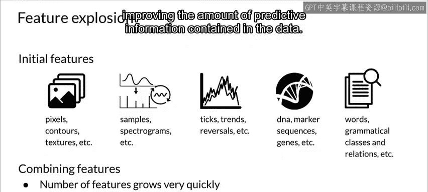
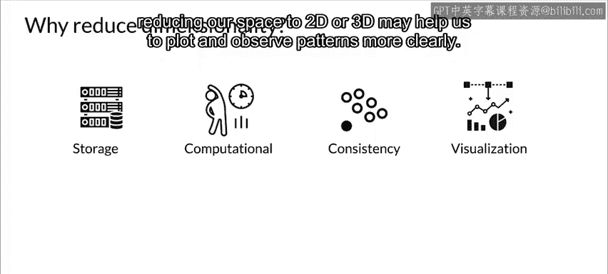
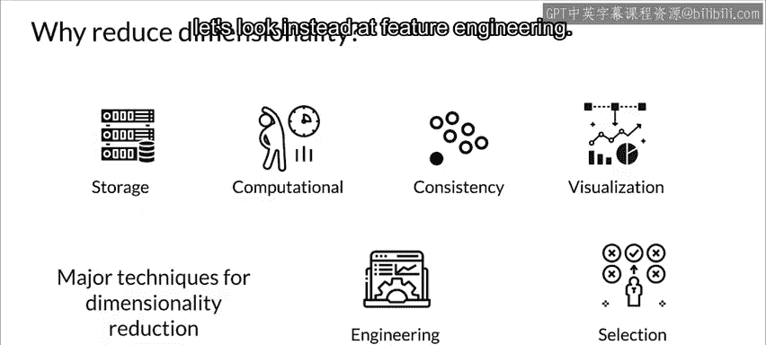
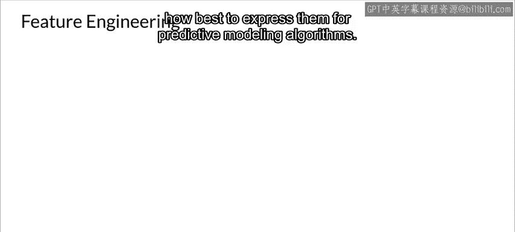
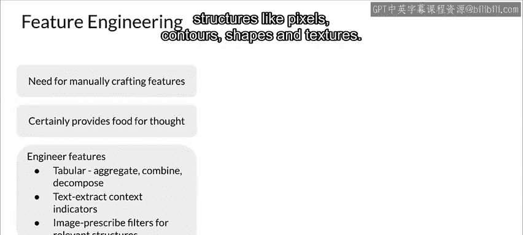
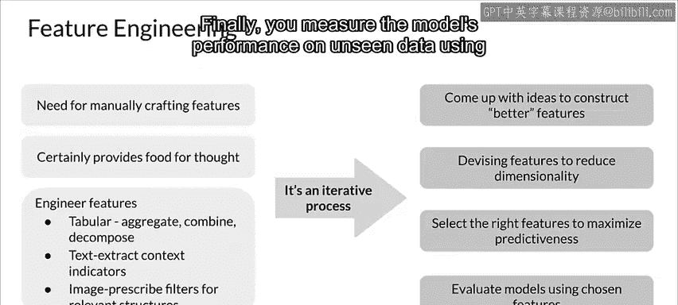

#  091：手动降维 📉

在本节课中，我们将要学习手动降维技术。我们将探讨数据如何影响模型性能，以及如何通过特征工程和特征选择来减少数据维度，同时保留关键的预测信息。

---

上一节我们讨论了数据对模型性能及资源需求的影响，本节中我们来看看一些手动降维的技术。

在预处理一组特征以创建新特征集时，尽可能多地保留预测信息至关重要。没有预测信息，再多的数据也无法帮助模型学习。

特征必须能代表数据集中的预测信息。这些信息还需要以有助于模型学习的形式存在。

虽然一些固有特征可以直接从原始数据中获得，但通常需要衍生特征、归一化特征、工程化特征或嵌入特征。一个使用重要特征的普通模型，其性能会优于一个使用低质量或不良特征的优秀模型。

😊

许多领域涉及大量特征和维度。通常，特征的初步选择是基于领域知识，这可能导致特征数量超出实际需要。

正如我们在讨论维度灾难时所看到的，这存在固有的缺点。这意味着你需要减少维度，更准确地说，是在保留或提高数据所含预测信息量的同时，减少数据中包含的特征数量。

降维技术寻找数据中的模式，并利用这些模式以更低维度的形式重新表达数据。这使得计算效率大大提高，在大模型和大数据集的世界中，这可能是一个重要因素。

然而，降维最基本的功能是将数据集精简到核心部分，丢弃那些对回归和分类等监督学习任务造成严重问题的噪声特征。

在许多实际应用中，正是降维使得预测成为可能。你的数据收集和管理基础设施也将得到简化。

另一个需要考虑的因素是，当维度很大时，某些算法表现不佳。降维还能通过移除冗余特征来减少多重共线性。

当我们试图可视化数据时，降维也很有帮助。正如我们之前讨论的，在高维度中可视化数据并不容易。因此，将我们的空间降至2D或3D可能有助于我们更清晰地绘制和观察模式。

特征工程有助于满足这些要求。它通过重新格式化、组合和转换原始特征来从原始数据中构建有价值的信息，直到产生一个能带来更好模型的新数据集。

此外，特征选择会检查一组潜在特征，选择其中一部分并丢弃其余部分。应用特征选择是为了防止原始特征中的冗余和/或无关性，或者仅仅是为了将特征数量限制在一定范围内以避免问题。

既然我们已经了解了各种特征选择技术，现在让我们看看特征工程。最佳结果最终取决于你——实践者如何精心设计特征。这是机器学习工程带有些许艺术形式的领域之一。

特征重要性和特征选择可以帮助你了解特征的客观效用，但这些特征必须来自某个地方。你通常需要手动创建它们。这需要花费大量时间研究实际样本数据，思考问题的基本形式、数据的结构，以及如何最好地表达它们以供预测建模算法使用。😊

以下是针对不同类型数据的特征工程方法：

*   **对于表格数据**：通常意味着聚合和/或组合特征以创建新特征，以及分解或拆分特征以创建新特征。
*   **对于文本数据**：通常意味着设计与问题相关的文档或内容特定指标。
*   **对于图像数据**：通常意味着使用过滤器来挑选出相关的结构，如像素、轮廓、形状和纹理。

特征工程往往是一个迭代过程，需要反复进行数据选择和模型评估。

以下是特征工程的一般流程：

该过程通常从头脑风暴特征开始。在这里，你需要深入问题，查看大量数据，研究其他问题上的特征工程，看看能学到什么。

然后，你开始设计新特征。这取决于你的问题，但你可以使用自动特征提取、手动特征工程或两者结合。

接下来，你使用特征重要性评分和特征选择方法挑选正确的特征，以准备数据的一个或多个视图。

最后，你使用选定的特征在未见过的数据上衡量模型的性能。

---

本节课中我们一起学习了手动降维的核心概念。我们了解到，降维旨在减少特征数量以提高计算效率并提升模型性能。关键方法包括**特征工程**（通过转换和组合创建新特征）和**特征选择**（筛选最有价值的特征）。这是一个需要结合领域知识和反复实践的迭代过程，对于构建高效、准确的机器学习模型至关重要。