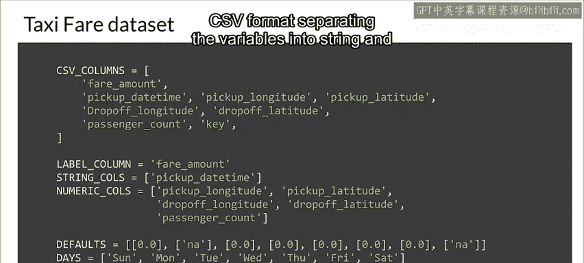
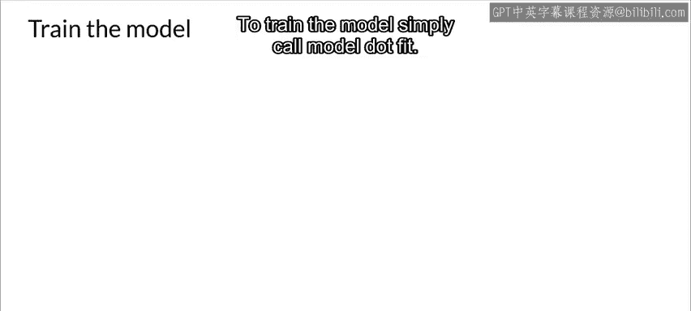
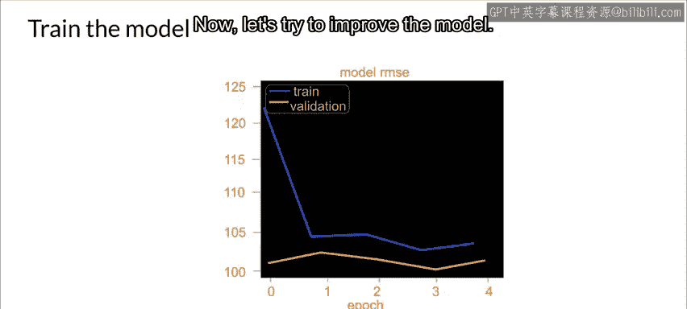
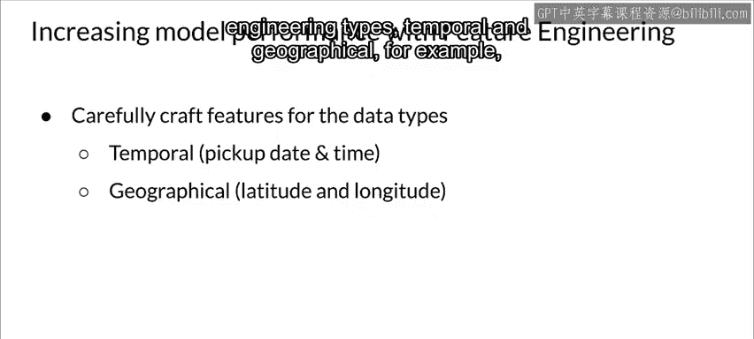
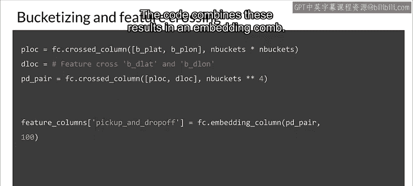
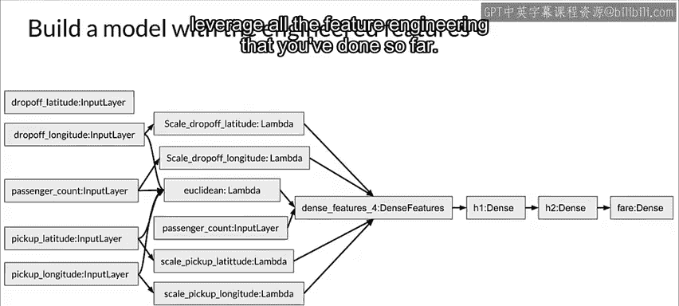
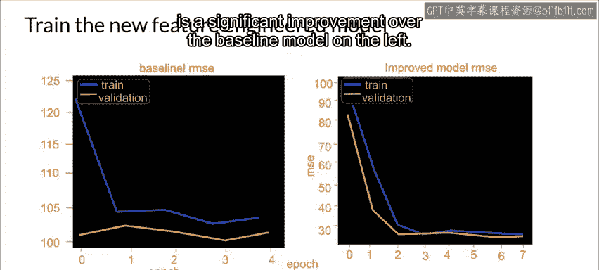

#  092：手动降维案例研究 📊

在本节课中，我们将学习数据维度对模型性能及训练、部署资源需求的影响。我们将通过一个出租车费预测的具体案例，探索手动进行特征工程和降维的技术，以提升模型效率与效果。

---

## 数据维度的重要性

上一节我们介绍了数据维度对模型的影响。处理数据维度时，通常意味着需要寻找降低维度的方法。这在处理资源受限的场景（如移动端部署）时尤为重要。

现在，我们来看看一些手动降维的技术。

---

## 案例研究：出租车费数据集

让我们看一个使用出租车费数据集的具体例子。该数据集包含106,545次出租车行程记录。目标是根据多种特征（如上车时间、地点、行驶距离、乘客数量等）预测每次行程的车费。

通常，第一步是下载CSV格式的数据集，将变量分为字符串和数值类型，并定义有用的常量和参数。

---

## 建立基线模型

为了预测车费，我们先建立一个基线模型。我们将尝试使用以下特征：下车纬度、下车经度、乘客数量、上车纬度和上车经度。

网络结构由多个密集隐藏层串联而成，最后一层输出车费预测值。我们将使用Keras的函数式API构建模型。与顺序API不同，你需要指定输入层和隐藏层。

请注意，你正在创建一个没有特征工程的线性回归基线模型。快速回顾一下，基线模型是一个朴素的实现，有助于设定模型性能的期望。

在设置好训练模型并创建数据集后，你就可以开始训练基线模型了。只需调用 `model.fit()` 即可。

---

## 评估基线模型性能

让我们使用训练周期内的均方根误差损失来查看训练和验证性能。理想情况下，你希望验证集的RMSE接近训练集。

现在，让我们尝试改进模型以提高其性能。我们将创建两种新的特征工程类型：时间特征和地理特征。例如，我们将处理一个时间特征。

---

## 特征工程：时间与地理特征

**上车日期时间**是一个字符串，我们需要在模型内部处理它。首先，你将把上车日期时间作为一个特征包含进来，然后需要修改模型以将其作为字符串特征处理。

上车或下车的经度和纬度数据对于预测车费金额至关重要，因为纽约市出租车费主要由行驶距离决定。因此，我们需要教给模型上车点和下车点之间的欧几里得距离。

回想一下，纬度和经度允许我们使用一组坐标来指定地球上的任何位置。数据集包含有关上车和下车坐标的信息，但没有关于上车点和下车点之间距离的信息。

所以，让我们创建一个新特征来计算每对上车点和下车点之间的距离。你可以使用欧几里得距离来实现，它是任意两个坐标点之间的直线距离。但请注意，这只是实际驾驶距离的一个粗略指标。

---

## 数据标准化处理

在将数值变量输入神经网络之前，对其进行缩放非常重要。让我们对地理定位特征使用最小-最大缩放，也称为归一化。稍后在模型中，你会看到这些值被移动和重新缩放，最终范围在0到1之间。

我们利用领域知识创建一个名为 `scale_longitude` 的函数，传入所有经度值并为每个值加上78。请注意，我们的缩放经度值范围是从-70到-78，因此值78是最大经度值。-70和-78之间的差值是8。该函数为每个经度值加上78，然后除以8以返回缩放后的值。

类似地，我们创建一个名为 `scale_latitude` 的函数，传入所有纬度值并从每个值中减去37。请注意，我们的缩放纬度范围是从37到45。因此，值37是最小纬度值。-37和-45之间的差值也恰好是8。因此，该函数从每个纬度值中减去37，然后除以8以返回缩放后的值。

接下来，我们创建一个 `geo_transform` 函数。该函数将数值和字符串列特征作为输入传递给模型，然后按照上一张幻灯片所示缩放经度和纬度。接着，我们基于地理定位参数计算欧几里得距离。

---

## 分桶与特征交叉

除非地球的特定几何形状与你的数据相关，否则地图的分桶版本可能比原始输入更有用。这需要分别对纬度和经度维度进行分桶，然后将它们交叉，有效地对位置数据进行二维分桶。

在这个例子中，你对这些纬度和经度特征进行分桶，并基于地理定位特征创建特征交叉。

以下是代码为上车和下车的纬度和经度创建分桶列，然后为每个创建交叉列。代码将这些结果组合在一个嵌入列中。

---

## 新模型架构

这是你的模型的新架构。与第一次尝试的模型一样，你需要使用Keras的函数式API创建一个模型。当然，这将利用你到目前为止完成的所有特征工程。

---

## 新模型性能评估

让我们看看这个新模型的性能。观察训练和验证的结果，很明显，右侧进行了特征工程的模型相比左侧的基线模型有显著改进。

---

## 总结

本节课中，我们一起学习了数据维度管理的重要性，并通过出租车费预测案例实践了手动降维技术。我们建立了基线模型，并引入了时间与地理特征工程，包括数据标准化、欧几里得距离计算以及特征分桶与交叉。最终，改进后的模型性能得到了显著提升。这些技术对于在资源受限环境下构建高效模型至关重要。