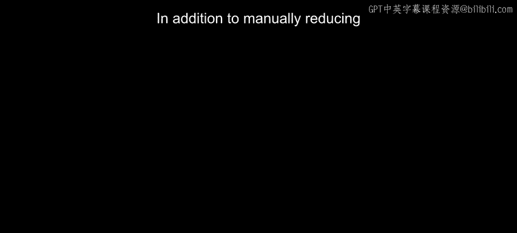
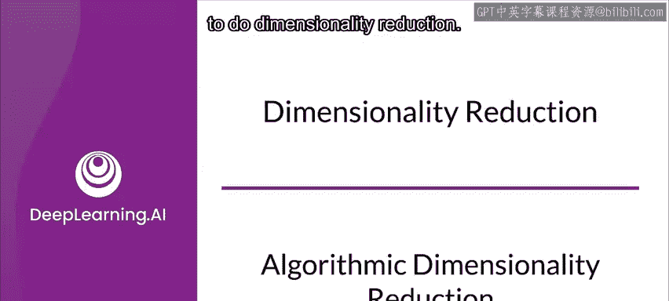
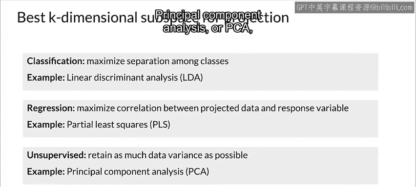

#  093：算法降维 📉



在本节课中，我们将学习如何运用算法自动降低数据集的维度。除了手动处理，算法降维能更高效地发现数据中的关键结构。



---

上一节我们介绍了手动降维的概念，本节中我们来看看几种自动降维的算法方法。

## 线性降维的工作原理

首先，让我们建立对线性降维工作原理的直观理解。在这种方法中，我们将 **N** 维数据线性投影到一个更小的 **K** 维子空间上。通常，**K** 远小于 **N**。

由于存在无限多个可能的子空间可供投影，因此我们需要选择最合适的一个。为了理解如何选择子空间，我们先退一步，看看如何将数据投影到一条直线上。

## 数据投影与嵌入

我们可以将特征视为存在于高维空间中的向量。虽然人类无法同时观察这么多维度，但通过将数据投影到低维空间，我们可能更直接地可视化数据分布。这种投影被称为**嵌入**。

计算嵌入需要为每个样本计算一个（或多个）数值来描述它。降至一维的好处是，所有样本都可以在一条线上排序。例如，我们可以将图像包含的信息降至一维，比如其平均像素亮度，然后将每张图像可视化为这条线上的一个点。

以下是计算图像平均像素亮度的伪代码示例：
```python
average_brightness = sum(pixel_values) / total_number_of_pixels
```

## 如何选择子空间

回到子空间选择的问题，根据任务目标的不同，有几种选择 **K** 维子空间的方法：

以下是几种常见方法及其适用场景：

*   **线性判别分析**：在分类任务中，通常希望最大化不同类别之间的分离度。**线性判别分析** 在这方面效果很好。
*   **偏最小二乘法**：在回归任务中，目标是最大化投影数据与输出之间的相关性。**偏最小二乘法** 是常用的方法。
*   **主成分分析**：在无监督任务中，我们通常希望尽可能保留原始数据的方差。**主成分分析** 是应用最广泛的技术。

---



本节课中我们一起学习了算法降维的核心思想。我们了解到，通过线性投影可以将高维数据映射到低维子空间，并且可以根据任务目标（如分类、回归或无监督学习）选择不同的算法（如LDA、PLS或PCA）来找到最优的子空间。这为后续处理高维数据提供了强大的工具。